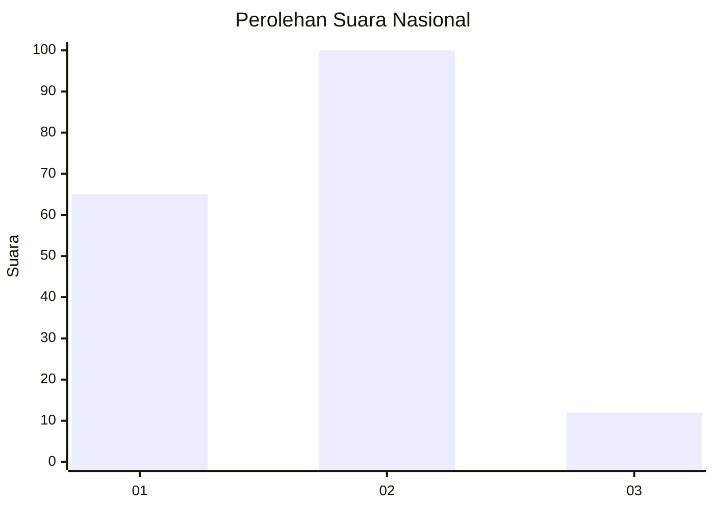
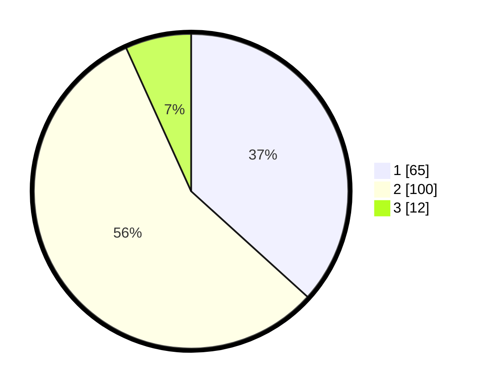

# Hasil

## Grafik

## Tabel

| No. | Nama Paslon    | Suara | Suara (raw) | Persentase |
|:--- |:-------------- | -----:| -----------:| ----------:|
| 1   | ANIES MUHAIMIN | 65    | [65][p-1]   | 36,72      |
| 2   | PRABOWO GIBRAN | 100   | [100][p-2]  | 56,50      |
| 3   | GANJAR MAHFUD  | 12    | [12][p-3]   | 6,78       |

[p-1]: https://github.com/gigit-pemilu/pemilu-2024/blob/main/pilpres/hitung-suara/sub/34-di-yogyakarta/sub/02-bantul/sub/13-pleret/sub/2001-wonokromo/sub/003-tps/sub/paslon-1.txt
[p-2]: https://github.com/gigit-pemilu/pemilu-2024/blob/main/pilpres/hitung-suara/sub/34-di-yogyakarta/sub/02-bantul/sub/13-pleret/sub/2001-wonokromo/sub/003-tps/sub/paslon-2.txt
[p-3]: https://github.com/gigit-pemilu/pemilu-2024/blob/main/pilpres/hitung-suara/sub/34-di-yogyakarta/sub/02-bantul/sub/13-pleret/sub/2001-wonokromo/sub/003-tps/sub/paslon-3.txt

## Foto C Plano

https://sirekap-obj-formc.kpu.go.id/5376/pemilu/ppwp/34/02/13/20/01/3402132001003-20240214-233054--e4f6e8ca-0ba0-4d1a-81a1-7cd3f5c7fe47.jpg

https://sirekap-obj-formc.kpu.go.id/5376/pemilu/ppwp/34/02/13/20/01/3402132001003-20240214-233719--c2921abc-9e7b-4a15-a182-c0d3434a6b5a.jpg

https://sirekap-obj-formc.kpu.go.id/5376/pemilu/ppwp/34/02/13/20/01/3402132001003-20240218-223217--1e8eb05c-92be-4dce-8c13-ee411a101be0.jpg

## Metadata

| Key        | Value               |
| ---------- | ------------------- |
| Time Stamp | 2024-02-24 22:31:28 |

