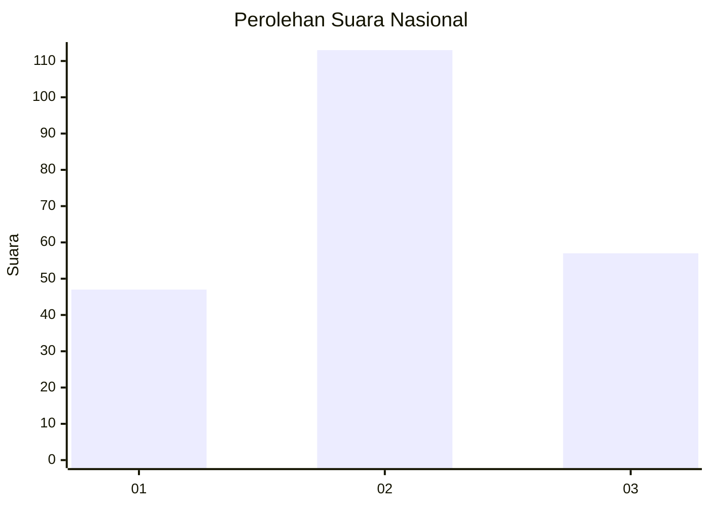
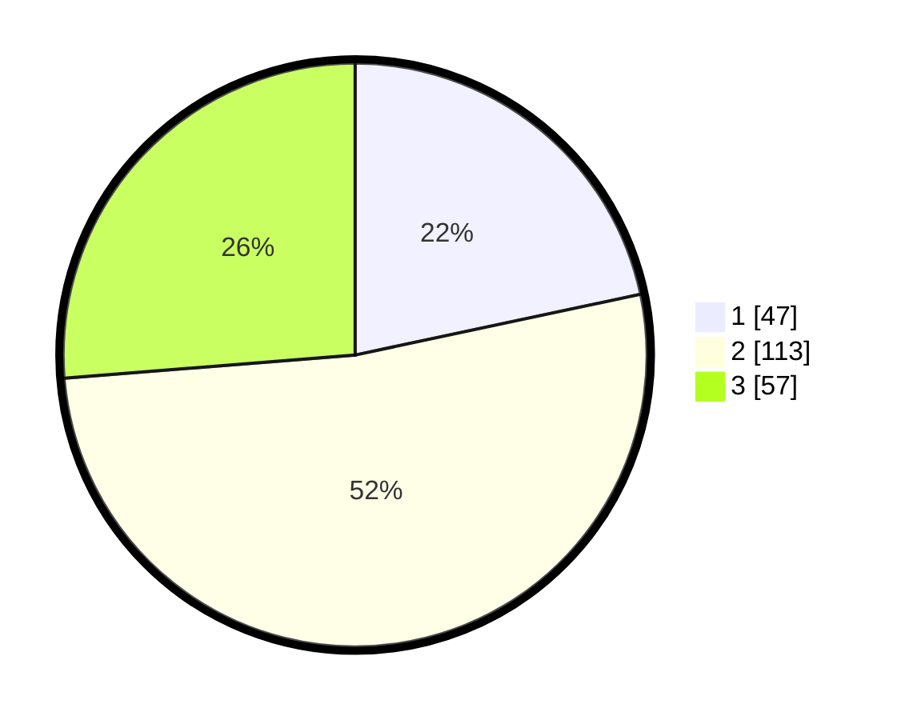

# Hasil

## Grafik

## Tabel

| No. | Nama Paslon    | Suara | Suara (raw) | Persentase |
|:--- |:-------------- | -----:| -----------:| ----------:|
| 1   | ANIES MUHAIMIN | 47    | [47][p-1]   | 21,66      |
| 2   | PRABOWO GIBRAN | 113   | [113][p-2]  | 52,07      |
| 3   | GANJAR MAHFUD  | 57    | [57][p-3]   | 26,27      |

[p-1]: https://github.com/gigit-pemilu/pemilu-2024/blob/main/pilpres/hitung-suara/sub/34-di-yogyakarta/sub/02-bantul/sub/13-pleret/sub/2001-wonokromo/sub/004-tps/sub/paslon-1.txt
[p-2]: https://github.com/gigit-pemilu/pemilu-2024/blob/main/pilpres/hitung-suara/sub/34-di-yogyakarta/sub/02-bantul/sub/13-pleret/sub/2001-wonokromo/sub/004-tps/sub/paslon-2.txt
[p-3]: https://github.com/gigit-pemilu/pemilu-2024/blob/main/pilpres/hitung-suara/sub/34-di-yogyakarta/sub/02-bantul/sub/13-pleret/sub/2001-wonokromo/sub/004-tps/sub/paslon-3.txt

## Foto C Plano

https://sirekap-obj-formc.kpu.go.id/2ae8/pemilu/ppwp/34/02/13/20/01/3402132001004-20240308-030433--ed70ff45-f253-454b-9fec-61cb5cc80d16.jpg

https://sirekap-obj-formc.kpu.go.id/2ae8/pemilu/ppwp/34/02/13/20/01/3402132001004-20240214-234854--e5a5605f-63ec-427d-8b63-541aeb4c0454.jpg

https://sirekap-obj-formc.kpu.go.id/2ae8/pemilu/ppwp/34/02/13/20/01/3402132001004-20240308-030433--f336b156-e49b-4b45-95fc-36417ad0689a.jpg

## Metadata

| Key        | Value               |
| ---------- | ------------------- |
| Time Stamp | 2024-03-08 04:00:00 |

## DATA PEMILIH TETAP

Jumlah pemilih dalam DPT: **0**.
 * L: **0**.
 * P: **0**.

## DATA PENGGUNA HAK PILIH

Jumlah pengguna hak pilih dalam DPT: **0**.
 * L: **0**.
 * P: **0**.

Jumlah pengguna hak pilih dalam DPTb: **0**.
 * L: **0**.
 * P: **0**.

Jumlah pengguna hak pilih dalam DPK: **0**.
 * L: **0**.
 * P: **0**.

Jumlah pengguna hak pilih: **0**.
 * L: **0**.
 * P: **0**.

## JUMLAH SUARA SAH DAN TIDAK SAH

JUMLAH SELURUH SUARA SAH: **0**.

JUMLAH SUARA TIDAK SAH: **0**.

JUMLAH SELURUH SUARA SAH DAN SUARA TIDAK SAH: **0**.

