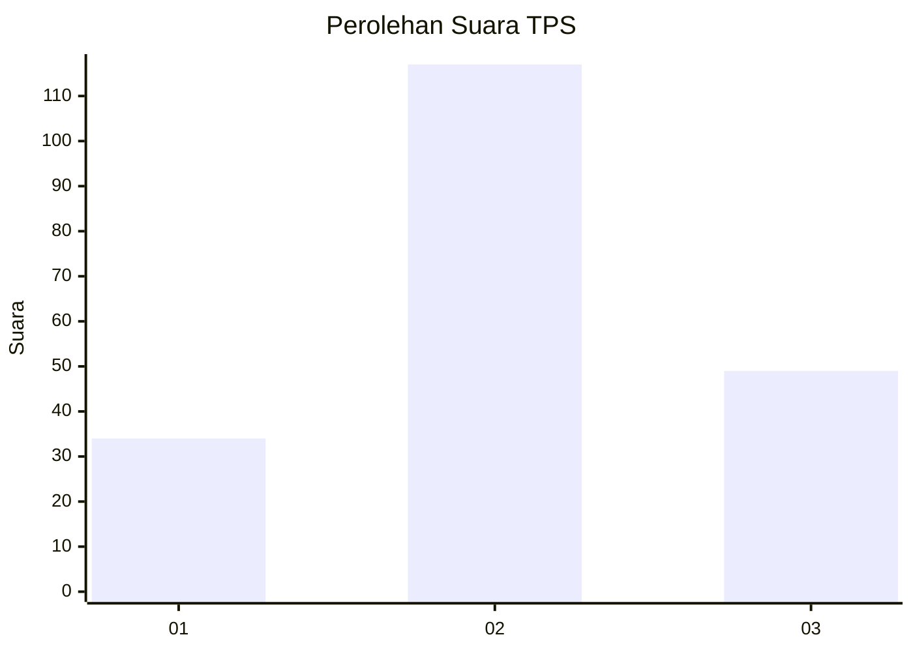
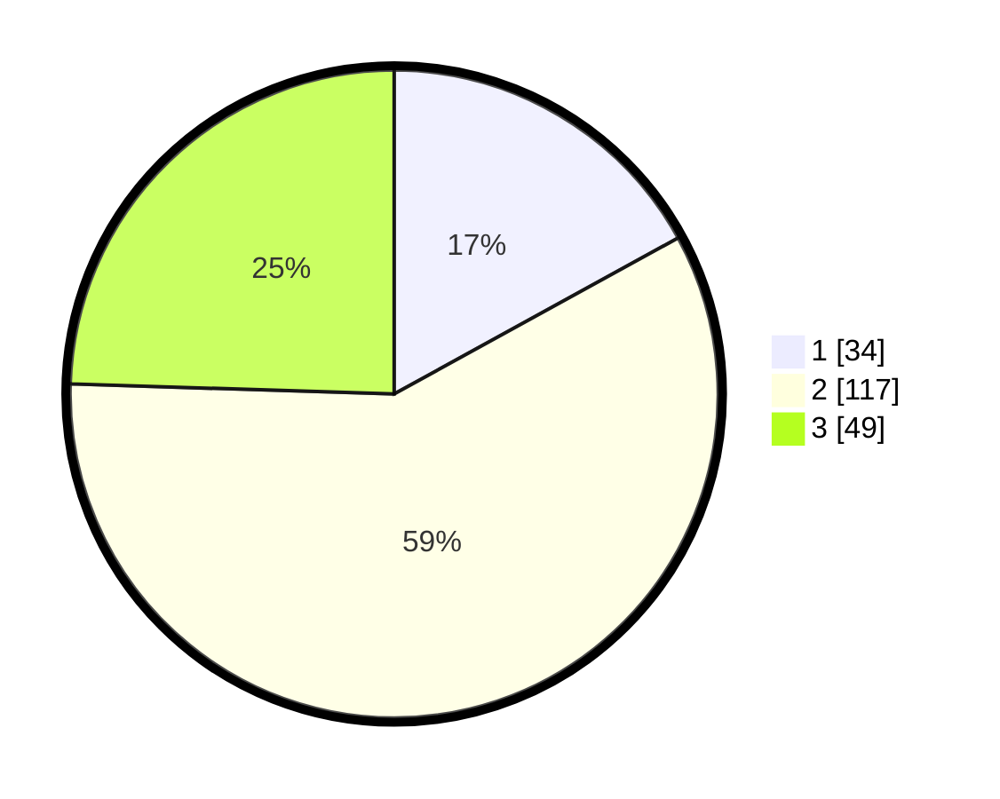

# Hasil

## Grafik

## Tabel

| No. | Nama Paslon    | Suara | Suara (raw) | Persentase |
|:--- |:-------------- | -----:| -----------:| ----------:|
| 1   | ANIES MUHAIMIN | 34    | [34][p-1]   | 17,00      |
| 2   | PRABOWO GIBRAN | 117   | [117][p-2]  | 58,50      |
| 3   | GANJAR MAHFUD  | 49    | [49][p-3]   | 24,50      |

[p-1]: https://github.com/gigit-pemilu/pemilu-2024-34-di-yogyakarta/blob/main/pilpres/hitung-suara/sub/34-di-yogyakarta/sub/02-bantul/sub/13-pleret/sub/2001-wonokromo/sub/011-tps/sub/paslon-1.txt
[p-2]: https://github.com/gigit-pemilu/pemilu-2024-34-di-yogyakarta/blob/main/pilpres/hitung-suara/sub/34-di-yogyakarta/sub/02-bantul/sub/13-pleret/sub/2001-wonokromo/sub/011-tps/sub/paslon-2.txt
[p-3]: https://github.com/gigit-pemilu/pemilu-2024-34-di-yogyakarta/blob/main/pilpres/hitung-suara/sub/34-di-yogyakarta/sub/02-bantul/sub/13-pleret/sub/2001-wonokromo/sub/011-tps/sub/paslon-3.txt

## Foto C Plano

https://sirekap-obj-formc.kpu.go.id/d6c1/pemilu/ppwp/34/02/13/20/01/3402132001011-20240216-030404--1f456d15-47cc-40cd-b998-0846d6c84ed3.jpg

https://sirekap-obj-formc.kpu.go.id/d6c1/pemilu/ppwp/34/02/13/20/01/3402132001011-20240214-203733--24f02d24-b389-4caa-a4df-6c0915154318.jpg

https://sirekap-obj-formc.kpu.go.id/d6c1/pemilu/ppwp/34/02/13/20/01/3402132001011-20240216-030408--dfe1e16b-24c0-48d3-9ec2-58c244aa48dd.jpg

## Metadata

| Key        | Value               |
| ---------- | ------------------- |
| Time Stamp | 2024-02-16 03:30:26 |

## DATA PEMILIH TETAP

Jumlah pemilih dalam DPT: **231**.
 * L: **121**.
 * P: **110**.

## DATA PENGGUNA HAK PILIH

Jumlah pengguna hak pilih dalam DPT: **200**.
 * L: **101**.
 * P: **99**.

Jumlah pengguna hak pilih dalam DPTb: **6**.
 * L: **1**.
 * P: **5**.

Jumlah pengguna hak pilih dalam DPK: **2**.
 * L: **1**.
 * P: **1**.

Jumlah pengguna hak pilih: **208**.
 * L: **103**.
 * P: **105**.

## JUMLAH SUARA SAH DAN TIDAK SAH

JUMLAH SELURUH SUARA SAH: **200**.

JUMLAH SUARA TIDAK SAH: **8**.

JUMLAH SELURUH SUARA SAH DAN SUARA TIDAK SAH: **208**.

