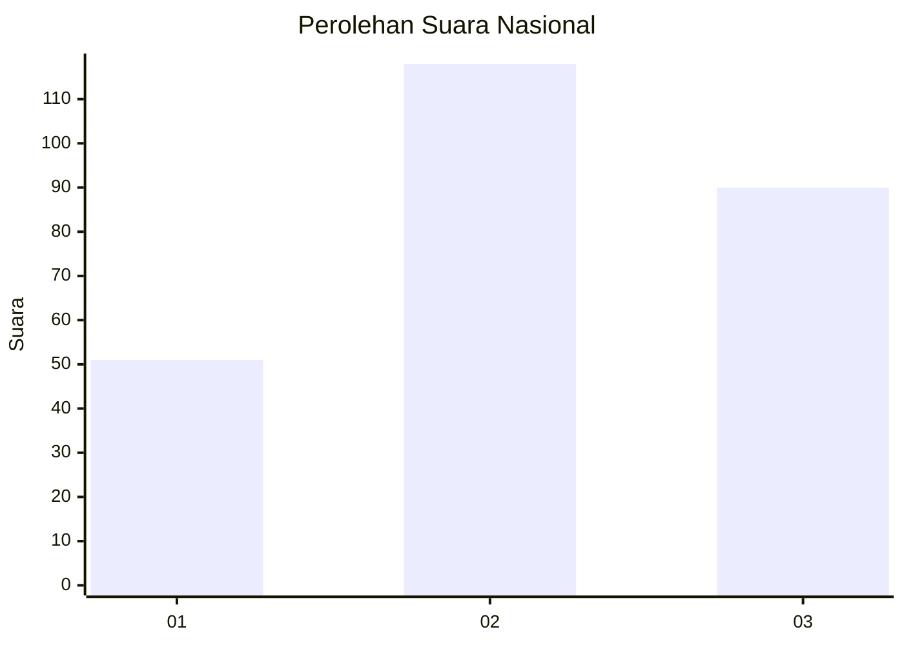
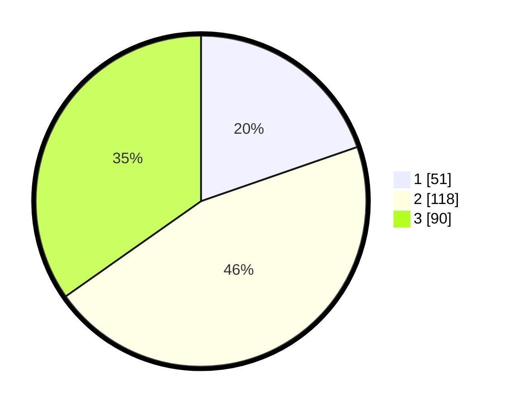

# Hasil

## Grafik

## Tabel

| No. | Nama Paslon    | Suara | Suara (raw) | Persentase |
|:--- |:-------------- | -----:| -----------:| ----------:|
| 1   | ANIES MUHAIMIN | 51    | [51][p-1]   | 19,69      |
| 2   | PRABOWO GIBRAN | 118   | [118][p-2]  | 45,56      |
| 3   | GANJAR MAHFUD  | 90    | [90][p-3]   | 34,75      |

[p-1]: https://github.com/gigit-pemilu/pemilu-2024/blob/main/pilpres/hitung-suara/sub/34-di-yogyakarta/sub/02-bantul/sub/13-pleret/sub/2002-pleret/sub/002-tps/sub/paslon-1.txt
[p-2]: https://github.com/gigit-pemilu/pemilu-2024/blob/main/pilpres/hitung-suara/sub/34-di-yogyakarta/sub/02-bantul/sub/13-pleret/sub/2002-pleret/sub/002-tps/sub/paslon-2.txt
[p-3]: https://github.com/gigit-pemilu/pemilu-2024/blob/main/pilpres/hitung-suara/sub/34-di-yogyakarta/sub/02-bantul/sub/13-pleret/sub/2002-pleret/sub/002-tps/sub/paslon-3.txt

## Foto C Plano

https://sirekap-obj-formc.kpu.go.id/9ac3/pemilu/ppwp/34/02/13/20/02/3402132002002-20240216-134736--e5cac103-23d6-44e6-9800-4cdacdbee916.jpg

https://sirekap-obj-formc.kpu.go.id/9ac3/pemilu/ppwp/34/02/13/20/02/3402132002002-20240216-134738--0ded7575-6fa9-45bb-ab4f-9f60d71d143b.jpg

https://sirekap-obj-formc.kpu.go.id/9ac3/pemilu/ppwp/34/02/13/20/02/3402132002002-20240216-134737--18e6c4f8-5a5d-4dfd-8daa-56935ab98d00.jpg

## Metadata

| Key        | Value               |
| ---------- | ------------------- |
| Time Stamp | 2024-02-21 18:00:00 |

## DATA PEMILIH TETAP

Jumlah pemilih dalam DPT: **283**.
 * L: **141**.
 * P: **142**.

## DATA PENGGUNA HAK PILIH

Jumlah pengguna hak pilih dalam DPT: **251**.
 * L: **121**.
 * P: **130**.

Jumlah pengguna hak pilih dalam DPTb: **5**.
 * L: **2**.
 * P: **3**.

Jumlah pengguna hak pilih dalam DPK: **11**.
 * L: **7**.
 * P: **4**.

Jumlah pengguna hak pilih: **267**.
 * L: **130**.
 * P: **137**.

## JUMLAH SUARA SAH DAN TIDAK SAH

JUMLAH SELURUH SUARA SAH: **259**.

JUMLAH SUARA TIDAK SAH: **8**.

JUMLAH SELURUH SUARA SAH DAN SUARA TIDAK SAH: **267**.

