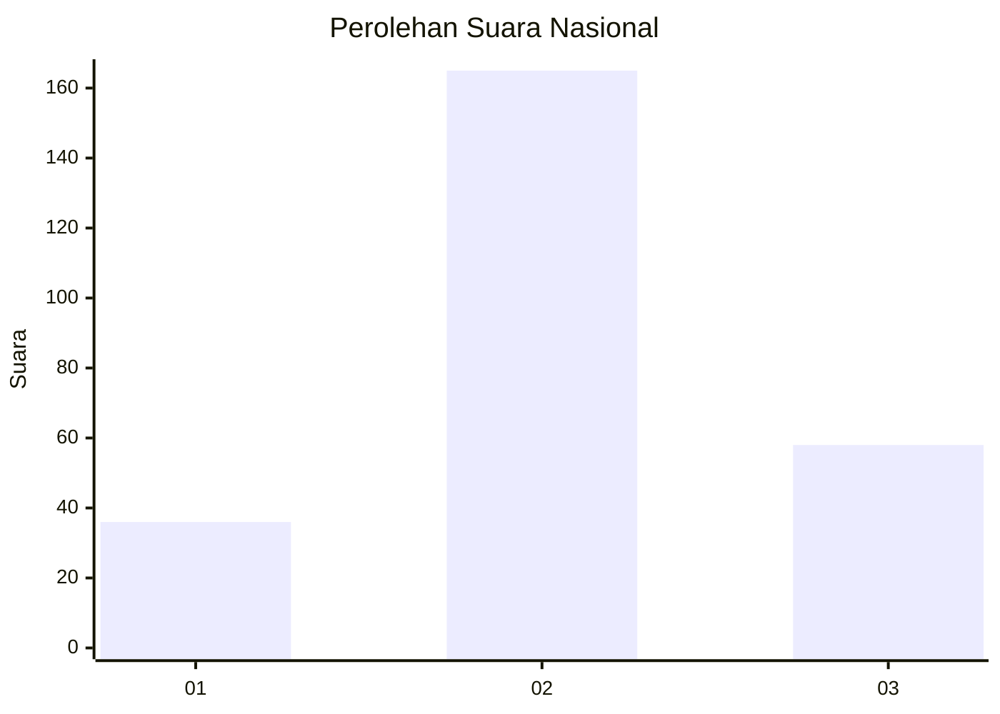
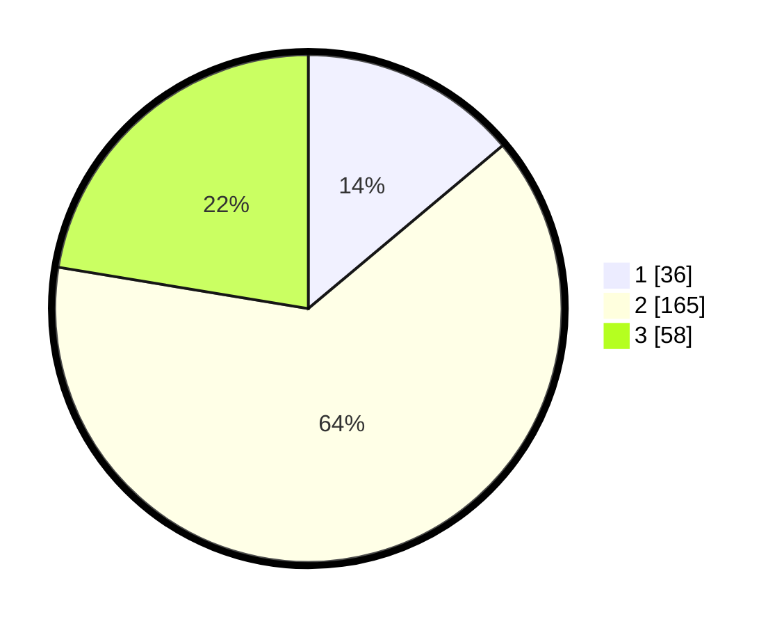

# Hasil

## Grafik

## Tabel

| No. | Nama Paslon    | Suara | Suara (raw) | Persentase |
|:--- |:-------------- | -----:| -----------:| ----------:|
| 1   | ANIES MUHAIMIN | 36    | [36][p-1]   | 13,90      |
| 2   | PRABOWO GIBRAN | 165   | [165][p-2]  | 63,71      |
| 3   | GANJAR MAHFUD  | 58    | [58][p-3]   | 22,39      |

[p-1]: https://github.com/gigit-pemilu/pemilu-2024/blob/main/pilpres/hitung-suara/sub/34-di-yogyakarta/sub/02-bantul/sub/13-pleret/sub/2002-pleret/sub/006-tps/sub/paslon-1.txt
[p-2]: https://github.com/gigit-pemilu/pemilu-2024/blob/main/pilpres/hitung-suara/sub/34-di-yogyakarta/sub/02-bantul/sub/13-pleret/sub/2002-pleret/sub/006-tps/sub/paslon-2.txt
[p-3]: https://github.com/gigit-pemilu/pemilu-2024/blob/main/pilpres/hitung-suara/sub/34-di-yogyakarta/sub/02-bantul/sub/13-pleret/sub/2002-pleret/sub/006-tps/sub/paslon-3.txt

## Foto C Plano

https://sirekap-obj-formc.kpu.go.id/5eeb/pemilu/ppwp/34/02/13/20/02/3402132002006-20240215-004957--f326e8f5-4fd2-4ae8-8c7f-43f9bc8bdf6b.jpg

https://sirekap-obj-formc.kpu.go.id/5eeb/pemilu/ppwp/34/02/13/20/02/3402132002006-20240215-005043--5496f9a9-c1b8-477d-bbd8-bafc0746481a.jpg

https://sirekap-obj-formc.kpu.go.id/5eeb/pemilu/ppwp/34/02/13/20/02/3402132002006-20240215-005102--e380a6c0-4bbc-4a6f-987c-482396921662.jpg

## Metadata

| Key        | Value               |
| ---------- | ------------------- |
| Time Stamp | 2024-02-24 22:31:28 |

