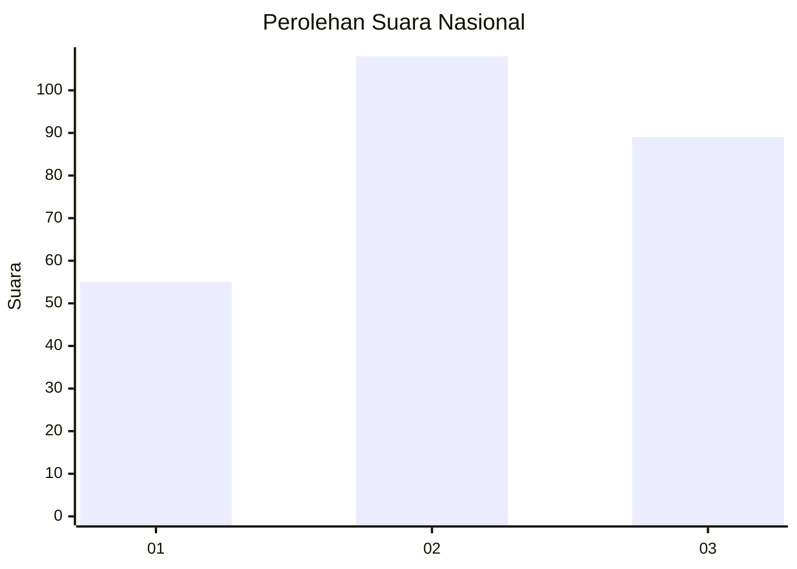
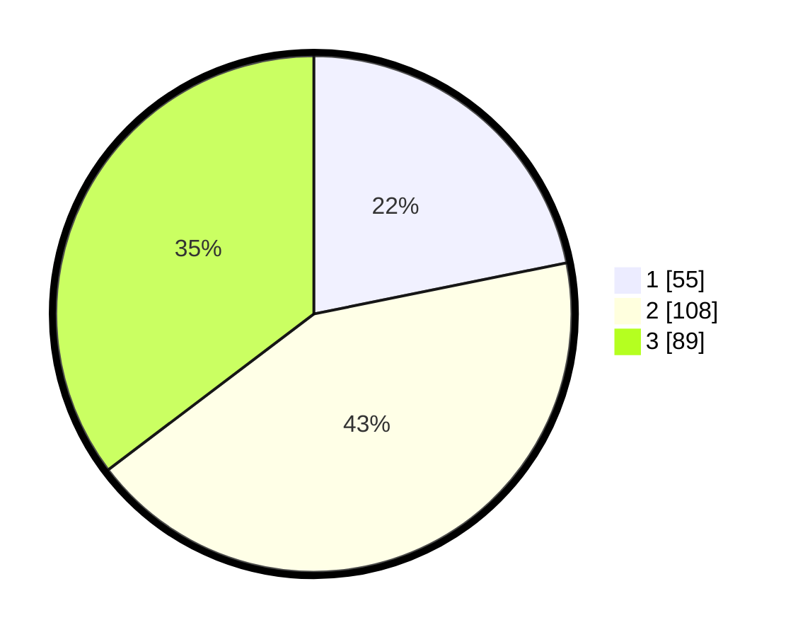

# Hasil

## Grafik

## Tabel

| No. | Nama Paslon    | Suara | Suara (raw) | Persentase |
|:--- |:-------------- | -----:| -----------:| ----------:|
| 1   | ANIES MUHAIMIN | 55    | [55][p-1]   | 21,83      |
| 2   | PRABOWO GIBRAN | 108   | [108][p-2]  | 42,86      |
| 3   | GANJAR MAHFUD  | 89    | [89][p-3]   | 35,32      |

[p-1]: https://github.com/gigit-pemilu/pemilu-2024/blob/main/pilpres/hitung-suara/sub/34-di-yogyakarta/sub/02-bantul/sub/13-pleret/sub/2002-pleret/sub/008-tps/sub/paslon-1.txt
[p-2]: https://github.com/gigit-pemilu/pemilu-2024/blob/main/pilpres/hitung-suara/sub/34-di-yogyakarta/sub/02-bantul/sub/13-pleret/sub/2002-pleret/sub/008-tps/sub/paslon-2.txt
[p-3]: https://github.com/gigit-pemilu/pemilu-2024/blob/main/pilpres/hitung-suara/sub/34-di-yogyakarta/sub/02-bantul/sub/13-pleret/sub/2002-pleret/sub/008-tps/sub/paslon-3.txt

## Foto C Plano

https://sirekap-obj-formc.kpu.go.id/29e8/pemilu/ppwp/34/02/13/20/02/3402132002008-20240218-221618--7e1e98f5-c313-401c-a628-da5a2fd3d010.jpg

https://sirekap-obj-formc.kpu.go.id/29e8/pemilu/ppwp/34/02/13/20/02/3402132002008-20240218-221619--810f80b6-e167-4ab8-b00d-c5f10e0929d2.jpg

https://sirekap-obj-formc.kpu.go.id/29e8/pemilu/ppwp/34/02/13/20/02/3402132002008-20240218-221618--e708030d-40ab-4e2c-bb00-9519ae9bf692.jpg

## Metadata

| Key        | Value               |
| ---------- | ------------------- |
| Time Stamp | 2024-02-21 15:00:00 |

## DATA PEMILIH TETAP

Jumlah pemilih dalam DPT: **297**.
 * L: **140**.
 * P: **157**.

## DATA PENGGUNA HAK PILIH

Jumlah pengguna hak pilih dalam DPT: **297**.
 * L: **140**.
 * P: **157**.

Jumlah pengguna hak pilih dalam DPTb: **0**.
 * L: **0**.
 * P: **2**.

Jumlah pengguna hak pilih dalam DPK: **0**.
 * L: **0**.
 * P: **1**.

Jumlah pengguna hak pilih: **300**.
 * L: **140**.
 * P: **160**.

## JUMLAH SUARA SAH DAN TIDAK SAH

JUMLAH SELURUH SUARA SAH: **252**.

JUMLAH SUARA TIDAK SAH: **2**.

JUMLAH SELURUH SUARA SAH DAN SUARA TIDAK SAH: **254**.

