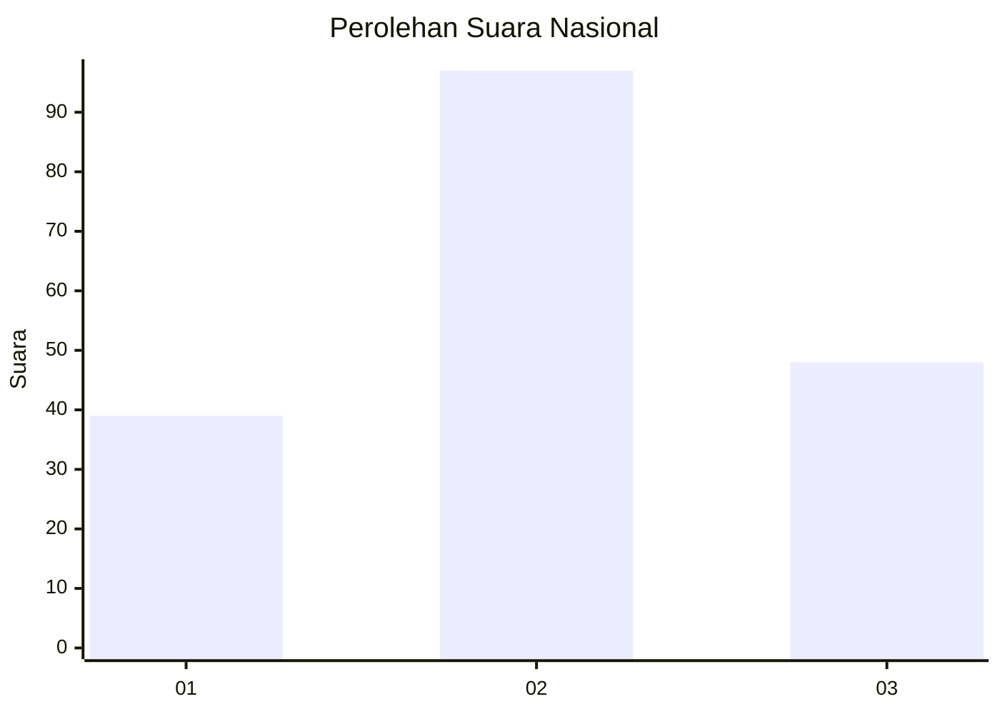
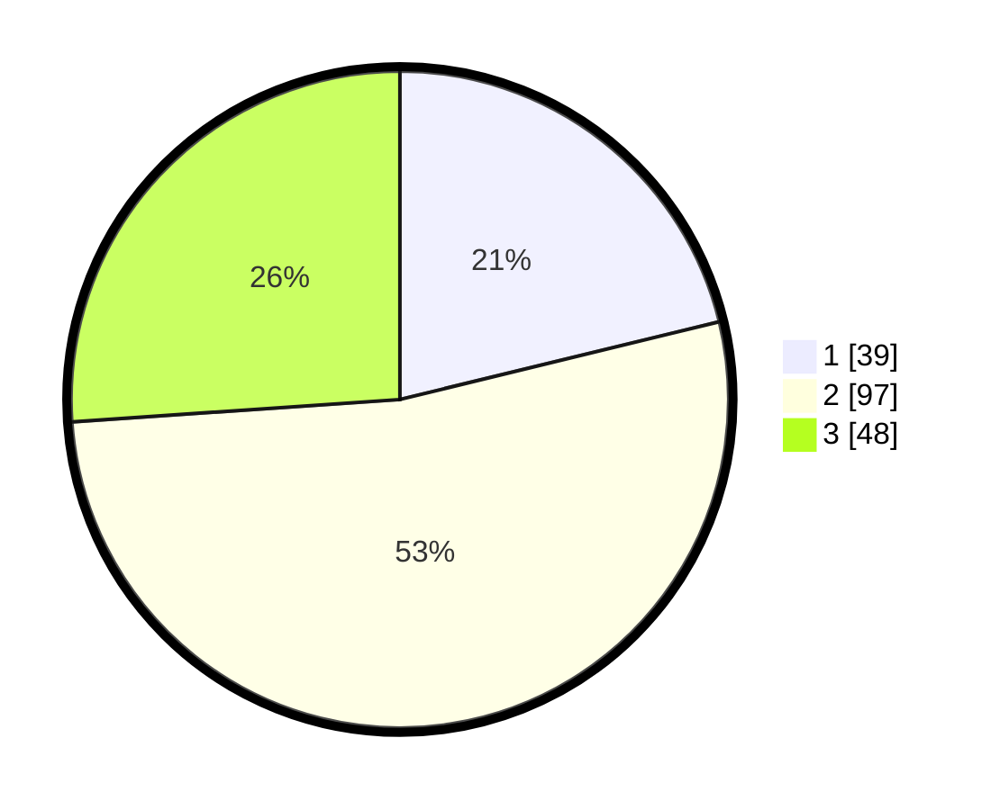

# Hasil

## Grafik

## Tabel

| No. | Nama Paslon    | Suara | Suara (raw) | Persentase |
|:--- |:-------------- | -----:| -----------:| ----------:|
| 1   | ANIES MUHAIMIN | 39    | [39][p-1]   | 21,20      |
| 2   | PRABOWO GIBRAN | 97    | [97][p-2]   | 52,72      |
| 3   | GANJAR MAHFUD  | 48    | [48][p-3]   | 26,09      |

[p-1]: https://github.com/gigit-pemilu/pemilu-2024/blob/main/pilpres/hitung-suara/sub/34-di-yogyakarta/sub/02-bantul/sub/13-pleret/sub/2002-pleret/sub/019-tps/sub/paslon-1.txt
[p-2]: https://github.com/gigit-pemilu/pemilu-2024/blob/main/pilpres/hitung-suara/sub/34-di-yogyakarta/sub/02-bantul/sub/13-pleret/sub/2002-pleret/sub/019-tps/sub/paslon-2.txt
[p-3]: https://github.com/gigit-pemilu/pemilu-2024/blob/main/pilpres/hitung-suara/sub/34-di-yogyakarta/sub/02-bantul/sub/13-pleret/sub/2002-pleret/sub/019-tps/sub/paslon-3.txt

## Foto C Plano

https://sirekap-obj-formc.kpu.go.id/838a/pemilu/ppwp/34/02/13/20/02/3402132002019-20240214-141941--2ba394bb-81e6-421a-a9df-975216e6f248.jpg

https://sirekap-obj-formc.kpu.go.id/838a/pemilu/ppwp/34/02/13/20/02/3402132002019-20240214-141557--d5a9d632-a8ee-40b5-9028-0c35e1665cf8.jpg

https://sirekap-obj-formc.kpu.go.id/838a/pemilu/ppwp/34/02/13/20/02/3402132002019-20240214-141733--fc8b57ee-82b1-482b-aa1c-48e27a3e81e6.jpg

## Metadata

| Key        | Value               |
| ---------- | ------------------- |
| Time Stamp | 2024-02-24 23:00:00 |

