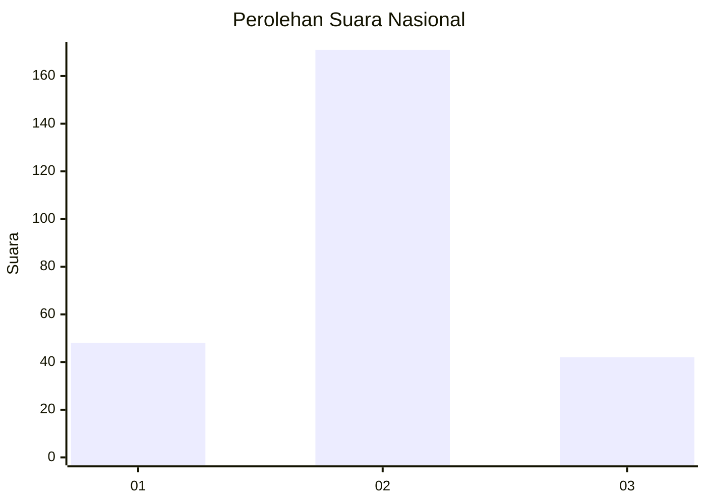
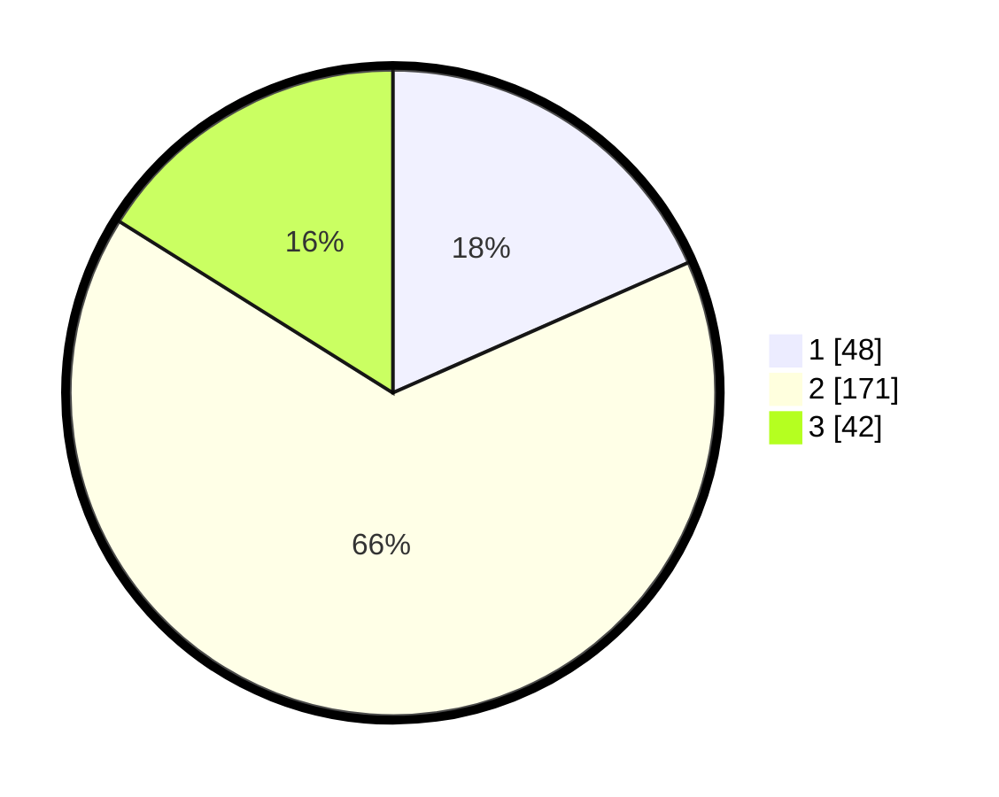

# Hasil

## Grafik

## Tabel

| No. | Nama Paslon    | Suara | Suara (raw) | Persentase |
|:--- |:-------------- | -----:| -----------:| ----------:|
| 1   | ANIES MUHAIMIN | 48    | [48][p-1]   | 18,39      |
| 2   | PRABOWO GIBRAN | 171   | [171][p-2]  | 65,52      |
| 3   | GANJAR MAHFUD  | 42    | [42][p-3]   | 16,09      |

[p-1]: https://github.com/gigit-pemilu/pemilu-2024/blob/main/pilpres/hitung-suara/sub/34-di-yogyakarta/sub/02-bantul/sub/13-pleret/sub/2003-segoroyoso/sub/005-tps/sub/paslon-1.txt
[p-2]: https://github.com/gigit-pemilu/pemilu-2024/blob/main/pilpres/hitung-suara/sub/34-di-yogyakarta/sub/02-bantul/sub/13-pleret/sub/2003-segoroyoso/sub/005-tps/sub/paslon-2.txt
[p-3]: https://github.com/gigit-pemilu/pemilu-2024/blob/main/pilpres/hitung-suara/sub/34-di-yogyakarta/sub/02-bantul/sub/13-pleret/sub/2003-segoroyoso/sub/005-tps/sub/paslon-3.txt

## Foto C Plano

https://sirekap-obj-formc.kpu.go.id/488e/pemilu/ppwp/34/02/13/20/03/3402132003005-20240216-023931--02172785-f1d1-4895-b50a-a8e0b5fbd7de.jpg

https://sirekap-obj-formc.kpu.go.id/488e/pemilu/ppwp/34/02/13/20/03/3402132003005-20240216-023936--f6eb15eb-a986-4902-be5d-a9394f83650e.jpg

https://sirekap-obj-formc.kpu.go.id/488e/pemilu/ppwp/34/02/13/20/03/3402132003005-20240216-023932--45379a75-0dc0-49d6-a5b8-1adf91a8b37a.jpg

## Metadata

| Key        | Value               |
| ---------- | ------------------- |
| Time Stamp | 2024-02-21 22:00:00 |

## DATA PEMILIH TETAP

Jumlah pemilih dalam DPT: **266**.
 * L: **125**.
 * P: **141**.

## DATA PENGGUNA HAK PILIH

Jumlah pengguna hak pilih dalam DPT: **260**.
 * L: **122**.
 * P: **138**.

Jumlah pengguna hak pilih dalam DPTb: **3**.
 * L: **1**.
 * P: **2**.

Jumlah pengguna hak pilih dalam DPK: **3**.
 * L: **2**.
 * P: **1**.

Jumlah pengguna hak pilih: **266**.
 * L: **125**.
 * P: **141**.

## JUMLAH SUARA SAH DAN TIDAK SAH

JUMLAH SELURUH SUARA SAH: **261**.

JUMLAH SUARA TIDAK SAH: **5**.

JUMLAH SELURUH SUARA SAH DAN SUARA TIDAK SAH: **266**.

