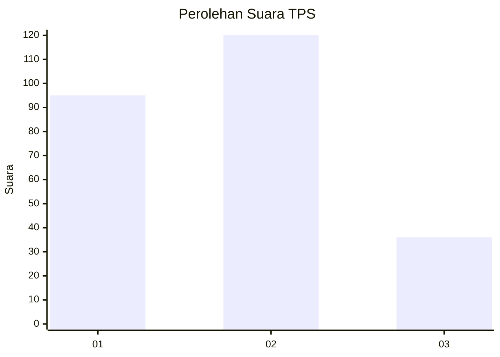
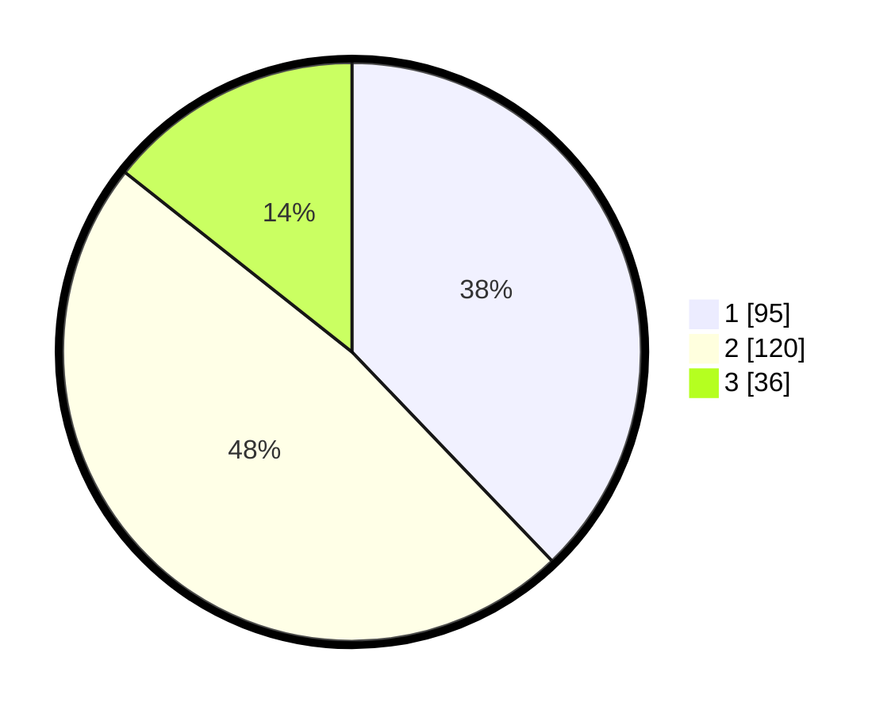

# Hasil

## Grafik

## Tabel

| No. | Nama Paslon    | Suara | Suara (raw) | Persentase |
|:--- |:-------------- | -----:| -----------:| ----------:|
| 1   | ANIES MUHAIMIN | 95    | [95][p-1]   | 37,85      |
| 2   | PRABOWO GIBRAN | 120   | [120][p-2]  | 47,81      |
| 3   | GANJAR MAHFUD  | 36    | [36][p-3]   | 14,34      |

[p-1]: https://github.com/gigit-pemilu/pemilu-2024-34-di-yogyakarta/blob/main/pilpres/hitung-suara/sub/34-di-yogyakarta/sub/02-bantul/sub/13-pleret/sub/2003-segoroyoso/sub/009-tps/sub/paslon-1.txt
[p-2]: https://github.com/gigit-pemilu/pemilu-2024-34-di-yogyakarta/blob/main/pilpres/hitung-suara/sub/34-di-yogyakarta/sub/02-bantul/sub/13-pleret/sub/2003-segoroyoso/sub/009-tps/sub/paslon-2.txt
[p-3]: https://github.com/gigit-pemilu/pemilu-2024-34-di-yogyakarta/blob/main/pilpres/hitung-suara/sub/34-di-yogyakarta/sub/02-bantul/sub/13-pleret/sub/2003-segoroyoso/sub/009-tps/sub/paslon-3.txt

## Foto C Plano

https://sirekap-obj-formc.kpu.go.id/2856/pemilu/ppwp/34/02/13/20/03/3402132003009-20240215-033041--3ede9fbd-dff9-4f4f-85a0-286607ff0081.jpg

https://sirekap-obj-formc.kpu.go.id/2856/pemilu/ppwp/34/02/13/20/03/3402132003009-20240215-023651--7e0f859b-eb36-4feb-b1a3-dc8c119a49b7.jpg

https://sirekap-obj-formc.kpu.go.id/2856/pemilu/ppwp/34/02/13/20/03/3402132003009-20240215-023725--b63ac66b-56ad-4ae4-970d-2b9bd04c57fc.jpg

## Metadata

| Key        | Value               |
| ---------- | ------------------- |
| Time Stamp | 2024-02-15 20:30:46 |

