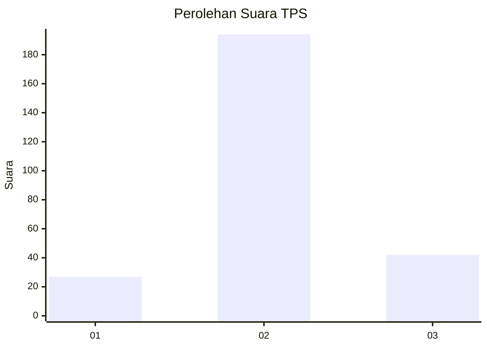
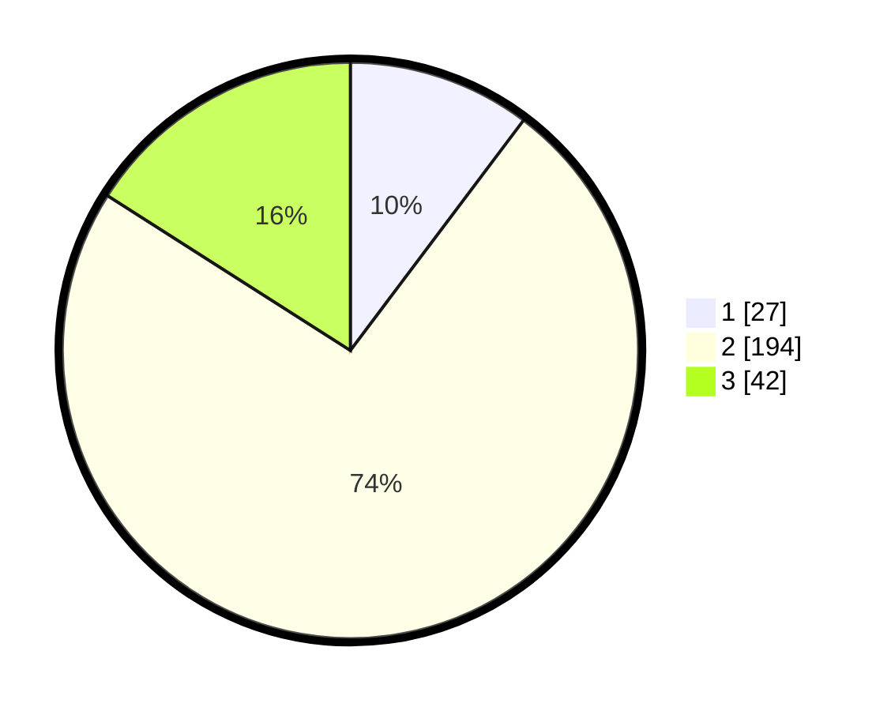

# Hasil

## Grafik

## Tabel

| No. | Nama Paslon    | Suara | Suara (raw) | Persentase |
|:--- |:-------------- | -----:| -----------:| ----------:|
| 1   | ANIES MUHAIMIN | 27    | [27][p-1]   | 10,27      |
| 2   | PRABOWO GIBRAN | 194   | [194][p-2]  | 73,76      |
| 3   | GANJAR MAHFUD  | 42    | [42][p-3]   | 15,97      |

[p-1]: https://github.com/gigit-pemilu/pemilu-2024-34-di-yogyakarta/blob/main/pilpres/hitung-suara/sub/34-di-yogyakarta/sub/02-bantul/sub/13-pleret/sub/2003-segoroyoso/sub/017-tps/sub/paslon-1.txt
[p-2]: https://github.com/gigit-pemilu/pemilu-2024-34-di-yogyakarta/blob/main/pilpres/hitung-suara/sub/34-di-yogyakarta/sub/02-bantul/sub/13-pleret/sub/2003-segoroyoso/sub/017-tps/sub/paslon-2.txt
[p-3]: https://github.com/gigit-pemilu/pemilu-2024-34-di-yogyakarta/blob/main/pilpres/hitung-suara/sub/34-di-yogyakarta/sub/02-bantul/sub/13-pleret/sub/2003-segoroyoso/sub/017-tps/sub/paslon-3.txt

## Foto C Plano

https://sirekap-obj-formc.kpu.go.id/2d49/pemilu/ppwp/34/02/13/20/03/3402132003017-20240214-230719--841e3c62-54c2-4823-b802-9ebc28cbfa5f.jpg

https://sirekap-obj-formc.kpu.go.id/2d49/pemilu/ppwp/34/02/13/20/03/3402132003017-20240214-230427--83765d32-ee4c-4de4-a50e-00f6b3d1fbfc.jpg

https://sirekap-obj-formc.kpu.go.id/2d49/pemilu/ppwp/34/02/13/20/03/3402132003017-20240214-230516--84a56fe3-e2b6-4996-86da-b7ed4ea6dee1.jpg

## Metadata

| Key        | Value               |
| ---------- | ------------------- |
| Time Stamp | 2024-02-24 22:31:28 |

