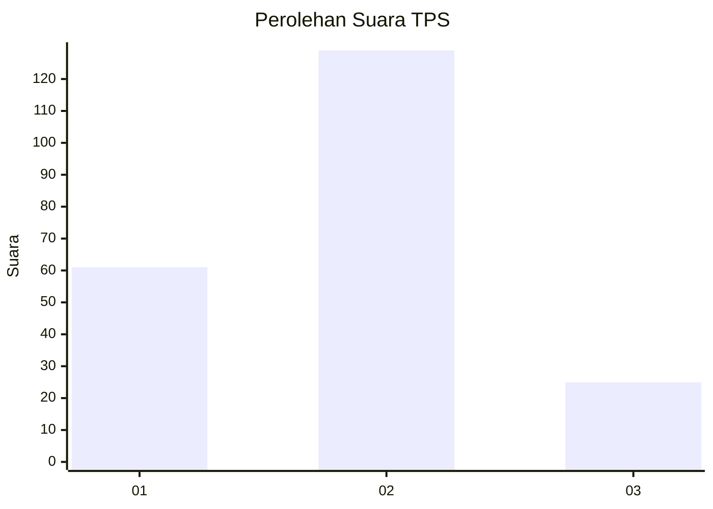
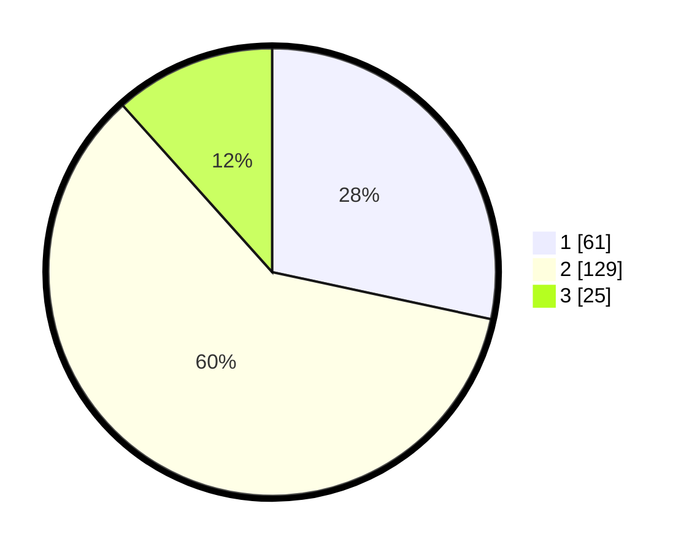

# Hasil

## Grafik

## Tabel

| No. | Nama Paslon    | Suara | Suara (raw) | Persentase |
|:--- |:-------------- | -----:| -----------:| ----------:|
| 1   | ANIES MUHAIMIN | 61    | [61][p-1]   | 28,37      |
| 2   | PRABOWO GIBRAN | 129   | [129][p-2]  | 60,00      |
| 3   | GANJAR MAHFUD  | 25    | [25][p-3]   | 11,63      |

[p-1]: https://github.com/gigit-pemilu/pemilu-2024-34-di-yogyakarta/blob/main/pilpres/hitung-suara/sub/34-di-yogyakarta/sub/02-bantul/sub/13-pleret/sub/2003-segoroyoso/sub/022-tps/sub/paslon-1.txt
[p-2]: https://github.com/gigit-pemilu/pemilu-2024-34-di-yogyakarta/blob/main/pilpres/hitung-suara/sub/34-di-yogyakarta/sub/02-bantul/sub/13-pleret/sub/2003-segoroyoso/sub/022-tps/sub/paslon-2.txt
[p-3]: https://github.com/gigit-pemilu/pemilu-2024-34-di-yogyakarta/blob/main/pilpres/hitung-suara/sub/34-di-yogyakarta/sub/02-bantul/sub/13-pleret/sub/2003-segoroyoso/sub/022-tps/sub/paslon-3.txt

## Foto C Plano

https://sirekap-obj-formc.kpu.go.id/fd38/pemilu/ppwp/34/02/13/20/03/3402132003022-20240214-211736--615afe32-7d4e-4b6b-bd8e-13224baedf13.jpg

https://sirekap-obj-formc.kpu.go.id/fd38/pemilu/ppwp/34/02/13/20/03/3402132003022-20240214-211237--a4ef0167-c100-459b-8652-e55e893af5f7.jpg

https://sirekap-obj-formc.kpu.go.id/fd38/pemilu/ppwp/34/02/13/20/03/3402132003022-20240218-100359--8eb9130e-3cab-4eae-ae1a-73ef20eff208.jpg

## Metadata

| Key        | Value               |
| ---------- | ------------------- |
| Time Stamp | 2024-02-21 17:00:00 |

