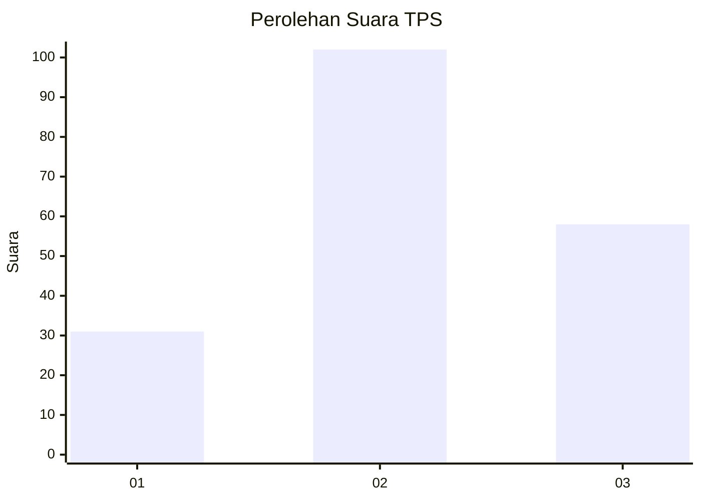
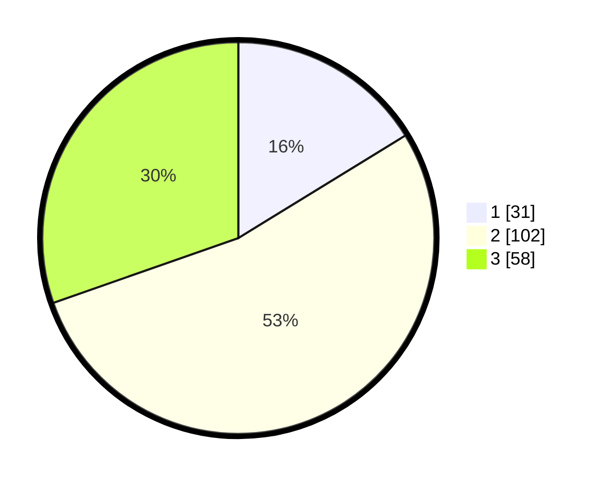

# Hasil

## Grafik

## Tabel

| No. | Nama Paslon    | Suara | Suara (raw) | Persentase |
|:--- |:-------------- | -----:| -----------:| ----------:|
| 1   | ANIES MUHAIMIN | 31    | [31][p-1]   | 16,23      |
| 2   | PRABOWO GIBRAN | 102   | [102][p-2]  | 53,40      |
| 3   | GANJAR MAHFUD  | 58    | [58][p-3]   | 30,37      |

[p-1]: https://github.com/gigit-pemilu/pemilu-2024-34-di-yogyakarta/blob/main/pilpres/hitung-suara/sub/34-di-yogyakarta/sub/02-bantul/sub/13-pleret/sub/2003-segoroyoso/sub/025-tps/sub/paslon-1.txt
[p-2]: https://github.com/gigit-pemilu/pemilu-2024-34-di-yogyakarta/blob/main/pilpres/hitung-suara/sub/34-di-yogyakarta/sub/02-bantul/sub/13-pleret/sub/2003-segoroyoso/sub/025-tps/sub/paslon-2.txt
[p-3]: https://github.com/gigit-pemilu/pemilu-2024-34-di-yogyakarta/blob/main/pilpres/hitung-suara/sub/34-di-yogyakarta/sub/02-bantul/sub/13-pleret/sub/2003-segoroyoso/sub/025-tps/sub/paslon-3.txt

## Foto C Plano

https://sirekap-obj-formc.kpu.go.id/1aea/pemilu/ppwp/34/02/13/20/03/3402132003025-20240214-141613--4266ff9a-94b2-497b-bc02-ed7c072ef5a8.jpg

https://sirekap-obj-formc.kpu.go.id/1aea/pemilu/ppwp/34/02/13/20/03/3402132003025-20240214-141651--91c443cd-c100-4b75-bd52-3eca508217be.jpg

https://sirekap-obj-formc.kpu.go.id/1aea/pemilu/ppwp/34/02/13/20/03/3402132003025-20240214-141910--a8c2b7c7-8c67-4c41-b90d-d1c4b768bf8a.jpg

## Metadata

| Key        | Value               |
| ---------- | ------------------- |
| Time Stamp | 2024-02-14 21:46:01 |

