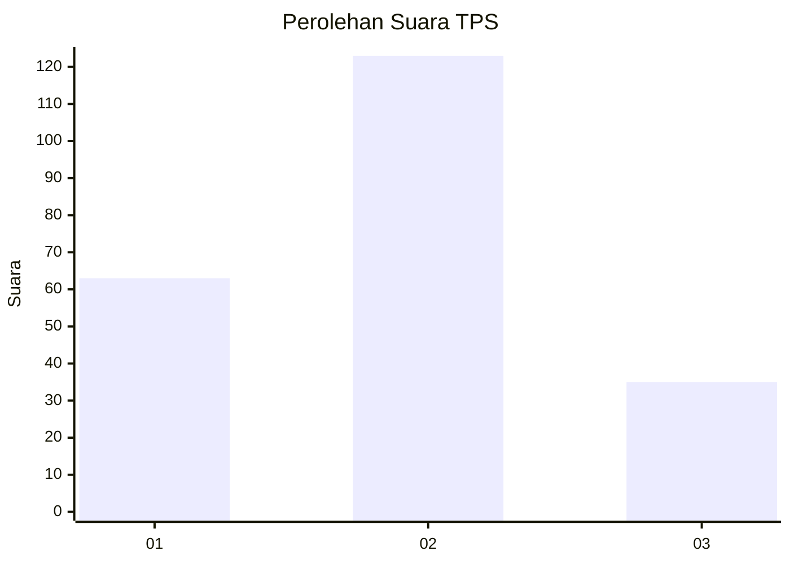
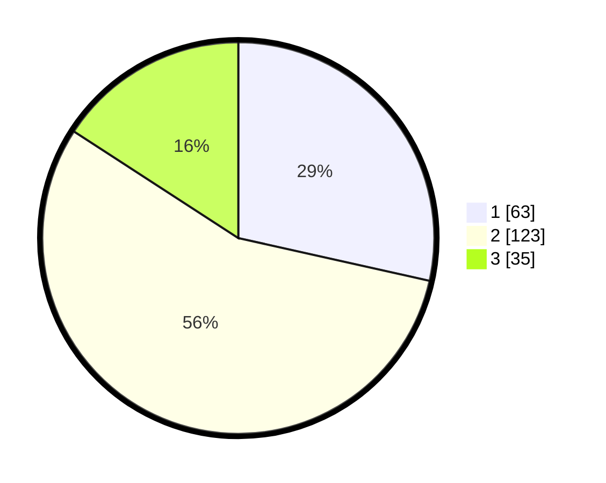

# Hasil

## Grafik

## Tabel

| No. | Nama Paslon    | Suara | Suara (raw) | Persentase |
|:--- |:-------------- | -----:| -----------:| ----------:|
| 1   | ANIES MUHAIMIN | 63    | [63][p-1]   | 28,51      |
| 2   | PRABOWO GIBRAN | 123   | [123][p-2]  | 55,66      |
| 3   | GANJAR MAHFUD  | 35    | [35][p-3]   | 15,84      |

[p-1]: https://github.com/gigit-pemilu/pemilu-2024-34-di-yogyakarta/blob/main/pilpres/hitung-suara/sub/34-di-yogyakarta/sub/02-bantul/sub/13-pleret/sub/2004-bawuran/sub/001-tps/sub/paslon-1.txt
[p-2]: https://github.com/gigit-pemilu/pemilu-2024-34-di-yogyakarta/blob/main/pilpres/hitung-suara/sub/34-di-yogyakarta/sub/02-bantul/sub/13-pleret/sub/2004-bawuran/sub/001-tps/sub/paslon-2.txt
[p-3]: https://github.com/gigit-pemilu/pemilu-2024-34-di-yogyakarta/blob/main/pilpres/hitung-suara/sub/34-di-yogyakarta/sub/02-bantul/sub/13-pleret/sub/2004-bawuran/sub/001-tps/sub/paslon-3.txt

## Foto C Plano

https://sirekap-obj-formc.kpu.go.id/3325/pemilu/ppwp/34/02/13/20/04/3402132004001-20240215-061655--4a6cb042-52fb-493e-91e4-50889f900f97.jpg

https://sirekap-obj-formc.kpu.go.id/3325/pemilu/ppwp/34/02/13/20/04/3402132004001-20240215-061706--7aee447f-41dc-47ba-868f-a77247d29707.jpg

https://sirekap-obj-formc.kpu.go.id/3325/pemilu/ppwp/34/02/13/20/04/3402132004001-20240215-061714--b5ae80eb-71de-4abf-a712-fd3bcbe6f119.jpg

## Metadata

| Key        | Value               |
| ---------- | ------------------- |
| Time Stamp | 2024-02-19 06:16:00 |

