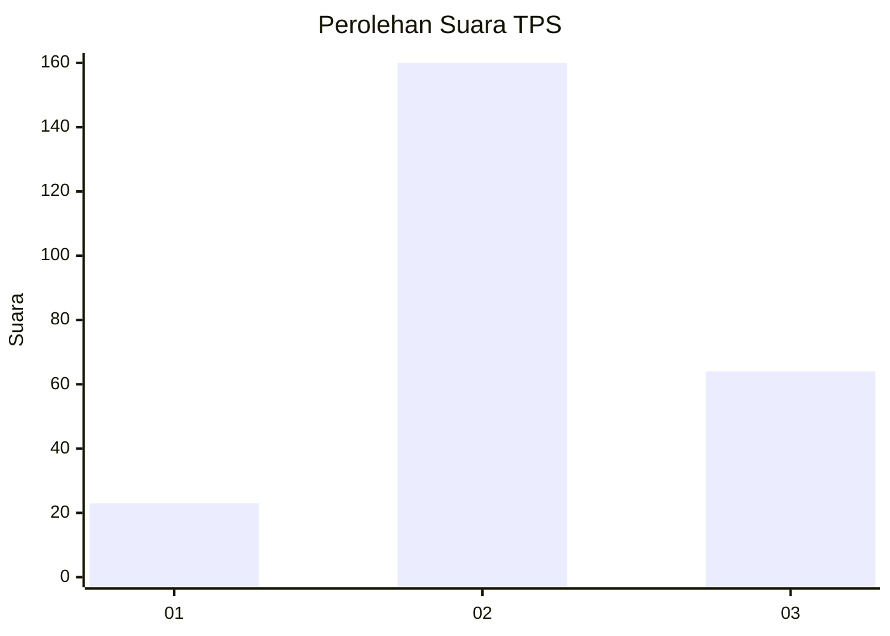
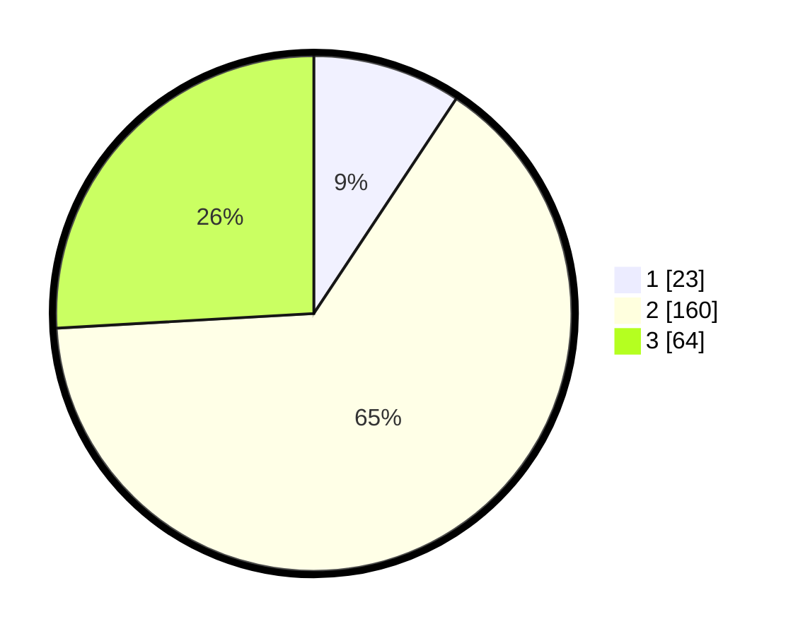

# Hasil

## Grafik

## Tabel

| No. | Nama Paslon    | Suara | Suara (raw) | Persentase |
|:--- |:-------------- | -----:| -----------:| ----------:|
| 1   | ANIES MUHAIMIN | 23    | [23][p-1]   | 9,31       |
| 2   | PRABOWO GIBRAN | 160   | [160][p-2]  | 64,78      |
| 3   | GANJAR MAHFUD  | 64    | [64][p-3]   | 25,91      |

[p-1]: https://github.com/gigit-pemilu/pemilu-2024-34-di-yogyakarta/blob/main/pilpres/hitung-suara/sub/34-di-yogyakarta/sub/02-bantul/sub/13-pleret/sub/2004-bawuran/sub/010-tps/sub/paslon-1.txt
[p-2]: https://github.com/gigit-pemilu/pemilu-2024-34-di-yogyakarta/blob/main/pilpres/hitung-suara/sub/34-di-yogyakarta/sub/02-bantul/sub/13-pleret/sub/2004-bawuran/sub/010-tps/sub/paslon-2.txt
[p-3]: https://github.com/gigit-pemilu/pemilu-2024-34-di-yogyakarta/blob/main/pilpres/hitung-suara/sub/34-di-yogyakarta/sub/02-bantul/sub/13-pleret/sub/2004-bawuran/sub/010-tps/sub/paslon-3.txt

## Foto C Plano

https://sirekap-obj-formc.kpu.go.id/d08e/pemilu/ppwp/34/02/13/20/04/3402132004010-20240215-003439--2042262e-eb57-40da-9477-841df2dafef7.jpg

https://sirekap-obj-formc.kpu.go.id/d08e/pemilu/ppwp/34/02/13/20/04/3402132004010-20240215-003528--5992dbb3-56f5-485b-8ba9-84b8cca07c24.jpg

https://sirekap-obj-formc.kpu.go.id/d08e/pemilu/ppwp/34/02/13/20/04/3402132004010-20240215-003752--ff7ffb31-3b1a-4746-ae73-1554d292bf5a.jpg

## Metadata

| Key        | Value               |
| ---------- | ------------------- |
| Time Stamp | 2024-02-19 06:16:00 |

