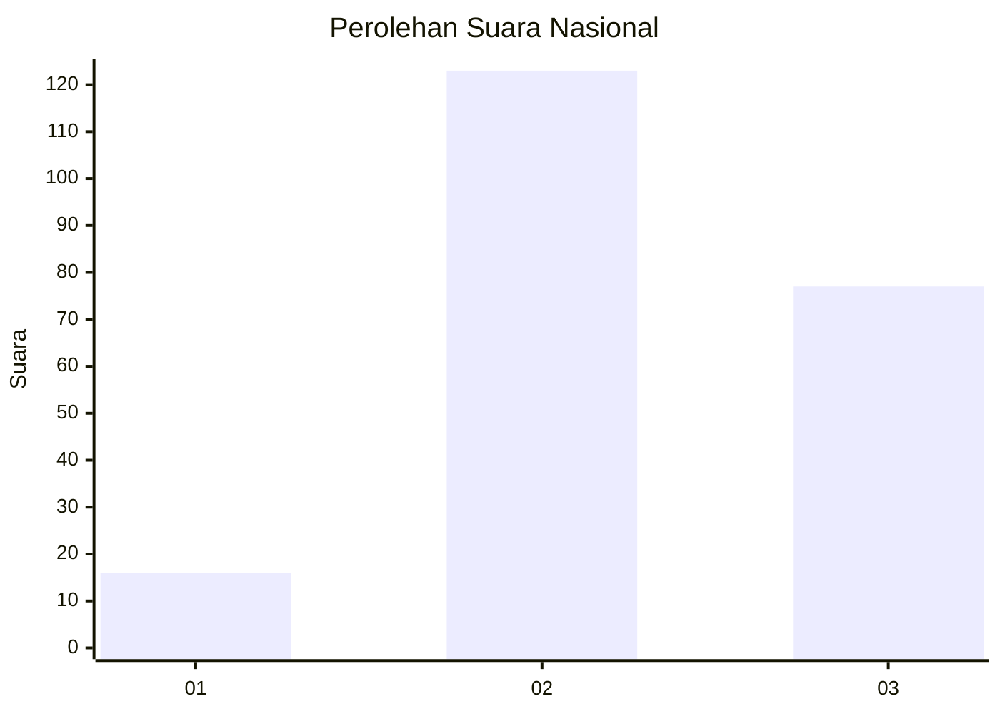
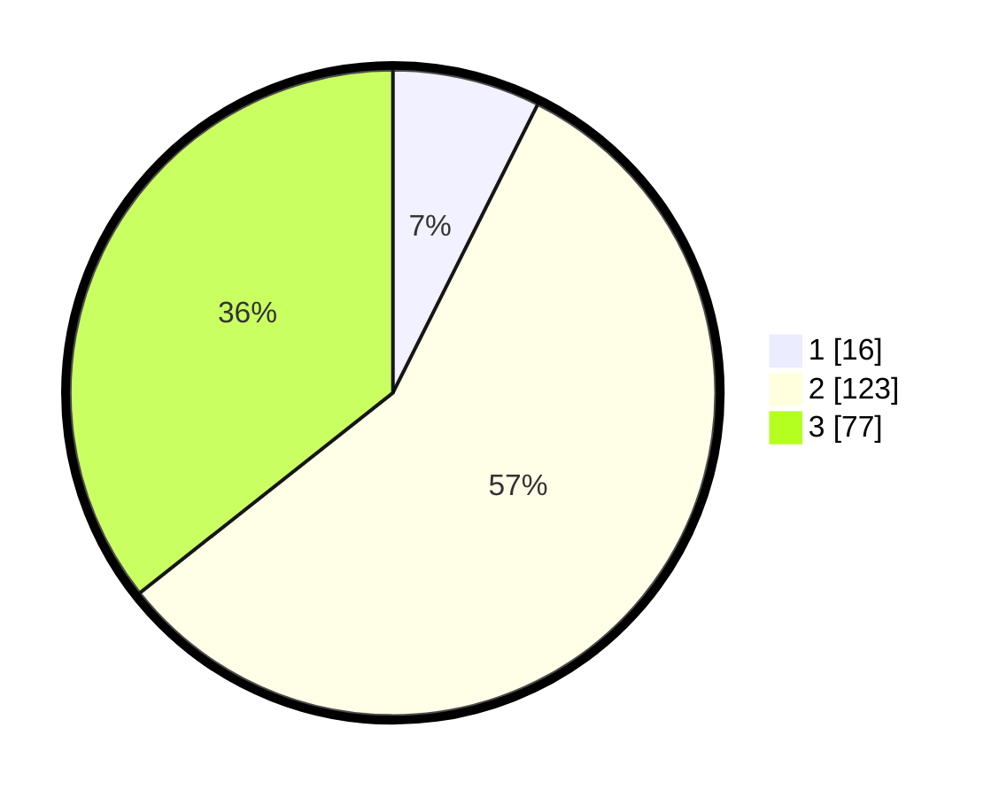

# Hasil

## Grafik

## Tabel

| No. | Nama Paslon    | Suara | Suara (raw) | Persentase |
|:--- |:-------------- | -----:| -----------:| ----------:|
| 1   | ANIES MUHAIMIN | 16    | [16][p-1]   | 7,41       |
| 2   | PRABOWO GIBRAN | 123   | [123][p-2]  | 56,94      |
| 3   | GANJAR MAHFUD  | 77    | [77][p-3]   | 35,65      |

[p-1]: https://github.com/gigit-pemilu/pemilu-2024/blob/main/pilpres/hitung-suara/sub/34-di-yogyakarta/sub/02-bantul/sub/13-pleret/sub/2004-bawuran/sub/014-tps/sub/paslon-1.txt
[p-2]: https://github.com/gigit-pemilu/pemilu-2024/blob/main/pilpres/hitung-suara/sub/34-di-yogyakarta/sub/02-bantul/sub/13-pleret/sub/2004-bawuran/sub/014-tps/sub/paslon-2.txt
[p-3]: https://github.com/gigit-pemilu/pemilu-2024/blob/main/pilpres/hitung-suara/sub/34-di-yogyakarta/sub/02-bantul/sub/13-pleret/sub/2004-bawuran/sub/014-tps/sub/paslon-3.txt

## Foto C Plano

https://sirekap-obj-formc.kpu.go.id/d69f/pemilu/ppwp/34/02/13/20/04/3402132004014-20240215-002229--86706a36-920f-4e69-abe3-3669171a9f73.jpg

https://sirekap-obj-formc.kpu.go.id/d69f/pemilu/ppwp/34/02/13/20/04/3402132004014-20240215-002344--f35a115b-1d42-4756-8b1b-20c62512c467.jpg

https://sirekap-obj-formc.kpu.go.id/d69f/pemilu/ppwp/34/02/13/20/04/3402132004014-20240215-002457--43b3cb79-6352-4cd6-ad09-0e7740af22fb.jpg

## Metadata

| Key        | Value               |
| ---------- | ------------------- |
| Time Stamp | 2024-02-19 06:16:00 |

