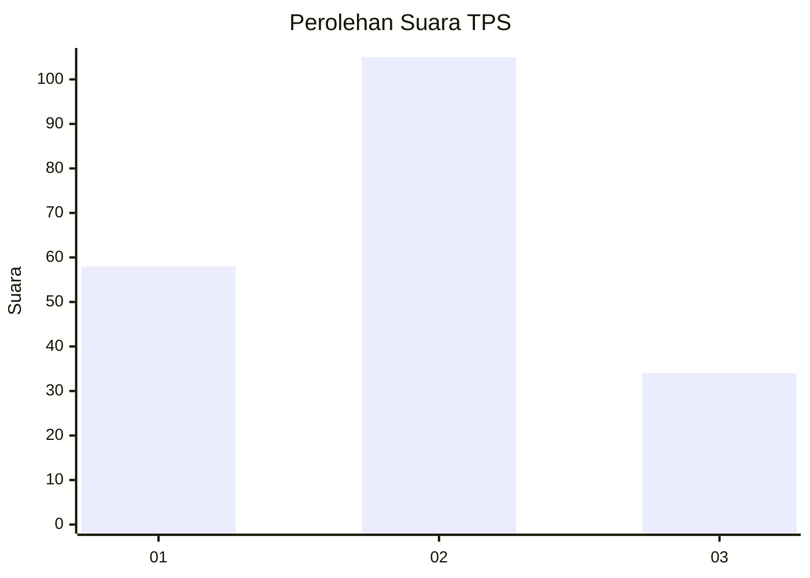
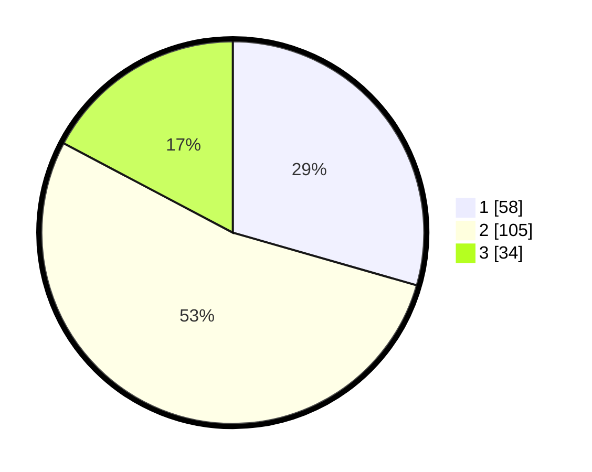

# Hasil

## Grafik

## Tabel

| No. | Nama Paslon    | Suara | Suara (raw) | Persentase |
|:--- |:-------------- | -----:| -----------:| ----------:|
| 1   | ANIES MUHAIMIN | 58    | [58][p-1]   | 29,44      |
| 2   | PRABOWO GIBRAN | 105   | [105][p-2]  | 53,30      |
| 3   | GANJAR MAHFUD  | 34    | [34][p-3]   | 17,26      |

[p-1]: https://github.com/gigit-pemilu/pemilu-2024-34-di-yogyakarta/blob/main/pilpres/hitung-suara/sub/34-di-yogyakarta/sub/02-bantul/sub/13-pleret/sub/2004-bawuran/sub/017-tps/sub/paslon-1.txt
[p-2]: https://github.com/gigit-pemilu/pemilu-2024-34-di-yogyakarta/blob/main/pilpres/hitung-suara/sub/34-di-yogyakarta/sub/02-bantul/sub/13-pleret/sub/2004-bawuran/sub/017-tps/sub/paslon-2.txt
[p-3]: https://github.com/gigit-pemilu/pemilu-2024-34-di-yogyakarta/blob/main/pilpres/hitung-suara/sub/34-di-yogyakarta/sub/02-bantul/sub/13-pleret/sub/2004-bawuran/sub/017-tps/sub/paslon-3.txt

## Foto C Plano

https://sirekap-obj-formc.kpu.go.id/e13f/pemilu/ppwp/34/02/13/20/04/3402132004017-20240215-001256--19a9e5c3-5a26-4ecc-b43f-ea61bd046208.jpg

https://sirekap-obj-formc.kpu.go.id/e13f/pemilu/ppwp/34/02/13/20/04/3402132004017-20240215-001019--f0c6a2bb-c2e3-4a86-b391-629341a193a4.jpg

https://sirekap-obj-formc.kpu.go.id/e13f/pemilu/ppwp/34/02/13/20/04/3402132004017-20240215-001630--7181332e-e4f8-4443-95ef-8c728601acce.jpg

## Metadata

| Key        | Value               |
| ---------- | ------------------- |
| Time Stamp | 2024-02-19 06:16:00 |

