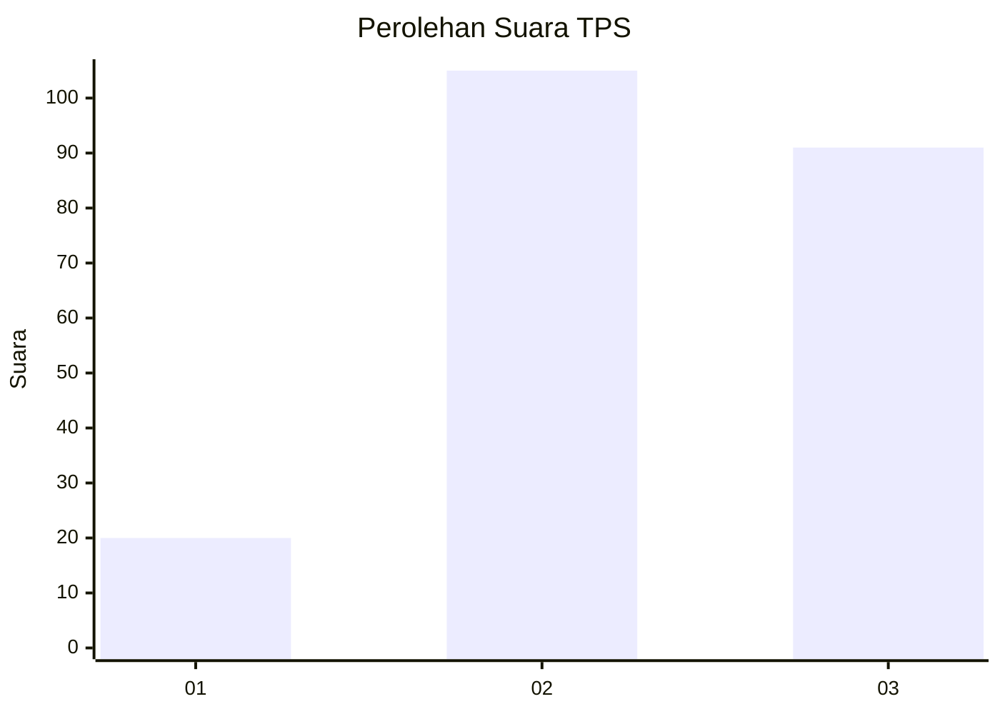
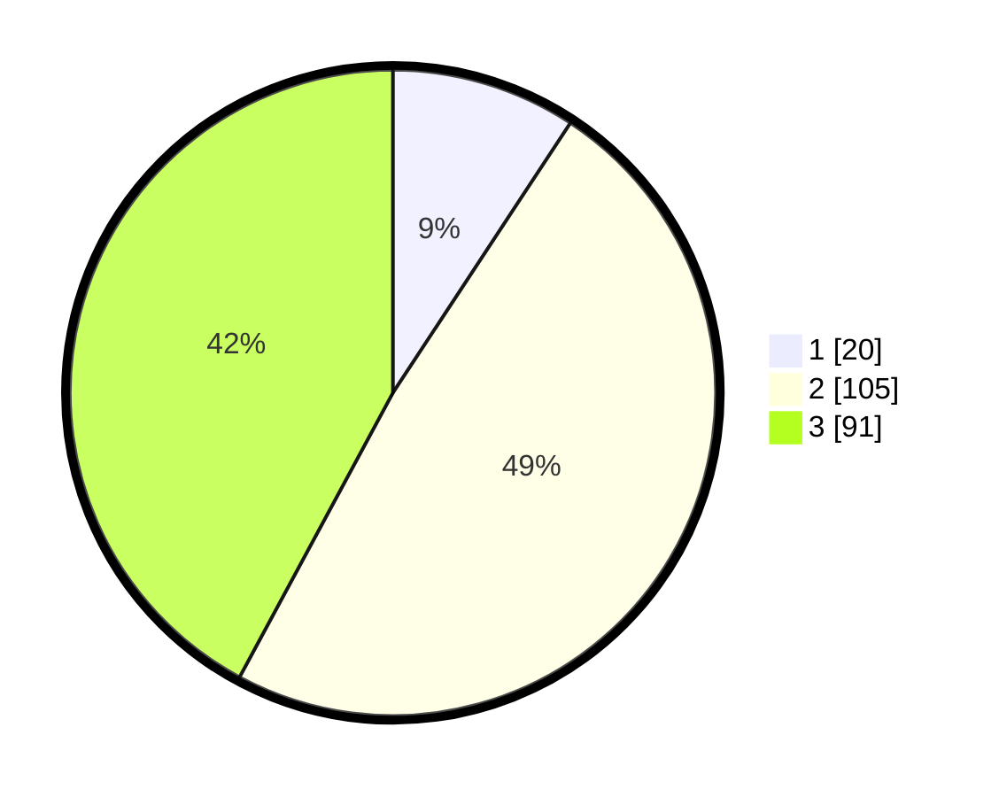

# Hasil

## Grafik

## Tabel

| No. | Nama Paslon    | Suara | Suara (raw) | Persentase |
|:--- |:-------------- | -----:| -----------:| ----------:|
| 1   | ANIES MUHAIMIN | 20    | [20][p-1]   | 9,26       |
| 2   | PRABOWO GIBRAN | 105   | [105][p-2]  | 48,61      |
| 3   | GANJAR MAHFUD  | 91    | [91][p-3]   | 42,13      |

[p-1]: https://github.com/gigit-pemilu/pemilu-2024-34-di-yogyakarta/blob/main/pilpres/hitung-suara/sub/34-di-yogyakarta/sub/02-bantul/sub/13-pleret/sub/2004-bawuran/sub/018-tps/sub/paslon-1.txt
[p-2]: https://github.com/gigit-pemilu/pemilu-2024-34-di-yogyakarta/blob/main/pilpres/hitung-suara/sub/34-di-yogyakarta/sub/02-bantul/sub/13-pleret/sub/2004-bawuran/sub/018-tps/sub/paslon-2.txt
[p-3]: https://github.com/gigit-pemilu/pemilu-2024-34-di-yogyakarta/blob/main/pilpres/hitung-suara/sub/34-di-yogyakarta/sub/02-bantul/sub/13-pleret/sub/2004-bawuran/sub/018-tps/sub/paslon-3.txt

## Foto C Plano

https://sirekap-obj-formc.kpu.go.id/8d23/pemilu/ppwp/34/02/13/20/04/3402132004018-20240214-230130--45b2fc90-dd04-4e23-b5d4-24458a959086.jpg

https://sirekap-obj-formc.kpu.go.id/8d23/pemilu/ppwp/34/02/13/20/04/3402132004018-20240214-230307--5556eb56-5df3-4254-86f2-8958f7ea5542.jpg

https://sirekap-obj-formc.kpu.go.id/8d23/pemilu/ppwp/34/02/13/20/04/3402132004018-20240214-230532--5d4a33d4-56a8-42b1-a946-44800c529904.jpg

## Metadata

| Key        | Value               |
| ---------- | ------------------- |
| Time Stamp | 2024-02-19 06:16:00 |

