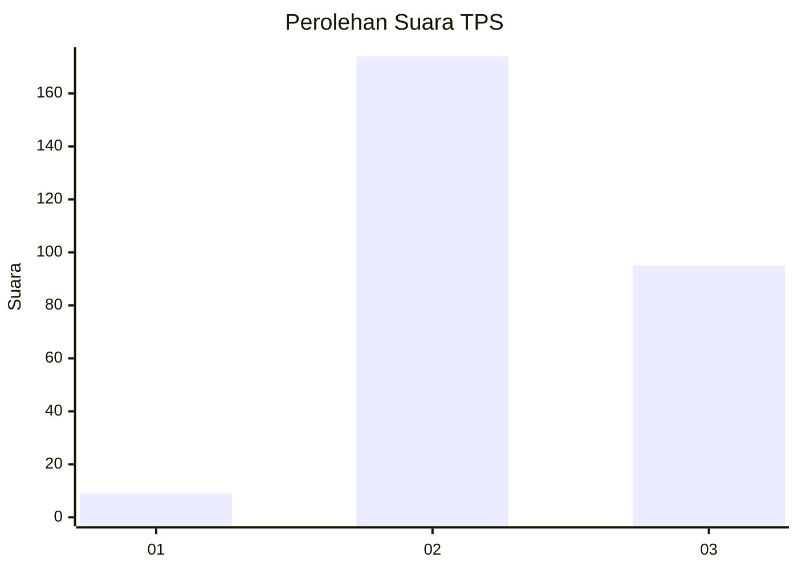
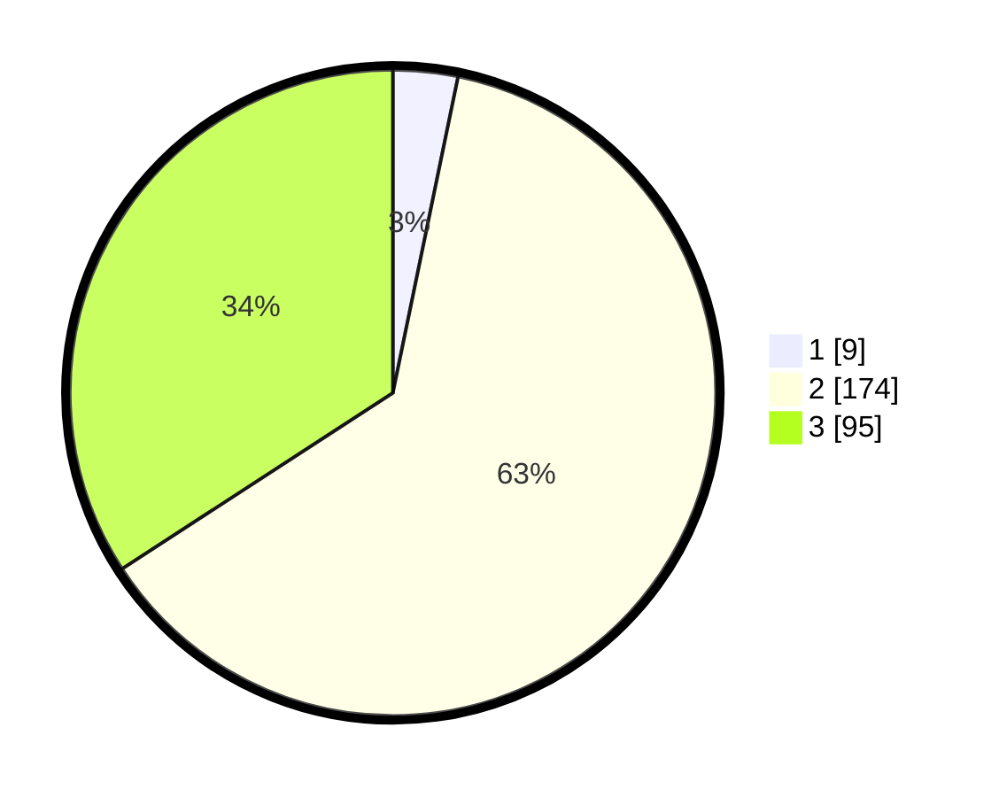

# Hasil

## Grafik

## Tabel

| No. | Nama Paslon    | Suara | Suara (raw) | Persentase |
|:--- |:-------------- | -----:| -----------:| ----------:|
| 1   | ANIES MUHAIMIN | 9     | [9][p-1]    | 3,24       |
| 2   | PRABOWO GIBRAN | 174   | [174][p-2]  | 62,59      |
| 3   | GANJAR MAHFUD  | 95    | [95][p-3]   | 34,17      |

[p-1]: https://github.com/gigit-pemilu/pemilu-2024-34-di-yogyakarta/blob/main/pilpres/hitung-suara/sub/34-di-yogyakarta/sub/02-bantul/sub/13-pleret/sub/2005-wonolelo/sub/003-tps/sub/paslon-1.txt
[p-2]: https://github.com/gigit-pemilu/pemilu-2024-34-di-yogyakarta/blob/main/pilpres/hitung-suara/sub/34-di-yogyakarta/sub/02-bantul/sub/13-pleret/sub/2005-wonolelo/sub/003-tps/sub/paslon-2.txt
[p-3]: https://github.com/gigit-pemilu/pemilu-2024-34-di-yogyakarta/blob/main/pilpres/hitung-suara/sub/34-di-yogyakarta/sub/02-bantul/sub/13-pleret/sub/2005-wonolelo/sub/003-tps/sub/paslon-3.txt

## Foto C Plano

https://sirekap-obj-formc.kpu.go.id/32c8/pemilu/ppwp/34/02/13/20/05/3402132005003-20240215-214119--84deb906-94e5-423b-9d72-2ca0e2f7a76c.jpg

https://sirekap-obj-formc.kpu.go.id/32c8/pemilu/ppwp/34/02/13/20/05/3402132005003-20240214-155840--aaf8a917-fb55-4893-bc11-a3551bb58940.jpg

https://sirekap-obj-formc.kpu.go.id/32c8/pemilu/ppwp/34/02/13/20/05/3402132005003-20240219-231817--6a53a8f9-410e-455f-85b7-e53e10dac146.jpg

## Metadata

| Key        | Value               |
| ---------- | ------------------- |
| Time Stamp | 2024-02-20 00:00:00 |

