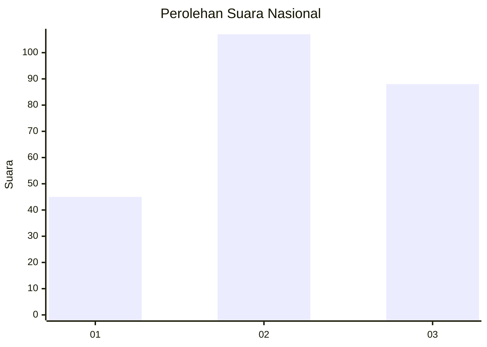
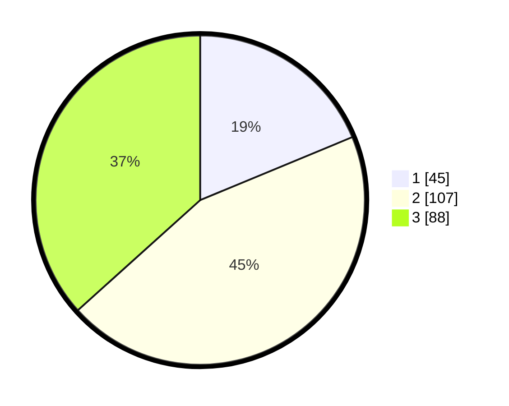

# Hasil

## Grafik

## Tabel

| No. | Nama Paslon    | Suara | Suara (raw) | Persentase |
|:--- |:-------------- | -----:| -----------:| ----------:|
| 1   | ANIES MUHAIMIN | 45    | [45][p-1]   | 18,75      |
| 2   | PRABOWO GIBRAN | 107   | [107][p-2]  | 44,58      |
| 3   | GANJAR MAHFUD  | 88    | [88][p-3]   | 36,67      |

[p-1]: https://github.com/gigit-pemilu/pemilu-2024/blob/main/pilpres/hitung-suara/sub/34-di-yogyakarta/sub/02-bantul/sub/13-pleret/sub/2005-wonolelo/sub/006-tps/sub/paslon-1.txt
[p-2]: https://github.com/gigit-pemilu/pemilu-2024/blob/main/pilpres/hitung-suara/sub/34-di-yogyakarta/sub/02-bantul/sub/13-pleret/sub/2005-wonolelo/sub/006-tps/sub/paslon-2.txt
[p-3]: https://github.com/gigit-pemilu/pemilu-2024/blob/main/pilpres/hitung-suara/sub/34-di-yogyakarta/sub/02-bantul/sub/13-pleret/sub/2005-wonolelo/sub/006-tps/sub/paslon-3.txt

## Foto C Plano

https://sirekap-obj-formc.kpu.go.id/4010/pemilu/ppwp/34/02/13/20/05/3402132005006-20240216-065010--6c8ff887-752e-4875-815c-343be750b2d7.jpg

https://sirekap-obj-formc.kpu.go.id/4010/pemilu/ppwp/34/02/13/20/05/3402132005006-20240215-040653--d2878dce-32df-4e38-ae12-4bfc0b6d97db.jpg

https://sirekap-obj-formc.kpu.go.id/4010/pemilu/ppwp/34/02/13/20/05/3402132005006-20240215-040713--b495eeaf-e0c8-49a7-951e-91983aaee9d5.jpg

## Metadata

| Key        | Value               |
| ---------- | ------------------- |
| Time Stamp | 2024-02-25 17:00:00 |

