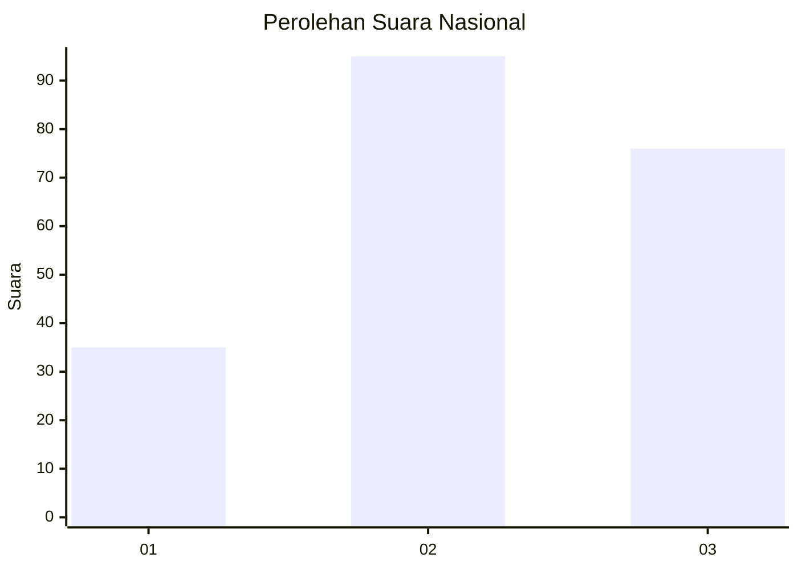
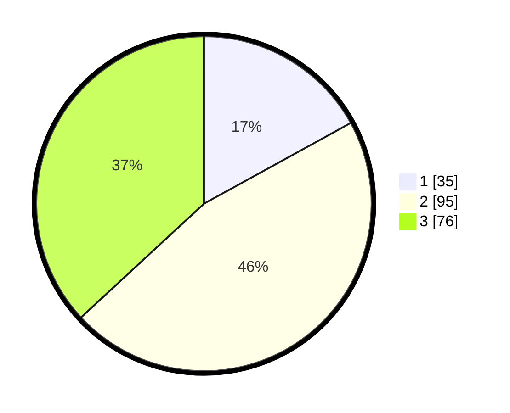

# Hasil

## Grafik

## Tabel

| No. | Nama Paslon    | Suara | Suara (raw) | Persentase |
|:--- |:-------------- | -----:| -----------:| ----------:|
| 1   | ANIES MUHAIMIN | 35    | [35][p-1]   | 16,99      |
| 2   | PRABOWO GIBRAN | 95    | [95][p-2]   | 46,12      |
| 3   | GANJAR MAHFUD  | 76    | [76][p-3]   | 36,89      |

[p-1]: https://github.com/gigit-pemilu/pemilu-2024/blob/main/pilpres/hitung-suara/sub/34-di-yogyakarta/sub/02-bantul/sub/14-piyungan/sub/2001-sitimulyo/sub/001-tps/sub/paslon-1.txt
[p-2]: https://github.com/gigit-pemilu/pemilu-2024/blob/main/pilpres/hitung-suara/sub/34-di-yogyakarta/sub/02-bantul/sub/14-piyungan/sub/2001-sitimulyo/sub/001-tps/sub/paslon-2.txt
[p-3]: https://github.com/gigit-pemilu/pemilu-2024/blob/main/pilpres/hitung-suara/sub/34-di-yogyakarta/sub/02-bantul/sub/14-piyungan/sub/2001-sitimulyo/sub/001-tps/sub/paslon-3.txt

## Foto C Plano

https://sirekap-obj-formc.kpu.go.id/a367/pemilu/ppwp/34/02/14/20/01/3402142001001-20240216-092323--1d2ce913-6bc4-40b7-a4f8-51935f57da5d.jpg

https://sirekap-obj-formc.kpu.go.id/a367/pemilu/ppwp/34/02/14/20/01/3402142001001-20240216-084743--791f759a-200f-4e78-ba9f-eff70bcc4db7.jpg

https://sirekap-obj-formc.kpu.go.id/a367/pemilu/ppwp/34/02/14/20/01/3402142001001-20240216-084742--a560fe6f-ba5e-43d3-84b8-4664320d027a.jpg

## Metadata

| Key        | Value               |
| ---------- | ------------------- |
| Time Stamp | 2024-02-21 22:00:00 |

## DATA PEMILIH TETAP

Jumlah pemilih dalam DPT: **230**.
 * L: **110**.
 * P: **120**.

## DATA PENGGUNA HAK PILIH

Jumlah pengguna hak pilih dalam DPT: **205**.
 * L: **91**.
 * P: **114**.

Jumlah pengguna hak pilih dalam DPTb: **4**.
 * L: **4**.
 * P: **0**.

Jumlah pengguna hak pilih dalam DPK: **0**.
 * L: **0**.
 * P: **0**.

Jumlah pengguna hak pilih: **209**.
 * L: **95**.
 * P: **114**.

## JUMLAH SUARA SAH DAN TIDAK SAH

JUMLAH SELURUH SUARA SAH: **206**.

JUMLAH SUARA TIDAK SAH: **3**.

JUMLAH SELURUH SUARA SAH DAN SUARA TIDAK SAH: **209**.

