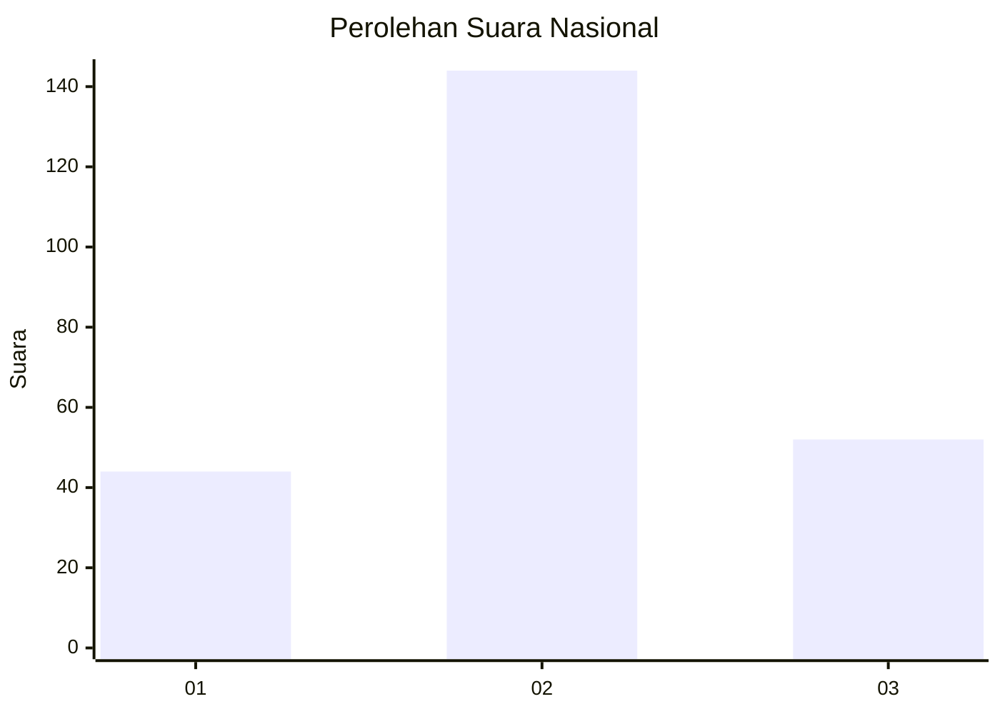
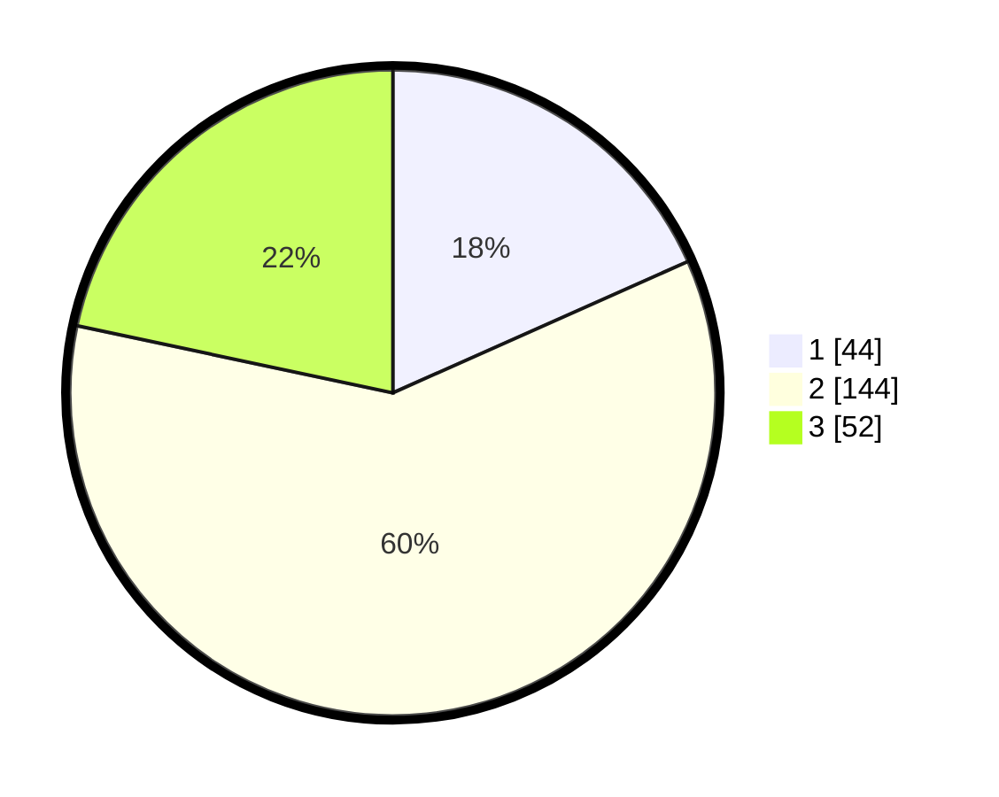

# Hasil

## Grafik

## Tabel

| No. | Nama Paslon    | Suara | Suara (raw) | Persentase |
|:--- |:-------------- | -----:| -----------:| ----------:|
| 1   | ANIES MUHAIMIN | 44    | [44][p-1]   | 18,33      |
| 2   | PRABOWO GIBRAN | 144   | [144][p-2]  | 60,00      |
| 3   | GANJAR MAHFUD  | 52    | [52][p-3]   | 21,67      |

[p-1]: https://github.com/gigit-pemilu/pemilu-2024/blob/main/pilpres/hitung-suara/sub/34-di-yogyakarta/sub/02-bantul/sub/14-piyungan/sub/2001-sitimulyo/sub/002-tps/sub/paslon-1.txt
[p-2]: https://github.com/gigit-pemilu/pemilu-2024/blob/main/pilpres/hitung-suara/sub/34-di-yogyakarta/sub/02-bantul/sub/14-piyungan/sub/2001-sitimulyo/sub/002-tps/sub/paslon-2.txt
[p-3]: https://github.com/gigit-pemilu/pemilu-2024/blob/main/pilpres/hitung-suara/sub/34-di-yogyakarta/sub/02-bantul/sub/14-piyungan/sub/2001-sitimulyo/sub/002-tps/sub/paslon-3.txt

## Foto C Plano

https://sirekap-obj-formc.kpu.go.id/af06/pemilu/ppwp/34/02/14/20/01/3402142001002-20240215-205231--7110a756-475b-4b34-a194-6ef42e2a62b0.jpg

https://sirekap-obj-formc.kpu.go.id/af06/pemilu/ppwp/34/02/14/20/01/3402142001002-20240215-205233--e9725d7f-a557-4752-94d4-aba81997dfb2.jpg

https://sirekap-obj-formc.kpu.go.id/af06/pemilu/ppwp/34/02/14/20/01/3402142001002-20240215-205233--06ebca9b-0c12-4111-8c8c-31c187c10913.jpg

## Metadata

| Key        | Value               |
| ---------- | ------------------- |
| Time Stamp | 2024-02-15 21:30:27 |

## DATA PEMILIH TETAP

Jumlah pemilih dalam DPT: **264**.
 * L: **123**.
 * P: **141**.

## DATA PENGGUNA HAK PILIH

Jumlah pengguna hak pilih dalam DPT: **238**.
 * L: **131**.
 * P: **107**.

Jumlah pengguna hak pilih dalam DPTb: **5**.
 * L: **3**.
 * P: **2**.

Jumlah pengguna hak pilih dalam DPK: **6**.
 * L: **2**.
 * P: **4**.

Jumlah pengguna hak pilih: **249**.
 * L: **136**.
 * P: **113**.

## JUMLAH SUARA SAH DAN TIDAK SAH

JUMLAH SELURUH SUARA SAH: **240**.

JUMLAH SUARA TIDAK SAH: **9**.

JUMLAH SELURUH SUARA SAH DAN SUARA TIDAK SAH: **249**.

