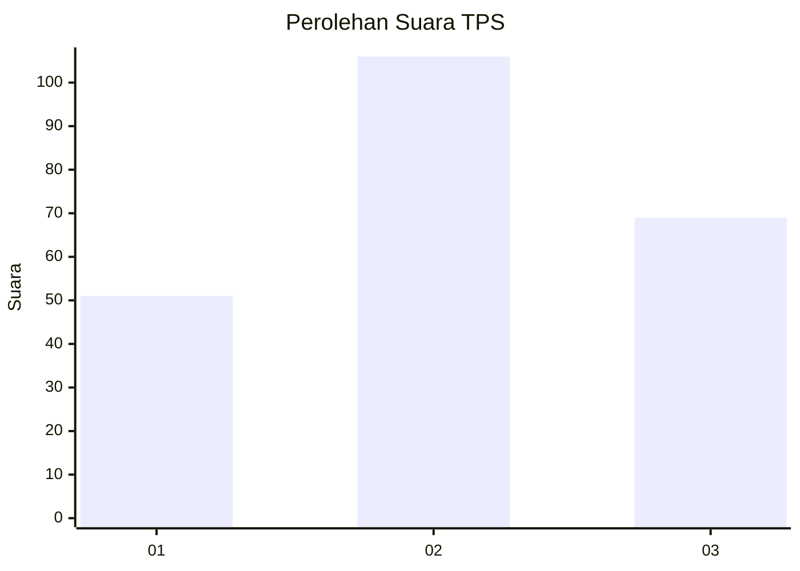
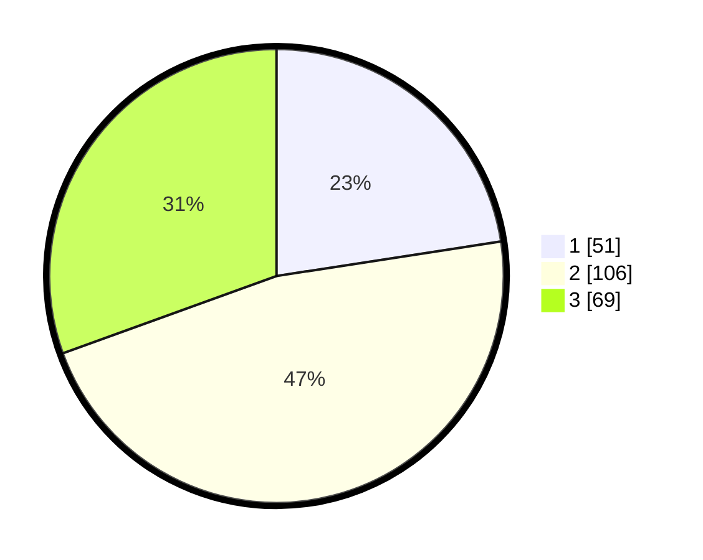

# Hasil

## Grafik

## Tabel

| No. | Nama Paslon    | Suara | Suara (raw) | Persentase |
|:--- |:-------------- | -----:| -----------:| ----------:|
| 1   | ANIES MUHAIMIN | 51    | [51][p-1]   | 22,57      |
| 2   | PRABOWO GIBRAN | 106   | [106][p-2]  | 46,90      |
| 3   | GANJAR MAHFUD  | 69    | [69][p-3]   | 30,53      |

[p-1]: https://github.com/gigit-pemilu/pemilu-2024-34-di-yogyakarta/blob/main/pilpres/hitung-suara/sub/34-di-yogyakarta/sub/02-bantul/sub/14-piyungan/sub/2001-sitimulyo/sub/003-tps/sub/paslon-1.txt
[p-2]: https://github.com/gigit-pemilu/pemilu-2024-34-di-yogyakarta/blob/main/pilpres/hitung-suara/sub/34-di-yogyakarta/sub/02-bantul/sub/14-piyungan/sub/2001-sitimulyo/sub/003-tps/sub/paslon-2.txt
[p-3]: https://github.com/gigit-pemilu/pemilu-2024-34-di-yogyakarta/blob/main/pilpres/hitung-suara/sub/34-di-yogyakarta/sub/02-bantul/sub/14-piyungan/sub/2001-sitimulyo/sub/003-tps/sub/paslon-3.txt

## Foto C Plano

https://sirekap-obj-formc.kpu.go.id/df02/pemilu/ppwp/34/02/14/20/01/3402142001003-20240216-010812--3410b80f-cd3f-4562-b845-16d8a671a32d.jpg

https://sirekap-obj-formc.kpu.go.id/df02/pemilu/ppwp/34/02/14/20/01/3402142001003-20240216-010826--83c9efdb-42ca-4861-b03a-d275aead0a0b.jpg

https://sirekap-obj-formc.kpu.go.id/df02/pemilu/ppwp/34/02/14/20/01/3402142001003-20240216-010820--e436af3a-8010-4716-a5bd-5e873ee4ba4f.jpg

## Metadata

| Key        | Value               |
| ---------- | ------------------- |
| Time Stamp | 2024-02-21 18:00:00 |

## DATA PEMILIH TETAP

Jumlah pemilih dalam DPT: **265**.
 * L: **125**.
 * P: **140**.

## DATA PENGGUNA HAK PILIH

Jumlah pengguna hak pilih dalam DPT: **223**.
 * L: **101**.
 * P: **122**.

Jumlah pengguna hak pilih dalam DPTb: **8**.
 * L: **6**.
 * P: **2**.

Jumlah pengguna hak pilih dalam DPK: **2**.
 * L: **1**.
 * P: **1**.

Jumlah pengguna hak pilih: **233**.
 * L: **108**.
 * P: **125**.

## JUMLAH SUARA SAH DAN TIDAK SAH

JUMLAH SELURUH SUARA SAH: **226**.

JUMLAH SUARA TIDAK SAH: **7**.

JUMLAH SELURUH SUARA SAH DAN SUARA TIDAK SAH: **233**.

