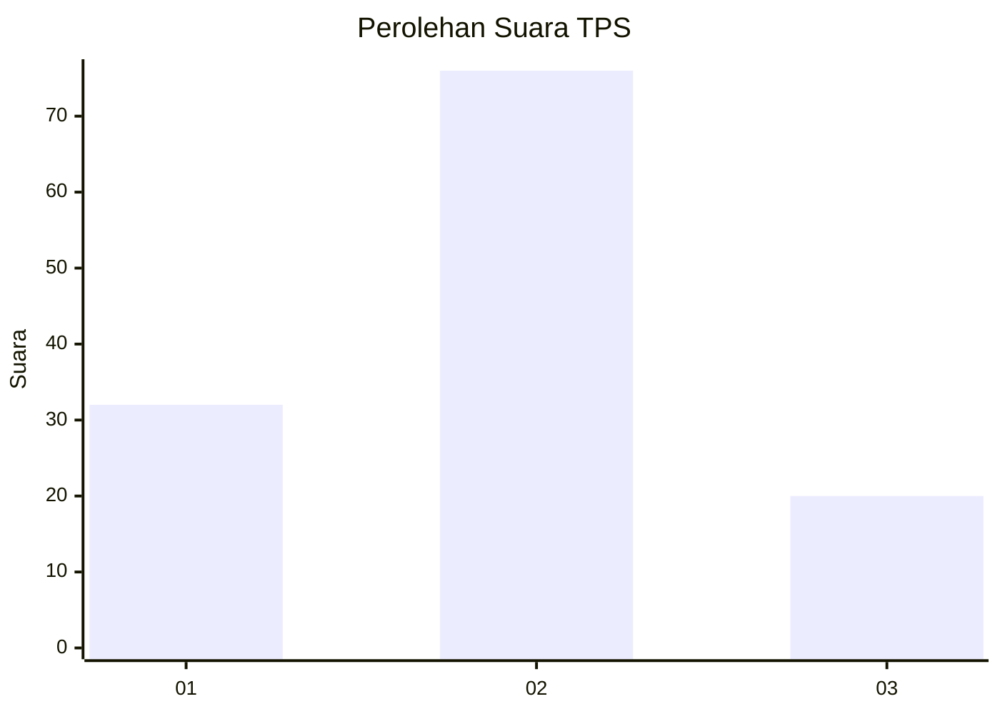
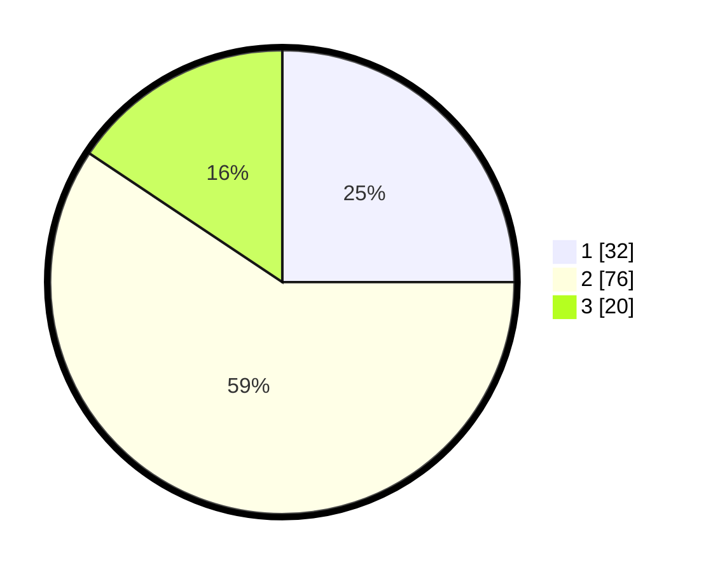

# Hasil

## Grafik

## Tabel

| No. | Nama Paslon    | Suara | Suara (raw) | Persentase |
|:--- |:-------------- | -----:| -----------:| ----------:|
| 1   | ANIES MUHAIMIN | 32    | [32][p-1]   | 25,00      |
| 2   | PRABOWO GIBRAN | 76    | [76][p-2]   | 59,38      |
| 3   | GANJAR MAHFUD  | 20    | [20][p-3]   | 15,63      |

[p-1]: https://github.com/gigit-pemilu/pemilu-2024-34-di-yogyakarta/blob/main/pilpres/hitung-suara/sub/34-di-yogyakarta/sub/02-bantul/sub/14-piyungan/sub/2001-sitimulyo/sub/004-tps/sub/paslon-1.txt
[p-2]: https://github.com/gigit-pemilu/pemilu-2024-34-di-yogyakarta/blob/main/pilpres/hitung-suara/sub/34-di-yogyakarta/sub/02-bantul/sub/14-piyungan/sub/2001-sitimulyo/sub/004-tps/sub/paslon-2.txt
[p-3]: https://github.com/gigit-pemilu/pemilu-2024-34-di-yogyakarta/blob/main/pilpres/hitung-suara/sub/34-di-yogyakarta/sub/02-bantul/sub/14-piyungan/sub/2001-sitimulyo/sub/004-tps/sub/paslon-3.txt

## Foto C Plano

https://sirekap-obj-formc.kpu.go.id/fa25/pemilu/ppwp/34/02/14/20/01/3402142001004-20240214-203440--0b157ddf-1b3f-4659-a08b-3e2aad2d1d71.jpg

https://sirekap-obj-formc.kpu.go.id/fa25/pemilu/ppwp/34/02/14/20/01/3402142001004-20240214-212233--4d0b9ce5-92d3-474d-8358-f9706a8174fa.jpg

https://sirekap-obj-formc.kpu.go.id/fa25/pemilu/ppwp/34/02/14/20/01/3402142001004-20240214-230000--05655700-265e-457e-8152-c1443789c29e.jpg

## Metadata

| Key        | Value               |
| ---------- | ------------------- |
| Time Stamp | 2024-02-15 00:41:44 |

