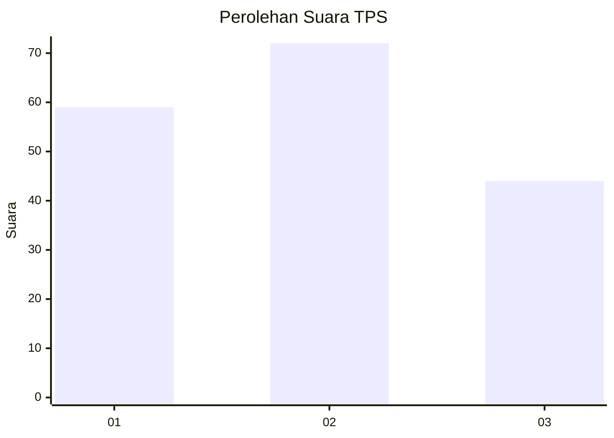
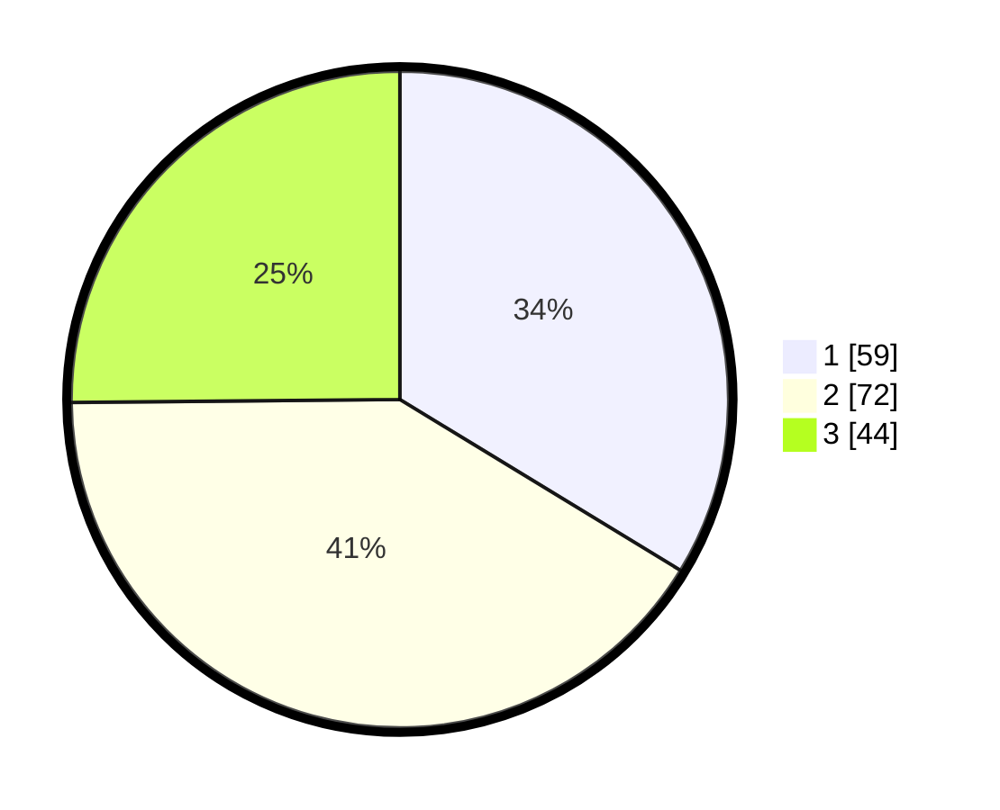

# Hasil

## Grafik

## Tabel

| No. | Nama Paslon    | Suara | Suara (raw) | Persentase |
|:--- |:-------------- | -----:| -----------:| ----------:|
| 1   | ANIES MUHAIMIN | 59    | [59][p-1]   | 33,71      |
| 2   | PRABOWO GIBRAN | 72    | [72][p-2]   | 41,14      |
| 3   | GANJAR MAHFUD  | 44    | [44][p-3]   | 25,14      |

[p-1]: https://github.com/gigit-pemilu/pemilu-2024-34-di-yogyakarta/blob/main/pilpres/hitung-suara/sub/34-di-yogyakarta/sub/02-bantul/sub/14-piyungan/sub/2001-sitimulyo/sub/005-tps/sub/paslon-1.txt
[p-2]: https://github.com/gigit-pemilu/pemilu-2024-34-di-yogyakarta/blob/main/pilpres/hitung-suara/sub/34-di-yogyakarta/sub/02-bantul/sub/14-piyungan/sub/2001-sitimulyo/sub/005-tps/sub/paslon-2.txt
[p-3]: https://github.com/gigit-pemilu/pemilu-2024-34-di-yogyakarta/blob/main/pilpres/hitung-suara/sub/34-di-yogyakarta/sub/02-bantul/sub/14-piyungan/sub/2001-sitimulyo/sub/005-tps/sub/paslon-3.txt

## Foto C Plano

https://sirekap-obj-formc.kpu.go.id/39a1/pemilu/ppwp/34/02/14/20/01/3402142001005-20240215-234236--ce0c5770-47b7-4781-891b-f9369392d0be.jpg

https://sirekap-obj-formc.kpu.go.id/39a1/pemilu/ppwp/34/02/14/20/01/3402142001005-20240215-234238--e30afa5e-473c-449d-95fc-a3d842bb20ed.jpg

https://sirekap-obj-formc.kpu.go.id/39a1/pemilu/ppwp/34/02/14/20/01/3402142001005-20240215-234237--f57bf94b-227d-4555-8341-2ba5c089d5cf.jpg

## Metadata

| Key        | Value               |
| ---------- | ------------------- |
| Time Stamp | 2024-02-21 16:00:00 |

## DATA PEMILIH TETAP

Jumlah pemilih dalam DPT: **208**.
 * L: **102**.
 * P: **106**.

## DATA PENGGUNA HAK PILIH

Jumlah pengguna hak pilih dalam DPT: **174**.
 * L: **80**.
 * P: **94**.

Jumlah pengguna hak pilih dalam DPTb: **3**.
 * L: **3**.
 * P: **0**.

Jumlah pengguna hak pilih dalam DPK: **1**.
 * L: **0**.
 * P: **1**.

Jumlah pengguna hak pilih: **178**.
 * L: **83**.
 * P: **95**.

## JUMLAH SUARA SAH DAN TIDAK SAH

JUMLAH SELURUH SUARA SAH: **175**.

JUMLAH SUARA TIDAK SAH: **3**.

JUMLAH SELURUH SUARA SAH DAN SUARA TIDAK SAH: **178**.

