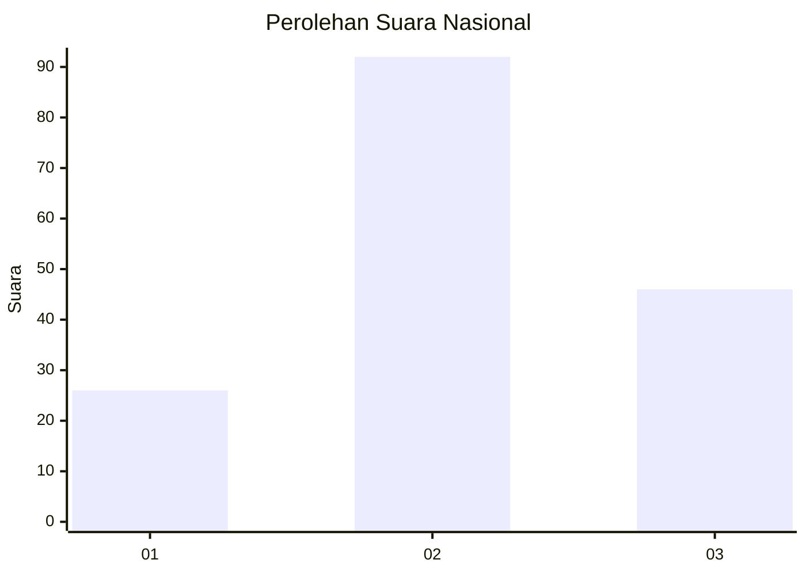
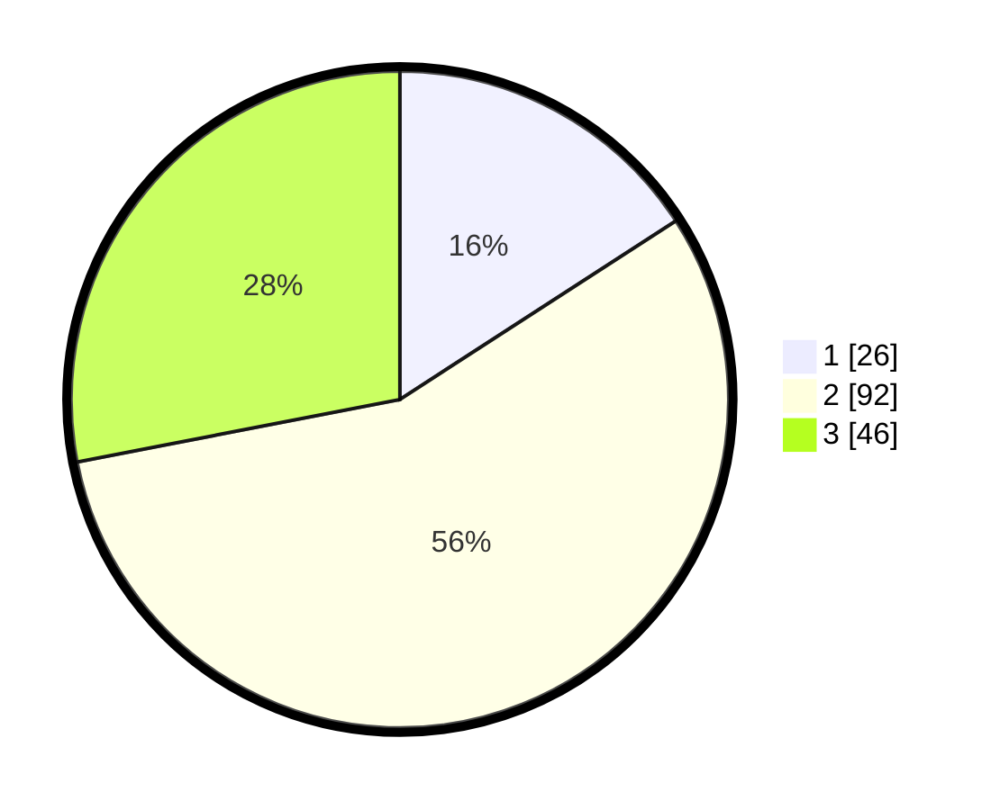

# Hasil

## Grafik

## Tabel

| No. | Nama Paslon    | Suara | Suara (raw) | Persentase |
|:--- |:-------------- | -----:| -----------:| ----------:|
| 1   | ANIES MUHAIMIN | 26    | [26][p-1]   | 15,85      |
| 2   | PRABOWO GIBRAN | 92    | [92][p-2]   | 56,10      |
| 3   | GANJAR MAHFUD  | 46    | [46][p-3]   | 28,05      |

[p-1]: https://github.com/gigit-pemilu/pemilu-2024/blob/main/pilpres/hitung-suara/sub/34-di-yogyakarta/sub/02-bantul/sub/14-piyungan/sub/2001-sitimulyo/sub/016-tps/sub/paslon-1.txt
[p-2]: https://github.com/gigit-pemilu/pemilu-2024/blob/main/pilpres/hitung-suara/sub/34-di-yogyakarta/sub/02-bantul/sub/14-piyungan/sub/2001-sitimulyo/sub/016-tps/sub/paslon-2.txt
[p-3]: https://github.com/gigit-pemilu/pemilu-2024/blob/main/pilpres/hitung-suara/sub/34-di-yogyakarta/sub/02-bantul/sub/14-piyungan/sub/2001-sitimulyo/sub/016-tps/sub/paslon-3.txt

## Foto C Plano

https://sirekap-obj-formc.kpu.go.id/0cfa/pemilu/ppwp/34/02/14/20/01/3402142001016-20240214-141700--d6d13e90-12e6-4349-82a1-8d8d51d43ac4.jpg

https://sirekap-obj-formc.kpu.go.id/0cfa/pemilu/ppwp/34/02/14/20/01/3402142001016-20240215-014313--32bbb2b3-f4b8-49af-9db9-44bb83501387.jpg

https://sirekap-obj-formc.kpu.go.id/0cfa/pemilu/ppwp/34/02/14/20/01/3402142001016-20240215-014320--59a7f47e-751c-4d06-a287-dd3c857442eb.jpg

## Metadata

| Key        | Value               |
| ---------- | ------------------- |
| Time Stamp | 2024-02-15 15:00:29 |

