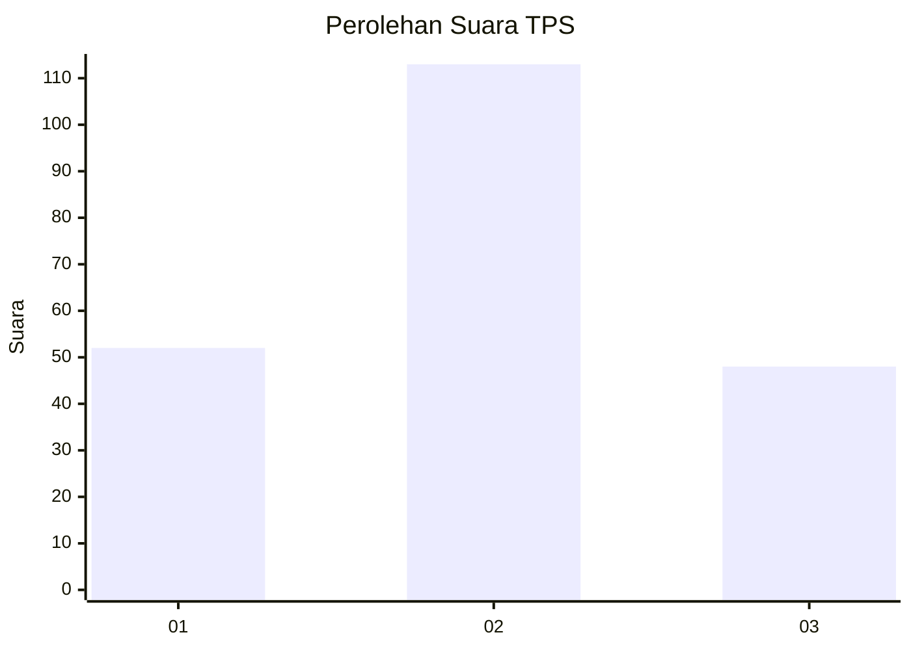
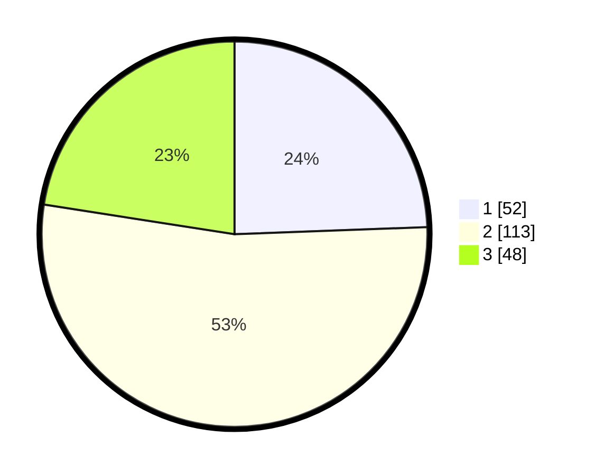

# Hasil

## Grafik

## Tabel

| No. | Nama Paslon    | Suara | Suara (raw) | Persentase |
|:--- |:-------------- | -----:| -----------:| ----------:|
| 1   | ANIES MUHAIMIN | 52    | [52][p-1]   | 24,41      |
| 2   | PRABOWO GIBRAN | 113   | [113][p-2]  | 53,05      |
| 3   | GANJAR MAHFUD  | 48    | [48][p-3]   | 22,54      |

[p-1]: https://github.com/gigit-pemilu/pemilu-2024-34-di-yogyakarta/blob/main/pilpres/hitung-suara/sub/34-di-yogyakarta/sub/02-bantul/sub/14-piyungan/sub/2001-sitimulyo/sub/025-tps/sub/paslon-1.txt
[p-2]: https://github.com/gigit-pemilu/pemilu-2024-34-di-yogyakarta/blob/main/pilpres/hitung-suara/sub/34-di-yogyakarta/sub/02-bantul/sub/14-piyungan/sub/2001-sitimulyo/sub/025-tps/sub/paslon-2.txt
[p-3]: https://github.com/gigit-pemilu/pemilu-2024-34-di-yogyakarta/blob/main/pilpres/hitung-suara/sub/34-di-yogyakarta/sub/02-bantul/sub/14-piyungan/sub/2001-sitimulyo/sub/025-tps/sub/paslon-3.txt

## Foto C Plano

https://sirekap-obj-formc.kpu.go.id/f737/pemilu/ppwp/34/02/14/20/01/3402142001025-20240215-005800--581231af-d15d-4310-8ae8-db287b2f3a06.jpg

https://sirekap-obj-formc.kpu.go.id/f737/pemilu/ppwp/34/02/14/20/01/3402142001025-20240215-010038--3ac08de6-fdff-400b-91d8-31c32ae13f94.jpg

https://sirekap-obj-formc.kpu.go.id/f737/pemilu/ppwp/34/02/14/20/01/3402142001025-20240215-010134--79f3cbf8-89c2-427d-906d-784112d94c30.jpg

## Metadata

| Key        | Value               |
| ---------- | ------------------- |
| Time Stamp | 2024-02-24 22:31:28 |

