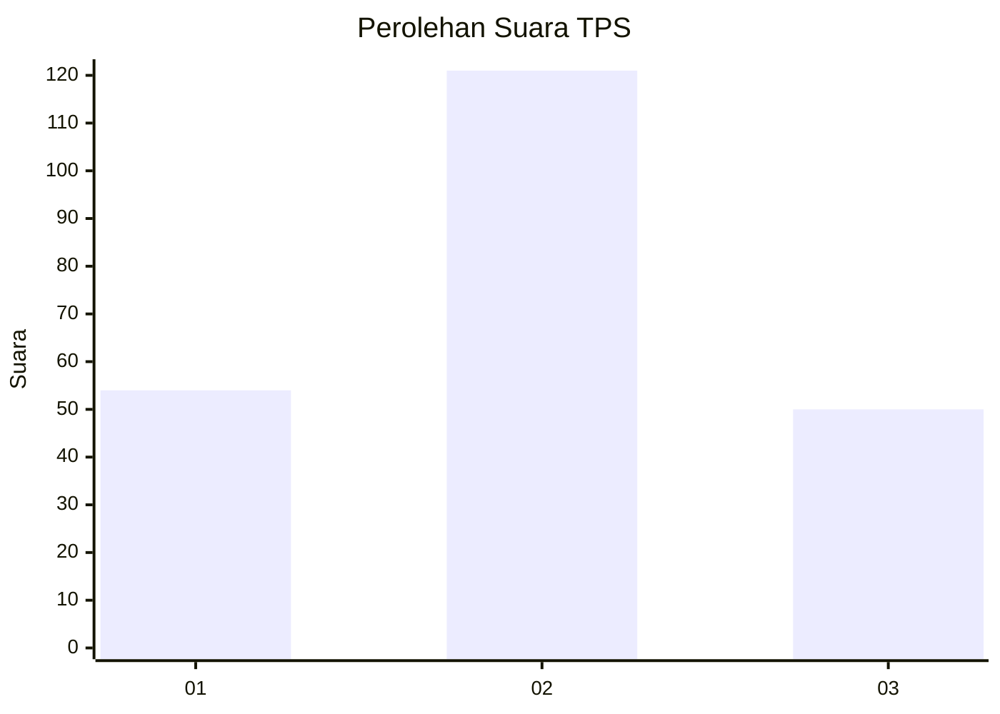
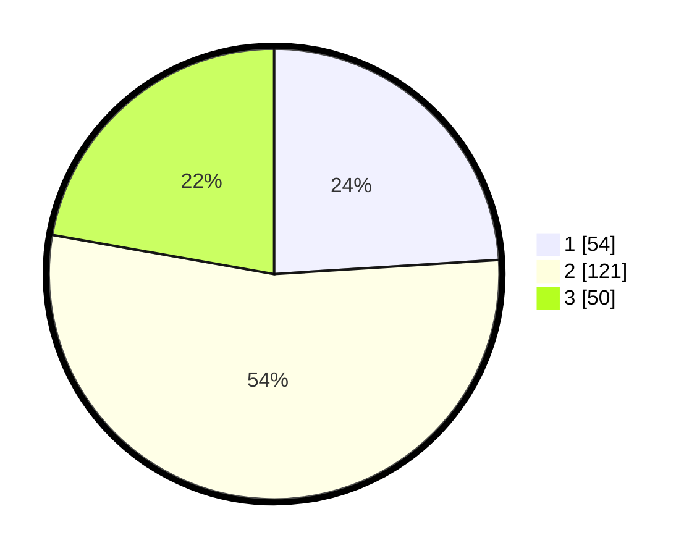

# Hasil

## Grafik

## Tabel

| No. | Nama Paslon    | Suara | Suara (raw) | Persentase |
|:--- |:-------------- | -----:| -----------:| ----------:|
| 1   | ANIES MUHAIMIN | 54    | [54][p-1]   | 24,00      |
| 2   | PRABOWO GIBRAN | 121   | [121][p-2]  | 53,78      |
| 3   | GANJAR MAHFUD  | 50    | [50][p-3]   | 22,22      |

[p-1]: https://github.com/gigit-pemilu/pemilu-2024-34-di-yogyakarta/blob/main/pilpres/hitung-suara/sub/34-di-yogyakarta/sub/02-bantul/sub/14-piyungan/sub/2001-sitimulyo/sub/026-tps/sub/paslon-1.txt
[p-2]: https://github.com/gigit-pemilu/pemilu-2024-34-di-yogyakarta/blob/main/pilpres/hitung-suara/sub/34-di-yogyakarta/sub/02-bantul/sub/14-piyungan/sub/2001-sitimulyo/sub/026-tps/sub/paslon-2.txt
[p-3]: https://github.com/gigit-pemilu/pemilu-2024-34-di-yogyakarta/blob/main/pilpres/hitung-suara/sub/34-di-yogyakarta/sub/02-bantul/sub/14-piyungan/sub/2001-sitimulyo/sub/026-tps/sub/paslon-3.txt

## Foto C Plano

https://sirekap-obj-formc.kpu.go.id/b6f8/pemilu/ppwp/34/02/14/20/01/3402142001026-20240215-003616--4e9b99ac-02c8-48d9-978f-f7324463e385.jpg

https://sirekap-obj-formc.kpu.go.id/b6f8/pemilu/ppwp/34/02/14/20/01/3402142001026-20240215-003720--d4b982b0-3ce6-4d0e-a303-d51c5405492a.jpg

https://sirekap-obj-formc.kpu.go.id/b6f8/pemilu/ppwp/34/02/14/20/01/3402142001026-20240215-003757--a136709c-8fb3-4f5d-b6d8-f1bd5b2be895.jpg

## Metadata

| Key        | Value               |
| ---------- | ------------------- |
| Time Stamp | 2024-02-25 16:00:00 |

