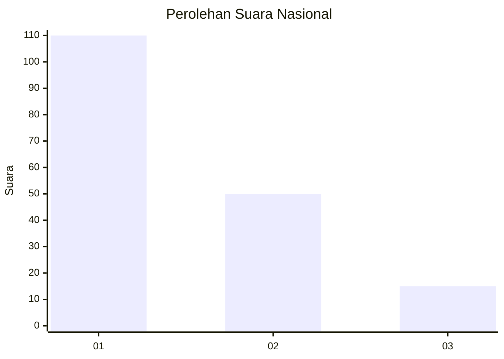
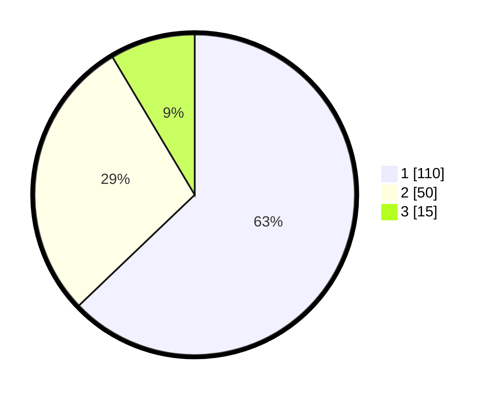

# Hasil

## Grafik

## Tabel

| No. | Nama Paslon    | Suara | Suara (raw) | Persentase |
|:--- |:-------------- | -----:| -----------:| ----------:|
| 1   | ANIES MUHAIMIN | 110   | [110][p-1]  | 62,86      |
| 2   | PRABOWO GIBRAN | 50    | [50][p-2]   | 28,57      |
| 3   | GANJAR MAHFUD  | 15    | [15][p-3]   | 8,57       |

[p-1]: https://github.com/gigit-pemilu/pemilu-2024/blob/main/pilpres/hitung-suara/sub/34-di-yogyakarta/sub/02-bantul/sub/14-piyungan/sub/2001-sitimulyo/sub/027-tps/sub/paslon-1.txt
[p-2]: https://github.com/gigit-pemilu/pemilu-2024/blob/main/pilpres/hitung-suara/sub/34-di-yogyakarta/sub/02-bantul/sub/14-piyungan/sub/2001-sitimulyo/sub/027-tps/sub/paslon-2.txt
[p-3]: https://github.com/gigit-pemilu/pemilu-2024/blob/main/pilpres/hitung-suara/sub/34-di-yogyakarta/sub/02-bantul/sub/14-piyungan/sub/2001-sitimulyo/sub/027-tps/sub/paslon-3.txt

## Foto C Plano

https://sirekap-obj-formc.kpu.go.id/6767/pemilu/ppwp/34/02/14/20/01/3402142001027-20240214-141708--e8015ec2-fb03-42b0-a27d-6371bbfcf88b.jpg

https://sirekap-obj-formc.kpu.go.id/6767/pemilu/ppwp/34/02/14/20/01/3402142001027-20240216-142235--f7d87142-ad9f-4385-b0f2-d2ef6c2b2d2a.jpg

https://sirekap-obj-formc.kpu.go.id/6767/pemilu/ppwp/34/02/14/20/01/3402142001027-20240216-142234--49451d5c-63e6-40ab-a204-85a237e4bd93.jpg

## Metadata

| Key        | Value               |
| ---------- | ------------------- |
| Time Stamp | 2024-02-21 16:00:00 |

