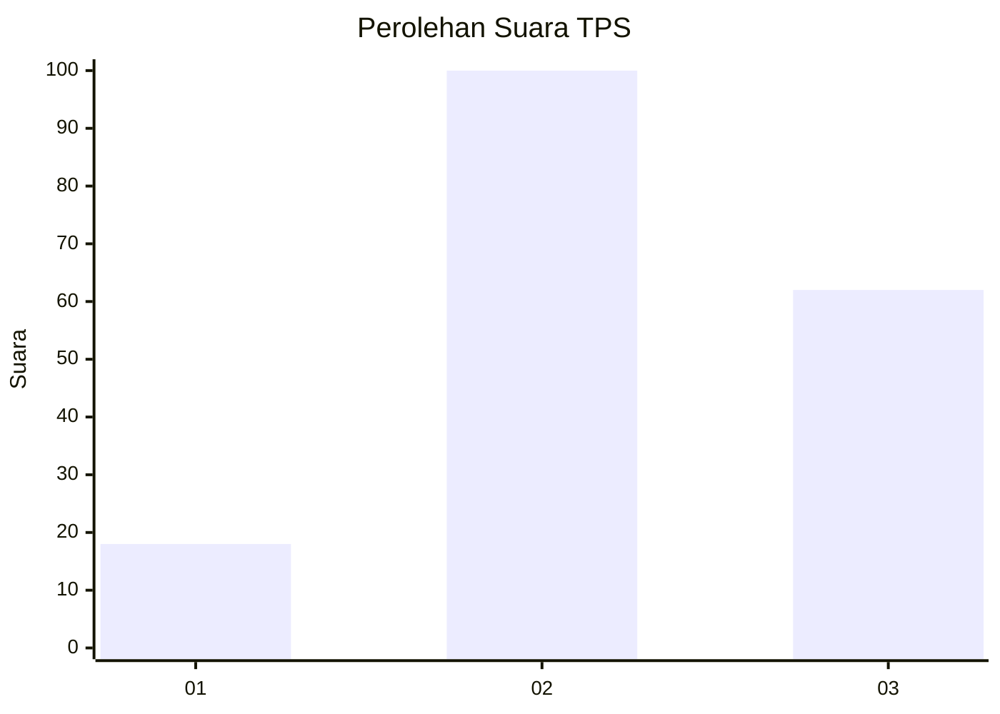
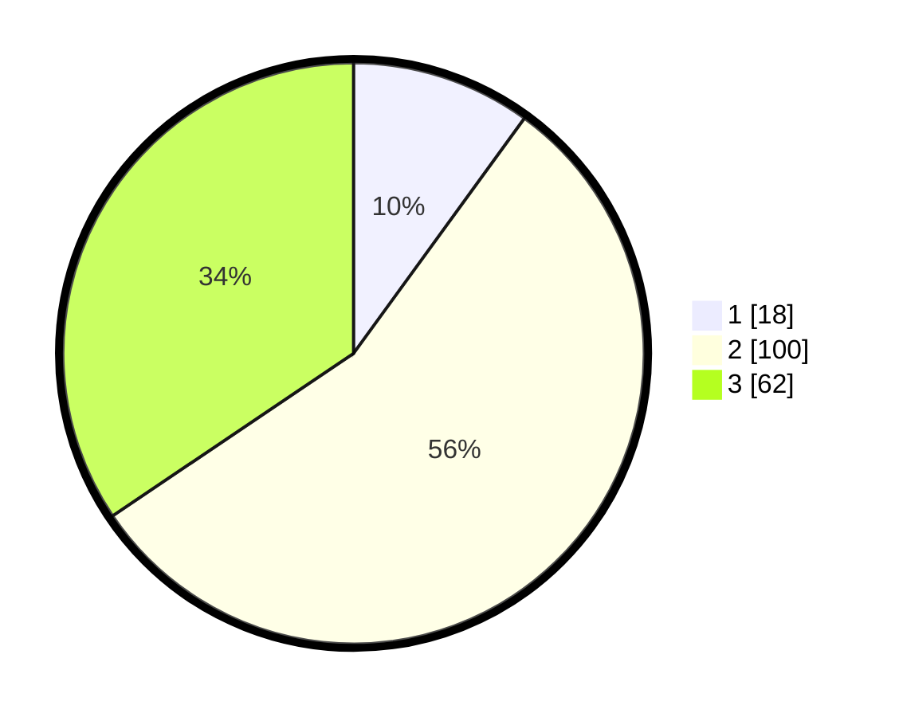

# Hasil

## Grafik

## Tabel

| No. | Nama Paslon    | Suara | Suara (raw) | Persentase |
|:--- |:-------------- | -----:| -----------:| ----------:|
| 1   | ANIES MUHAIMIN | 18    | [18][p-1]   | 10,00      |
| 2   | PRABOWO GIBRAN | 100   | [100][p-2]  | 55,56      |
| 3   | GANJAR MAHFUD  | 62    | [62][p-3]   | 34,44      |

[p-1]: https://github.com/gigit-pemilu/pemilu-2024-34-di-yogyakarta/blob/main/pilpres/hitung-suara/sub/34-di-yogyakarta/sub/02-bantul/sub/14-piyungan/sub/2001-sitimulyo/sub/039-tps/sub/paslon-1.txt
[p-2]: https://github.com/gigit-pemilu/pemilu-2024-34-di-yogyakarta/blob/main/pilpres/hitung-suara/sub/34-di-yogyakarta/sub/02-bantul/sub/14-piyungan/sub/2001-sitimulyo/sub/039-tps/sub/paslon-2.txt
[p-3]: https://github.com/gigit-pemilu/pemilu-2024-34-di-yogyakarta/blob/main/pilpres/hitung-suara/sub/34-di-yogyakarta/sub/02-bantul/sub/14-piyungan/sub/2001-sitimulyo/sub/039-tps/sub/paslon-3.txt

## Foto C Plano

https://sirekap-obj-formc.kpu.go.id/7038/pemilu/ppwp/34/02/14/20/01/3402142001039-20240214-224135--8b7f62c5-b054-49a5-bacd-e19213d8cd27.jpg

https://sirekap-obj-formc.kpu.go.id/7038/pemilu/ppwp/34/02/14/20/01/3402142001039-20240214-204042--2df915e1-e012-4fe4-b868-a5995d4376a6.jpg

https://sirekap-obj-formc.kpu.go.id/7038/pemilu/ppwp/34/02/14/20/01/3402142001039-20240214-204101--ebb0bae6-2773-4244-8b0f-55b903c89fc0.jpg

## Metadata

| Key        | Value               |
| ---------- | ------------------- |
| Time Stamp | 2024-02-15 09:00:24 |

