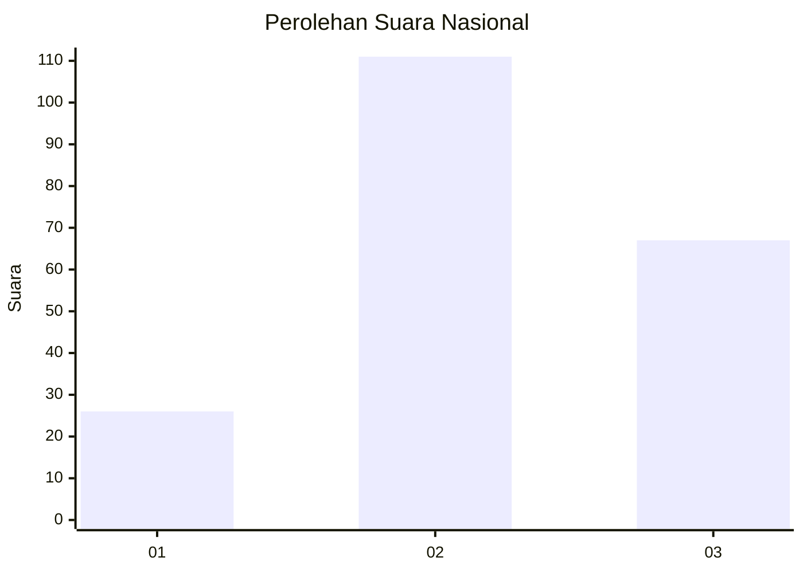
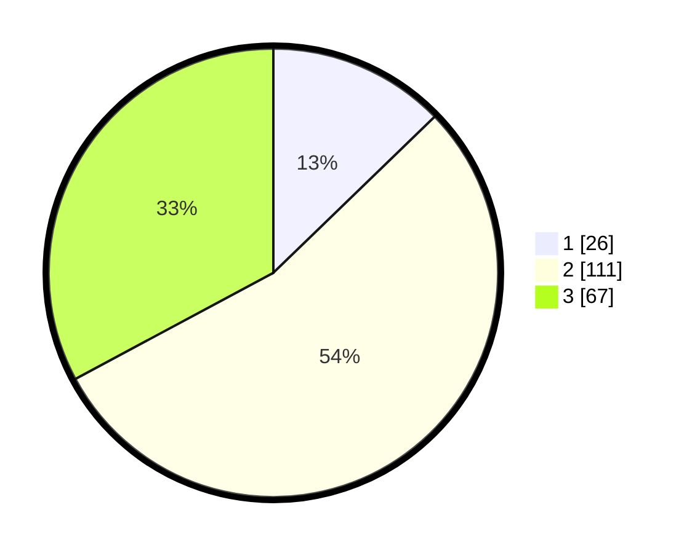

# Hasil

## Grafik

## Tabel

| No. | Nama Paslon    | Suara | Suara (raw) | Persentase |
|:--- |:-------------- | -----:| -----------:| ----------:|
| 1   | ANIES MUHAIMIN | 26    | [26][p-1]   | 12,75      |
| 2   | PRABOWO GIBRAN | 111   | [111][p-2]  | 54,41      |
| 3   | GANJAR MAHFUD  | 67    | [67][p-3]   | 32,84      |

[p-1]: https://github.com/gigit-pemilu/pemilu-2024/blob/main/pilpres/hitung-suara/sub/34-di-yogyakarta/sub/02-bantul/sub/14-piyungan/sub/2001-sitimulyo/sub/044-tps/sub/paslon-1.txt
[p-2]: https://github.com/gigit-pemilu/pemilu-2024/blob/main/pilpres/hitung-suara/sub/34-di-yogyakarta/sub/02-bantul/sub/14-piyungan/sub/2001-sitimulyo/sub/044-tps/sub/paslon-2.txt
[p-3]: https://github.com/gigit-pemilu/pemilu-2024/blob/main/pilpres/hitung-suara/sub/34-di-yogyakarta/sub/02-bantul/sub/14-piyungan/sub/2001-sitimulyo/sub/044-tps/sub/paslon-3.txt

## Foto C Plano

https://sirekap-obj-formc.kpu.go.id/7f9b/pemilu/ppwp/34/02/14/20/01/3402142001044-20240214-222825--9ea0016b-33ed-4355-a8ee-c9ed8930c5ff.jpg

https://sirekap-obj-formc.kpu.go.id/7f9b/pemilu/ppwp/34/02/14/20/01/3402142001044-20240214-222944--b41dcafe-0f5f-4bf1-bcd5-3c622da845bb.jpg

https://sirekap-obj-formc.kpu.go.id/7f9b/pemilu/ppwp/34/02/14/20/01/3402142001044-20240214-222459--7df4bbcf-fe95-4a89-8a95-e73de13a1524.jpg

## Metadata

| Key        | Value               |
| ---------- | ------------------- |
| Time Stamp | 2024-02-24 22:31:28 |

