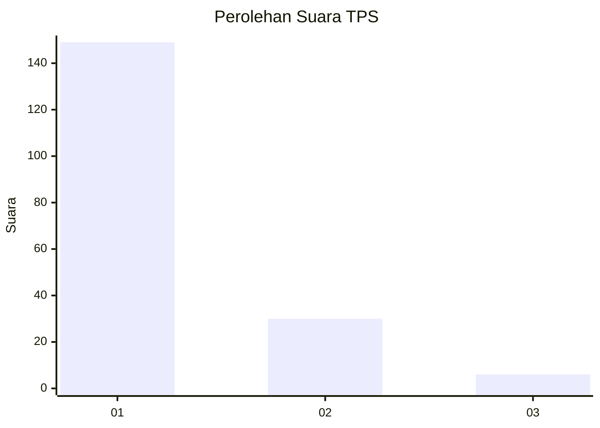
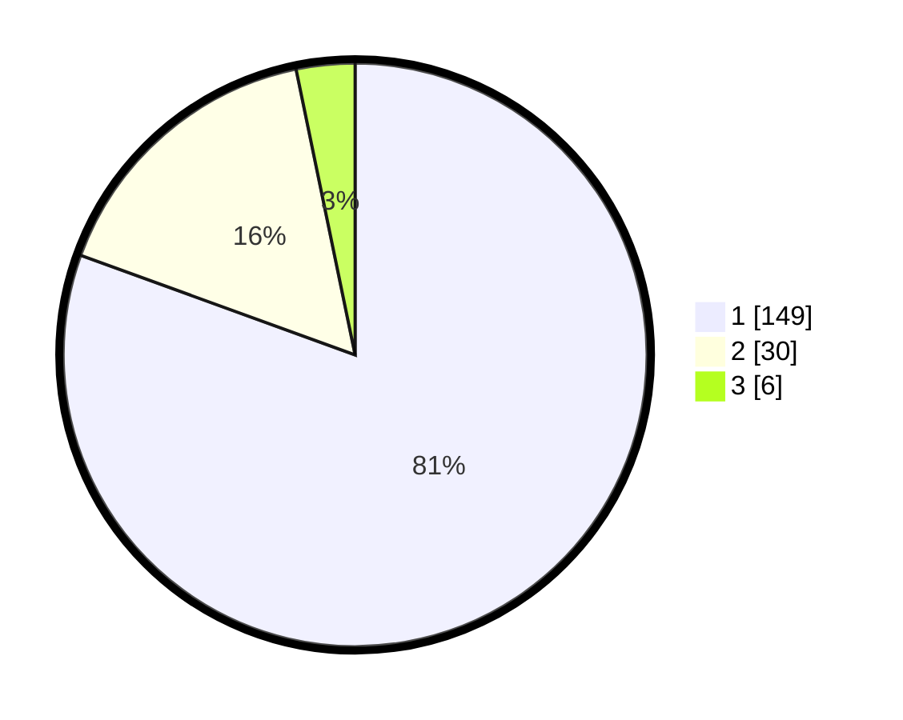

# Hasil

## Grafik

## Tabel

| No. | Nama Paslon    | Suara | Suara (raw) | Persentase |
|:--- |:-------------- | -----:| -----------:| ----------:|
| 1   | ANIES MUHAIMIN | 149   | [149][p-1]  | 80,54      |
| 2   | PRABOWO GIBRAN | 30    | [30][p-2]   | 16,22      |
| 3   | GANJAR MAHFUD  | 6     | [6][p-3]    | 3,24       |

[p-1]: https://github.com/gigit-pemilu/pemilu-2024-34-di-yogyakarta/blob/main/pilpres/hitung-suara/sub/34-di-yogyakarta/sub/02-bantul/sub/14-piyungan/sub/2001-sitimulyo/sub/901-tps/sub/paslon-1.txt
[p-2]: https://github.com/gigit-pemilu/pemilu-2024-34-di-yogyakarta/blob/main/pilpres/hitung-suara/sub/34-di-yogyakarta/sub/02-bantul/sub/14-piyungan/sub/2001-sitimulyo/sub/901-tps/sub/paslon-2.txt
[p-3]: https://github.com/gigit-pemilu/pemilu-2024-34-di-yogyakarta/blob/main/pilpres/hitung-suara/sub/34-di-yogyakarta/sub/02-bantul/sub/14-piyungan/sub/2001-sitimulyo/sub/901-tps/sub/paslon-3.txt

## Foto C Plano

https://sirekap-obj-formc.kpu.go.id/5e73/pemilu/ppwp/34/02/14/20/01/3402142001901-20240216-133220--49ebce13-48b7-4914-990b-8c18533366ce.jpg

https://sirekap-obj-formc.kpu.go.id/5e73/pemilu/ppwp/34/02/14/20/01/3402142001901-20240216-133221--827e7172-fc35-4114-a819-9f231621a428.jpg

https://sirekap-obj-formc.kpu.go.id/5e73/pemilu/ppwp/34/02/14/20/01/3402142001901-20240216-133221--d0662224-b6b9-477c-ba4a-f2a14eefd3bc.jpg

## Metadata

| Key        | Value               |
| ---------- | ------------------- |
| Time Stamp | 2024-02-21 21:00:04 |

## DATA PEMILIH TETAP

Jumlah pemilih dalam DPT: **217**.
 * L: **217**.
 * P: **0**.

## DATA PENGGUNA HAK PILIH

Jumlah pengguna hak pilih dalam DPT: **159**.
 * L: **159**.
 * P: **0**.

Jumlah pengguna hak pilih dalam DPTb: **29**.
 * L: **7**.
 * P: **22**.

Jumlah pengguna hak pilih dalam DPK: **0**.
 * L: **0**.
 * P: **0**.

Jumlah pengguna hak pilih: **188**.
 * L: **166**.
 * P: **22**.

## JUMLAH SUARA SAH DAN TIDAK SAH

JUMLAH SELURUH SUARA SAH: **185**.

JUMLAH SUARA TIDAK SAH: **3**.

JUMLAH SELURUH SUARA SAH DAN SUARA TIDAK SAH: **188**.

