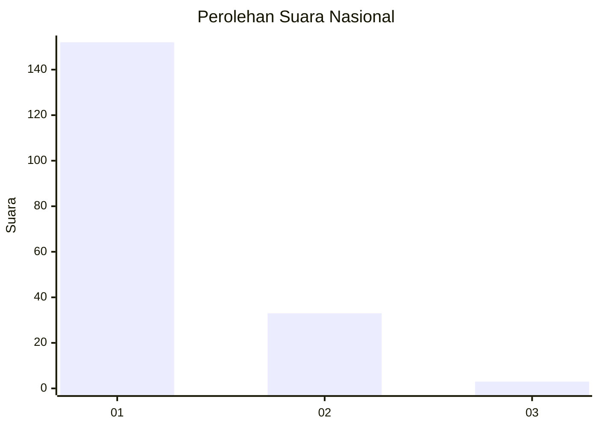
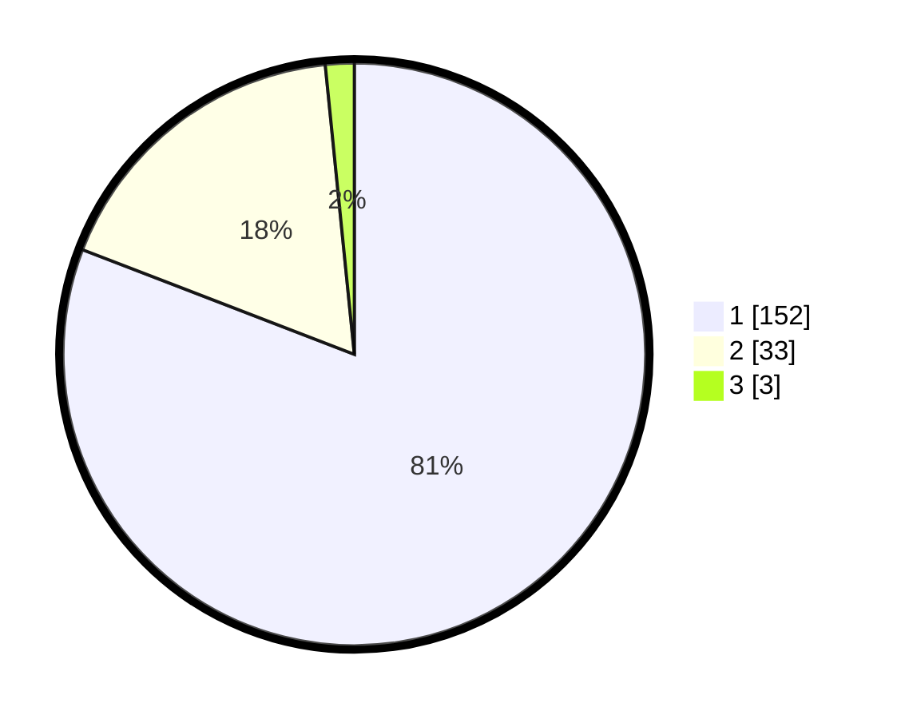

# Hasil

## Grafik

## Tabel

| No. | Nama Paslon    | Suara | Suara (raw) | Persentase |
|:--- |:-------------- | -----:| -----------:| ----------:|
| 1   | ANIES MUHAIMIN | 152   | [152][p-1]  | 80,85      |
| 2   | PRABOWO GIBRAN | 33    | [33][p-2]   | 17,55      |
| 3   | GANJAR MAHFUD  | 3     | [3][p-3]    | 1,60       |

[p-1]: https://github.com/gigit-pemilu/pemilu-2024/blob/main/pilpres/hitung-suara/sub/34-di-yogyakarta/sub/02-bantul/sub/14-piyungan/sub/2001-sitimulyo/sub/902-tps/sub/paslon-1.txt
[p-2]: https://github.com/gigit-pemilu/pemilu-2024/blob/main/pilpres/hitung-suara/sub/34-di-yogyakarta/sub/02-bantul/sub/14-piyungan/sub/2001-sitimulyo/sub/902-tps/sub/paslon-2.txt
[p-3]: https://github.com/gigit-pemilu/pemilu-2024/blob/main/pilpres/hitung-suara/sub/34-di-yogyakarta/sub/02-bantul/sub/14-piyungan/sub/2001-sitimulyo/sub/902-tps/sub/paslon-3.txt

## Foto C Plano

https://sirekap-obj-formc.kpu.go.id/1b2c/pemilu/ppwp/34/02/14/20/01/3402142001902-20240216-143134--e45f544a-afd0-476c-9fef-5f915594936f.jpg

https://sirekap-obj-formc.kpu.go.id/1b2c/pemilu/ppwp/34/02/14/20/01/3402142001902-20240216-143135--8cb68462-90d2-4210-a18d-2e5e71f285d2.jpg

https://sirekap-obj-formc.kpu.go.id/1b2c/pemilu/ppwp/34/02/14/20/01/3402142001902-20240216-143134--30ca6866-46dc-4554-96c1-24a24c36c542.jpg

## Metadata

| Key        | Value               |
| ---------- | ------------------- |
| Time Stamp | 2024-02-21 02:00:00 |

## DATA PEMILIH TETAP

Jumlah pemilih dalam DPT: **215**.
 * L: **215**.
 * P: **0**.

## DATA PENGGUNA HAK PILIH

Jumlah pengguna hak pilih dalam DPT: **173**.
 * L: **173**.
 * P: **0**.

Jumlah pengguna hak pilih dalam DPTb: **16**.
 * L: **4**.
 * P: **12**.

Jumlah pengguna hak pilih dalam DPK: **0**.
 * L: **0**.
 * P: **0**.

Jumlah pengguna hak pilih: **189**.
 * L: **177**.
 * P: **12**.

## JUMLAH SUARA SAH DAN TIDAK SAH

JUMLAH SELURUH SUARA SAH: **188**.

JUMLAH SUARA TIDAK SAH: **1**.

JUMLAH SELURUH SUARA SAH DAN SUARA TIDAK SAH: **189**.

