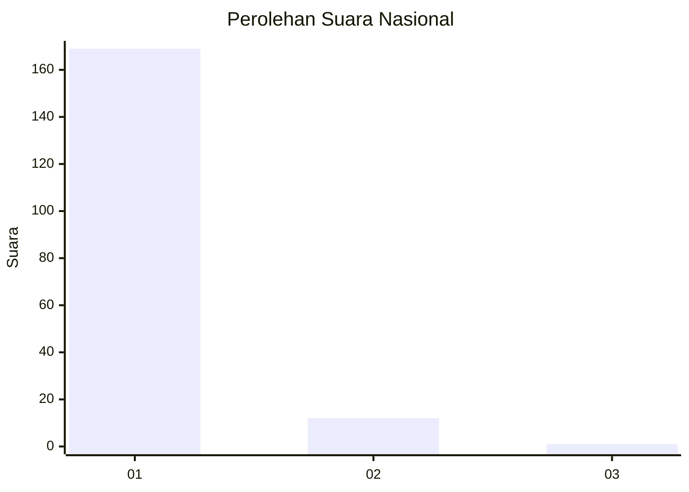
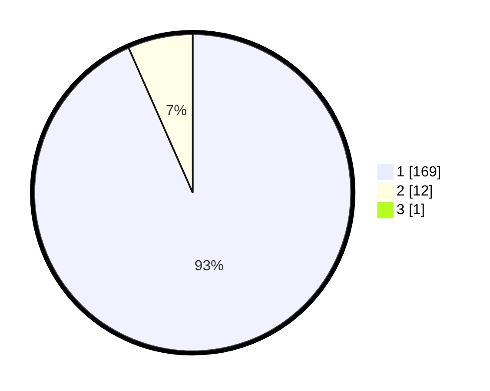

# Hasil

## Grafik

## Tabel

| No. | Nama Paslon    | Suara | Suara (raw) | Persentase |
|:--- |:-------------- | -----:| -----------:| ----------:|
| 1   | ANIES MUHAIMIN | 169   | [169][p-1]  | 92,86      |
| 2   | PRABOWO GIBRAN | 12    | [12][p-2]   | 6,59       |
| 3   | GANJAR MAHFUD  | 1     | [1][p-3]    | 0,55       |

[p-1]: https://github.com/gigit-pemilu/pemilu-2024/blob/main/pilpres/hitung-suara/sub/34-di-yogyakarta/sub/02-bantul/sub/14-piyungan/sub/2001-sitimulyo/sub/903-tps/sub/paslon-1.txt
[p-2]: https://github.com/gigit-pemilu/pemilu-2024/blob/main/pilpres/hitung-suara/sub/34-di-yogyakarta/sub/02-bantul/sub/14-piyungan/sub/2001-sitimulyo/sub/903-tps/sub/paslon-2.txt
[p-3]: https://github.com/gigit-pemilu/pemilu-2024/blob/main/pilpres/hitung-suara/sub/34-di-yogyakarta/sub/02-bantul/sub/14-piyungan/sub/2001-sitimulyo/sub/903-tps/sub/paslon-3.txt

## Foto C Plano

https://sirekap-obj-formc.kpu.go.id/c1da/pemilu/ppwp/34/02/14/20/01/3402142001903-20240216-003800--1ef74d8f-6c98-418b-ba89-e7aff3761141.jpg

https://sirekap-obj-formc.kpu.go.id/c1da/pemilu/ppwp/34/02/14/20/01/3402142001903-20240216-003801--3d111df6-6c31-49af-994f-c84605684ddf.jpg

https://sirekap-obj-formc.kpu.go.id/c1da/pemilu/ppwp/34/02/14/20/01/3402142001903-20240216-003800--43c2cc94-e82d-4e86-b15c-034c02df1aad.jpg

## Metadata

| Key        | Value               |
| ---------- | ------------------- |
| Time Stamp | 2024-02-21 12:00:00 |

## DATA PEMILIH TETAP

Jumlah pemilih dalam DPT: **193**.
 * L: **0**.
 * P: **193**.

## DATA PENGGUNA HAK PILIH

Jumlah pengguna hak pilih dalam DPT: **168**.
 * L: **0**.
 * P: **168**.

Jumlah pengguna hak pilih dalam DPTb: **14**.
 * L: **6**.
 * P: **8**.

Jumlah pengguna hak pilih dalam DPK: **0**.
 * L: **0**.
 * P: **0**.

Jumlah pengguna hak pilih: **182**.
 * L: **6**.
 * P: **176**.

## JUMLAH SUARA SAH DAN TIDAK SAH

JUMLAH SELURUH SUARA SAH: **182**.

JUMLAH SUARA TIDAK SAH: **0**.

JUMLAH SELURUH SUARA SAH DAN SUARA TIDAK SAH: **182**.

