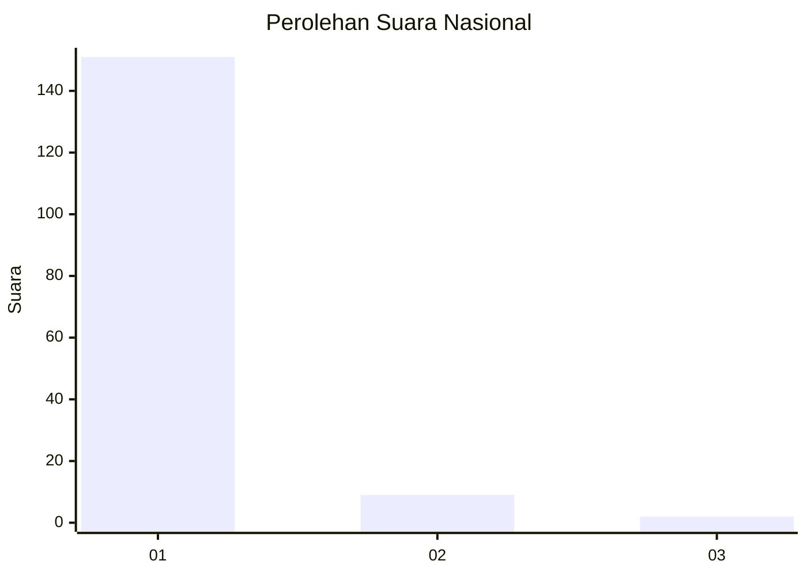
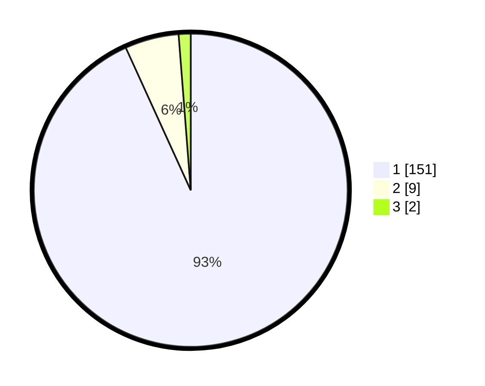

# Hasil

## Grafik

## Tabel

| No. | Nama Paslon    | Suara | Suara (raw) | Persentase |
|:--- |:-------------- | -----:| -----------:| ----------:|
| 1   | ANIES MUHAIMIN | 151   | [151][p-1]  | 93,21      |
| 2   | PRABOWO GIBRAN | 9     | [9][p-2]    | 5,56       |
| 3   | GANJAR MAHFUD  | 2     | [2][p-3]    | 1,23       |

[p-1]: https://github.com/gigit-pemilu/pemilu-2024/blob/main/pilpres/hitung-suara/sub/34-di-yogyakarta/sub/02-bantul/sub/14-piyungan/sub/2001-sitimulyo/sub/904-tps/sub/paslon-1.txt
[p-2]: https://github.com/gigit-pemilu/pemilu-2024/blob/main/pilpres/hitung-suara/sub/34-di-yogyakarta/sub/02-bantul/sub/14-piyungan/sub/2001-sitimulyo/sub/904-tps/sub/paslon-2.txt
[p-3]: https://github.com/gigit-pemilu/pemilu-2024/blob/main/pilpres/hitung-suara/sub/34-di-yogyakarta/sub/02-bantul/sub/14-piyungan/sub/2001-sitimulyo/sub/904-tps/sub/paslon-3.txt

## Foto C Plano

https://sirekap-obj-formc.kpu.go.id/1364/pemilu/ppwp/34/02/14/20/01/3402142001904-20240216-131240--331edbf5-8a43-49b4-a352-2662459852de.jpg

https://sirekap-obj-formc.kpu.go.id/1364/pemilu/ppwp/34/02/14/20/01/3402142001904-20240216-131242--c78f6e43-ee91-433e-bbd4-a440c7d8fd0a.jpg

https://sirekap-obj-formc.kpu.go.id/1364/pemilu/ppwp/34/02/14/20/01/3402142001904-20240216-131241--4e3c8527-0995-4f8d-bd7f-f46f117c1591.jpg

## Metadata

| Key        | Value               |
| ---------- | ------------------- |
| Time Stamp | 2024-02-21 16:00:00 |

## DATA PEMILIH TETAP

Jumlah pemilih dalam DPT: **178**.
 * L: **0**.
 * P: **178**.

## DATA PENGGUNA HAK PILIH

Jumlah pengguna hak pilih dalam DPT: **129**.
 * L: **0**.
 * P: **129**.

Jumlah pengguna hak pilih dalam DPTb: **33**.
 * L: **9**.
 * P: **24**.

Jumlah pengguna hak pilih dalam DPK: **0**.
 * L: **0**.
 * P: **0**.

Jumlah pengguna hak pilih: **162**.
 * L: **9**.
 * P: **153**.

## JUMLAH SUARA SAH DAN TIDAK SAH

JUMLAH SELURUH SUARA SAH: **162**.

JUMLAH SUARA TIDAK SAH: **0**.

JUMLAH SELURUH SUARA SAH DAN SUARA TIDAK SAH: **162**.

