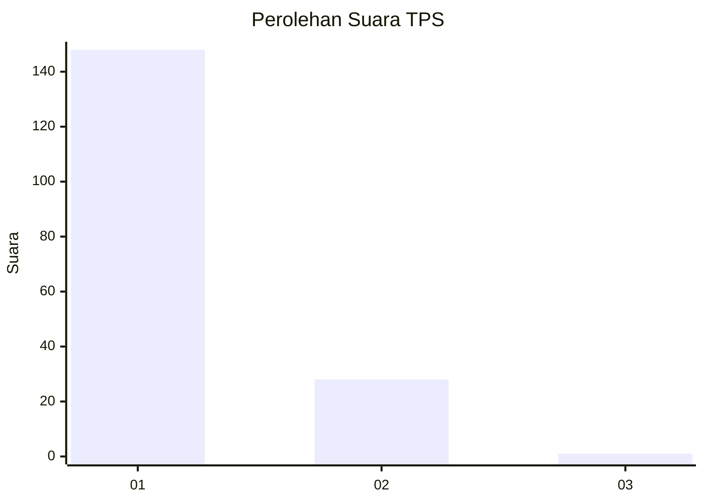
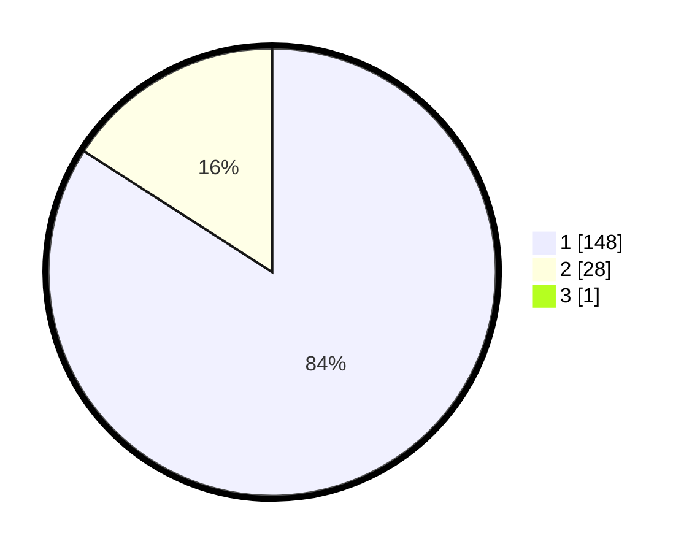

# Hasil

## Grafik

## Tabel

| No. | Nama Paslon    | Suara | Suara (raw) | Persentase |
|:--- |:-------------- | -----:| -----------:| ----------:|
| 1   | ANIES MUHAIMIN | 148   | [148][p-1]  | 83,62      |
| 2   | PRABOWO GIBRAN | 28    | [28][p-2]   | 15,82      |
| 3   | GANJAR MAHFUD  | 1     | [1][p-3]    | 0,56       |

[p-1]: https://github.com/gigit-pemilu/pemilu-2024-34-di-yogyakarta/blob/main/pilpres/hitung-suara/sub/34-di-yogyakarta/sub/02-bantul/sub/14-piyungan/sub/2001-sitimulyo/sub/905-tps/sub/paslon-1.txt
[p-2]: https://github.com/gigit-pemilu/pemilu-2024-34-di-yogyakarta/blob/main/pilpres/hitung-suara/sub/34-di-yogyakarta/sub/02-bantul/sub/14-piyungan/sub/2001-sitimulyo/sub/905-tps/sub/paslon-2.txt
[p-3]: https://github.com/gigit-pemilu/pemilu-2024-34-di-yogyakarta/blob/main/pilpres/hitung-suara/sub/34-di-yogyakarta/sub/02-bantul/sub/14-piyungan/sub/2001-sitimulyo/sub/905-tps/sub/paslon-3.txt

## Foto C Plano

https://sirekap-obj-formc.kpu.go.id/c8cf/pemilu/ppwp/34/02/14/20/01/3402142001905-20240216-151003--939ca571-c62b-4af4-b251-47c25721a754.jpg

https://sirekap-obj-formc.kpu.go.id/c8cf/pemilu/ppwp/34/02/14/20/01/3402142001905-20240216-151004--2bdc8191-e633-4414-bfb0-7f6a6e648cf1.jpg

https://sirekap-obj-formc.kpu.go.id/c8cf/pemilu/ppwp/34/02/14/20/01/3402142001905-20240216-151004--71757baf-6bcc-42a0-afbf-ffa64dbae2d7.jpg

## Metadata

| Key        | Value               |
| ---------- | ------------------- |
| Time Stamp | 2024-02-21 16:00:00 |

## DATA PEMILIH TETAP

Jumlah pemilih dalam DPT: **208**.
 * L: **208**.
 * P: **0**.

## DATA PENGGUNA HAK PILIH

Jumlah pengguna hak pilih dalam DPT: **163**.
 * L: **163**.
 * P: **0**.

Jumlah pengguna hak pilih dalam DPTb: **15**.
 * L: **1**.
 * P: **14**.

Jumlah pengguna hak pilih dalam DPK: **0**.
 * L: **0**.
 * P: **0**.

Jumlah pengguna hak pilih: **178**.
 * L: **164**.
 * P: **14**.

## JUMLAH SUARA SAH DAN TIDAK SAH

JUMLAH SELURUH SUARA SAH: **177**.

JUMLAH SUARA TIDAK SAH: **1**.

JUMLAH SELURUH SUARA SAH DAN SUARA TIDAK SAH: **178**.

