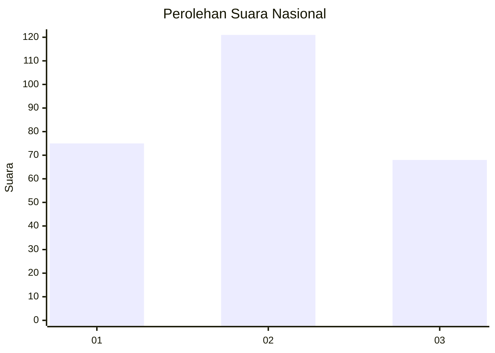
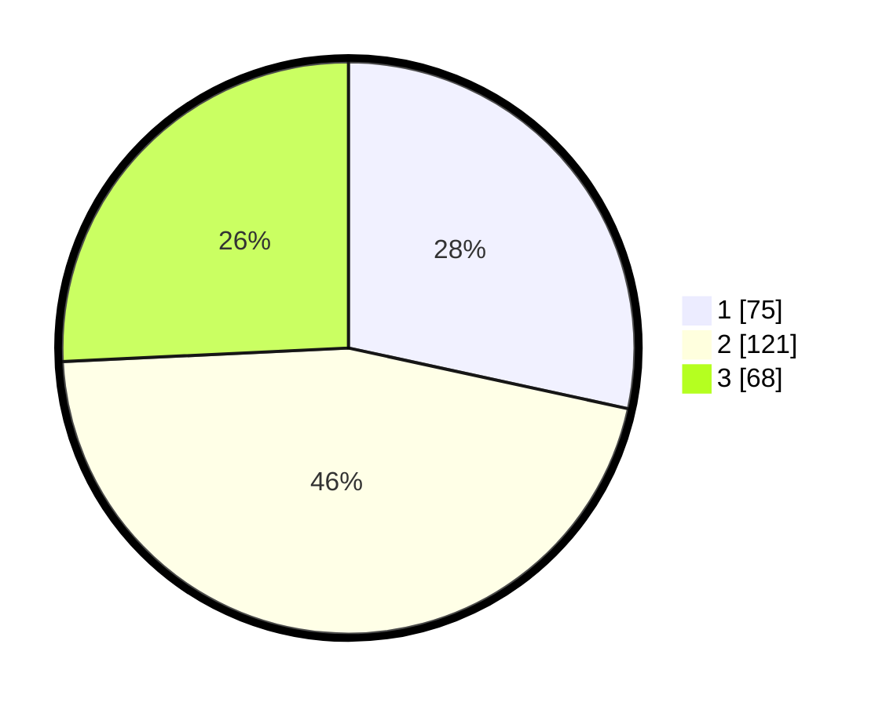

# Hasil

## Grafik

## Tabel

| No. | Nama Paslon    | Suara | Suara (raw) | Persentase |
|:--- |:-------------- | -----:| -----------:| ----------:|
| 1   | ANIES MUHAIMIN | 75    | [75][p-1]   | 28,41      |
| 2   | PRABOWO GIBRAN | 121   | [121][p-2]  | 45,83      |
| 3   | GANJAR MAHFUD  | 68    | [68][p-3]   | 25,76      |

[p-1]: https://github.com/gigit-pemilu/pemilu-2024/blob/main/pilpres/hitung-suara/sub/34-di-yogyakarta/sub/02-bantul/sub/14-piyungan/sub/2002-srimulyo/sub/014-tps/sub/paslon-1.txt
[p-2]: https://github.com/gigit-pemilu/pemilu-2024/blob/main/pilpres/hitung-suara/sub/34-di-yogyakarta/sub/02-bantul/sub/14-piyungan/sub/2002-srimulyo/sub/014-tps/sub/paslon-2.txt
[p-3]: https://github.com/gigit-pemilu/pemilu-2024/blob/main/pilpres/hitung-suara/sub/34-di-yogyakarta/sub/02-bantul/sub/14-piyungan/sub/2002-srimulyo/sub/014-tps/sub/paslon-3.txt

## Foto C Plano

https://sirekap-obj-formc.kpu.go.id/ef45/pemilu/ppwp/34/02/14/20/02/3402142002014-20240216-003026--7cd0beab-8bf4-44b2-a576-7884087a5cdb.jpg

https://sirekap-obj-formc.kpu.go.id/ef45/pemilu/ppwp/34/02/14/20/02/3402142002014-20240216-003028--f1a57f1d-a3ef-4006-ae8f-836028c9438e.jpg

https://sirekap-obj-formc.kpu.go.id/ef45/pemilu/ppwp/34/02/14/20/02/3402142002014-20240216-003027--3a3c6cd6-632e-4ec1-baa1-c5bf1255f8ae.jpg

## Metadata

| Key        | Value               |
| ---------- | ------------------- |
| Time Stamp | 2024-02-21 22:00:00 |

## DATA PEMILIH TETAP

Jumlah pemilih dalam DPT: **292**.
 * L: **139**.
 * P: **153**.

## DATA PENGGUNA HAK PILIH

Jumlah pengguna hak pilih dalam DPT: **248**.
 * L: **114**.
 * P: **134**.

Jumlah pengguna hak pilih dalam DPTb: **9**.
 * L: **6**.
 * P: **3**.

Jumlah pengguna hak pilih dalam DPK: **13**.
 * L: **5**.
 * P: **8**.

Jumlah pengguna hak pilih: **270**.
 * L: **125**.
 * P: **145**.

## JUMLAH SUARA SAH DAN TIDAK SAH

JUMLAH SELURUH SUARA SAH: **264**.

JUMLAH SUARA TIDAK SAH: **6**.

JUMLAH SELURUH SUARA SAH DAN SUARA TIDAK SAH: **270**.

