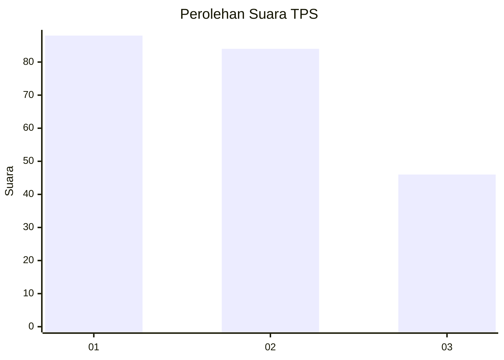
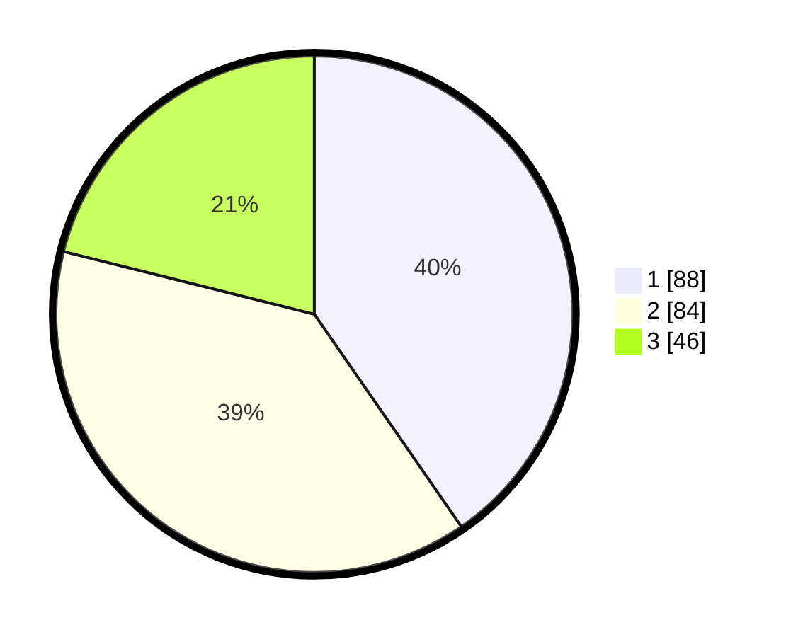

# Hasil

## Grafik

## Tabel

| No. | Nama Paslon    | Suara | Suara (raw) | Persentase |
|:--- |:-------------- | -----:| -----------:| ----------:|
| 1   | ANIES MUHAIMIN | 88    | [88][p-1]   | 40,37      |
| 2   | PRABOWO GIBRAN | 84    | [84][p-2]   | 38,53      |
| 3   | GANJAR MAHFUD  | 46    | [46][p-3]   | 21,10      |

[p-1]: https://github.com/gigit-pemilu/pemilu-2024-34-di-yogyakarta/blob/main/pilpres/hitung-suara/sub/34-di-yogyakarta/sub/02-bantul/sub/14-piyungan/sub/2003-srimartani/sub/005-tps/sub/paslon-1.txt
[p-2]: https://github.com/gigit-pemilu/pemilu-2024-34-di-yogyakarta/blob/main/pilpres/hitung-suara/sub/34-di-yogyakarta/sub/02-bantul/sub/14-piyungan/sub/2003-srimartani/sub/005-tps/sub/paslon-2.txt
[p-3]: https://github.com/gigit-pemilu/pemilu-2024-34-di-yogyakarta/blob/main/pilpres/hitung-suara/sub/34-di-yogyakarta/sub/02-bantul/sub/14-piyungan/sub/2003-srimartani/sub/005-tps/sub/paslon-3.txt

## Foto C Plano

https://sirekap-obj-formc.kpu.go.id/4617/pemilu/ppwp/34/02/14/20/03/3402142003005-20240215-080208--8b22c39c-9482-4c53-9dc0-b608f7846b08.jpg

https://sirekap-obj-formc.kpu.go.id/4617/pemilu/ppwp/34/02/14/20/03/3402142003005-20240215-080229--116f3fd0-90b0-4aa2-a68a-0f6c8fa60249.jpg

https://sirekap-obj-formc.kpu.go.id/4617/pemilu/ppwp/34/02/14/20/03/3402142003005-20240215-080218--e2629bc6-24de-4f96-a319-70d140317c90.jpg

## Metadata

| Key        | Value               |
| ---------- | ------------------- |
| Time Stamp | 2024-02-15 20:30:46 |

## DATA PEMILIH TETAP

Jumlah pemilih dalam DPT: **251**.
 * L: **117**.
 * P: **134**.

## DATA PENGGUNA HAK PILIH

Jumlah pengguna hak pilih dalam DPT: **209**.
 * L: **94**.
 * P: **115**.

Jumlah pengguna hak pilih dalam DPTb: **7**.
 * L: **3**.
 * P: **4**.

Jumlah pengguna hak pilih dalam DPK: **3**.
 * L: **1**.
 * P: **2**.

Jumlah pengguna hak pilih: **219**.
 * L: **98**.
 * P: **121**.

## JUMLAH SUARA SAH DAN TIDAK SAH

JUMLAH SELURUH SUARA SAH: **218**.

JUMLAH SUARA TIDAK SAH: **1**.

JUMLAH SELURUH SUARA SAH DAN SUARA TIDAK SAH: **219**.

