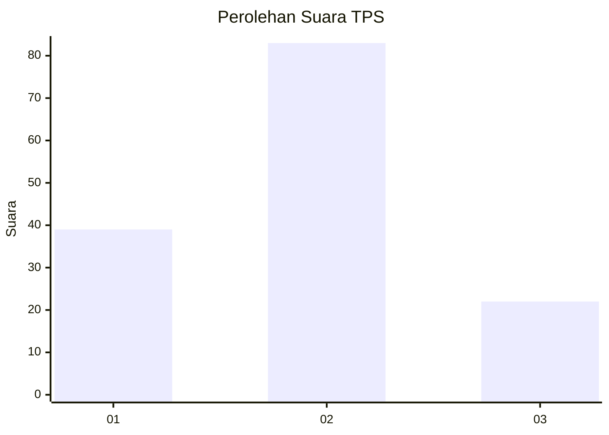
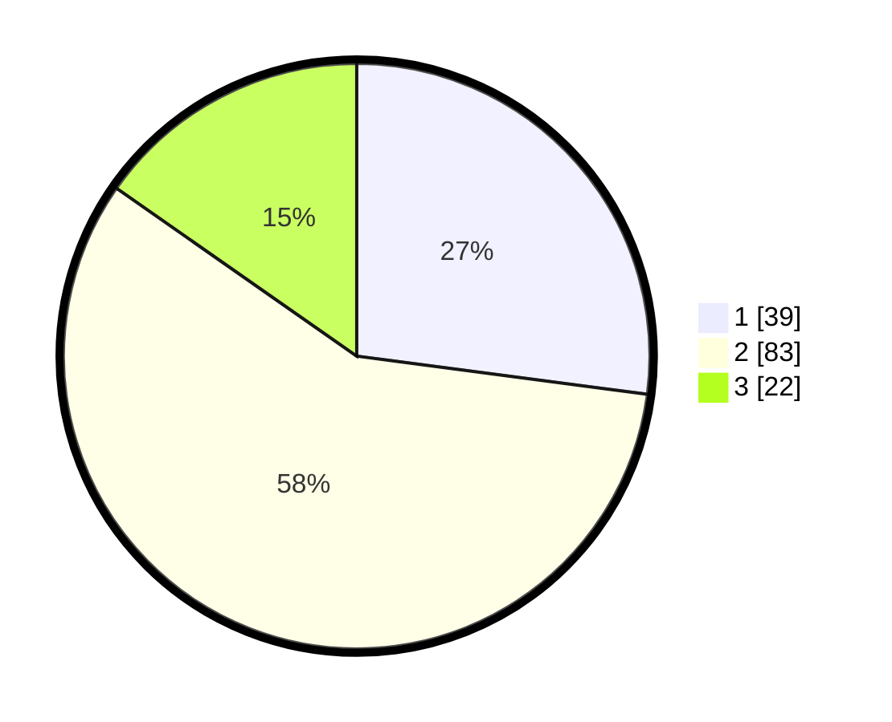

# Hasil

## Grafik

## Tabel

| No. | Nama Paslon    | Suara | Suara (raw) | Persentase |
|:--- |:-------------- | -----:| -----------:| ----------:|
| 1   | ANIES MUHAIMIN | 39    | [39][p-1]   | 27,08      |
| 2   | PRABOWO GIBRAN | 83    | [83][p-2]   | 57,64      |
| 3   | GANJAR MAHFUD  | 22    | [22][p-3]   | 15,28      |

[p-1]: https://github.com/gigit-pemilu/pemilu-2024-34-di-yogyakarta/blob/main/pilpres/hitung-suara/sub/34-di-yogyakarta/sub/02-bantul/sub/14-piyungan/sub/2003-srimartani/sub/006-tps/sub/paslon-1.txt
[p-2]: https://github.com/gigit-pemilu/pemilu-2024-34-di-yogyakarta/blob/main/pilpres/hitung-suara/sub/34-di-yogyakarta/sub/02-bantul/sub/14-piyungan/sub/2003-srimartani/sub/006-tps/sub/paslon-2.txt
[p-3]: https://github.com/gigit-pemilu/pemilu-2024-34-di-yogyakarta/blob/main/pilpres/hitung-suara/sub/34-di-yogyakarta/sub/02-bantul/sub/14-piyungan/sub/2003-srimartani/sub/006-tps/sub/paslon-3.txt

## Foto C Plano

https://sirekap-obj-formc.kpu.go.id/0075/pemilu/ppwp/34/02/14/20/03/3402142003006-20240214-230130--d6135322-62ad-4952-a54a-a8127df21251.jpg

https://sirekap-obj-formc.kpu.go.id/0075/pemilu/ppwp/34/02/14/20/03/3402142003006-20240214-230226--cdd5cabb-bde2-4fe1-a2be-f8483a26142c.jpg

https://sirekap-obj-formc.kpu.go.id/0075/pemilu/ppwp/34/02/14/20/03/3402142003006-20240214-230312--02d651db-bc83-4d3c-ac7e-b3455ba2b504.jpg

## Metadata

| Key        | Value               |
| ---------- | ------------------- |
| Time Stamp | 2024-02-24 22:31:28 |

