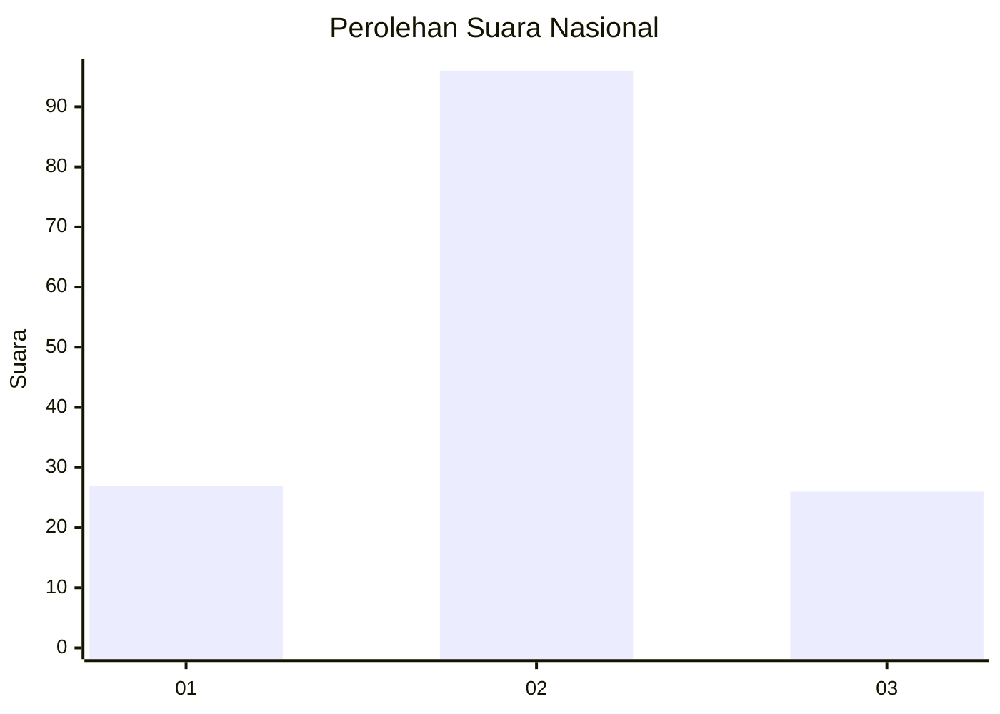
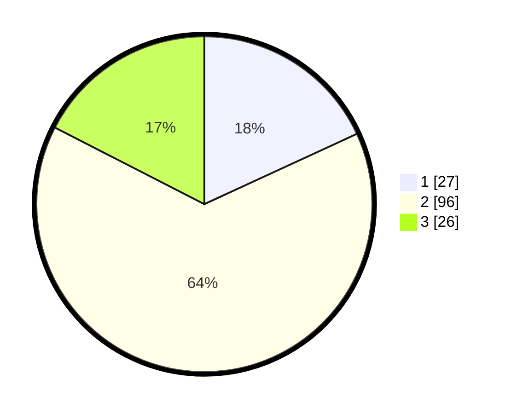

# Hasil

## Grafik

## Tabel

| No. | Nama Paslon    | Suara | Suara (raw) | Persentase |
|:--- |:-------------- | -----:| -----------:| ----------:|
| 1   | ANIES MUHAIMIN | 27    | [27][p-1]   | 18,12      |
| 2   | PRABOWO GIBRAN | 96    | [96][p-2]   | 64,43      |
| 3   | GANJAR MAHFUD  | 26    | [26][p-3]   | 17,45      |

[p-1]: https://github.com/gigit-pemilu/pemilu-2024/blob/main/pilpres/hitung-suara/sub/34-di-yogyakarta/sub/02-bantul/sub/14-piyungan/sub/2003-srimartani/sub/013-tps/sub/paslon-1.txt
[p-2]: https://github.com/gigit-pemilu/pemilu-2024/blob/main/pilpres/hitung-suara/sub/34-di-yogyakarta/sub/02-bantul/sub/14-piyungan/sub/2003-srimartani/sub/013-tps/sub/paslon-2.txt
[p-3]: https://github.com/gigit-pemilu/pemilu-2024/blob/main/pilpres/hitung-suara/sub/34-di-yogyakarta/sub/02-bantul/sub/14-piyungan/sub/2003-srimartani/sub/013-tps/sub/paslon-3.txt

## Foto C Plano

https://sirekap-obj-formc.kpu.go.id/70ef/pemilu/ppwp/34/02/14/20/03/3402142003013-20240214-155424--c9d046cb-bedf-453e-a587-f842b7b83c0c.jpg

https://sirekap-obj-formc.kpu.go.id/70ef/pemilu/ppwp/34/02/14/20/03/3402142003013-20240214-141613--6c1b7d15-a570-4897-a557-40ca4118f010.jpg

https://sirekap-obj-formc.kpu.go.id/70ef/pemilu/ppwp/34/02/14/20/03/3402142003013-20240214-141647--3c3e127e-f5a1-4833-816d-bf2102a92ae8.jpg

## Metadata

| Key        | Value               |
| ---------- | ------------------- |
| Time Stamp | 2024-02-24 22:31:28 |

