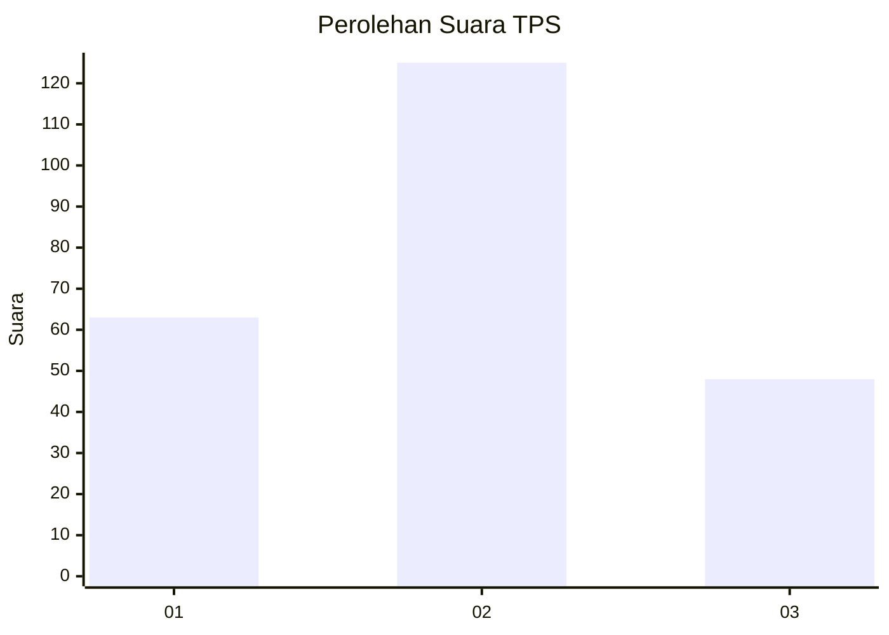
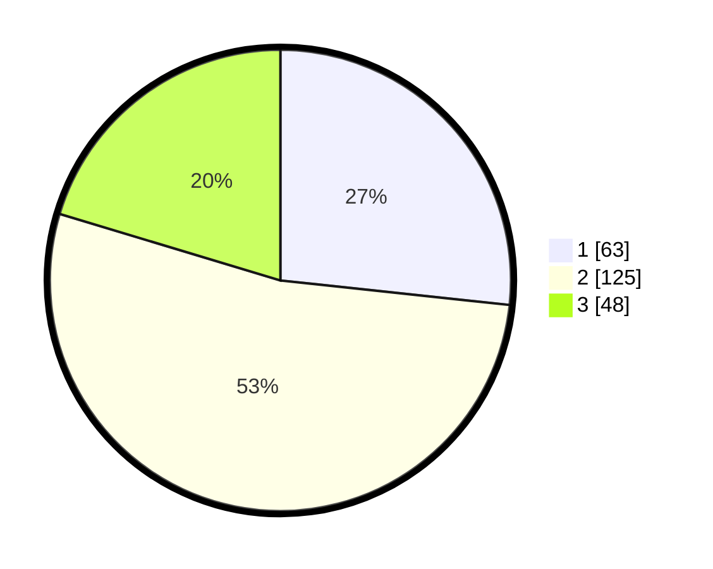

# Hasil

## Grafik

## Tabel

| No. | Nama Paslon    | Suara | Suara (raw) | Persentase |
|:--- |:-------------- | -----:| -----------:| ----------:|
| 1   | ANIES MUHAIMIN | 63    | [63][p-1]   | 26,69      |
| 2   | PRABOWO GIBRAN | 125   | [125][p-2]  | 52,97      |
| 3   | GANJAR MAHFUD  | 48    | [48][p-3]   | 20,34      |

[p-1]: https://github.com/gigit-pemilu/pemilu-2024-34-di-yogyakarta/blob/main/pilpres/hitung-suara/sub/34-di-yogyakarta/sub/02-bantul/sub/14-piyungan/sub/2003-srimartani/sub/038-tps/sub/paslon-1.txt
[p-2]: https://github.com/gigit-pemilu/pemilu-2024-34-di-yogyakarta/blob/main/pilpres/hitung-suara/sub/34-di-yogyakarta/sub/02-bantul/sub/14-piyungan/sub/2003-srimartani/sub/038-tps/sub/paslon-2.txt
[p-3]: https://github.com/gigit-pemilu/pemilu-2024-34-di-yogyakarta/blob/main/pilpres/hitung-suara/sub/34-di-yogyakarta/sub/02-bantul/sub/14-piyungan/sub/2003-srimartani/sub/038-tps/sub/paslon-3.txt

## Foto C Plano

https://sirekap-obj-formc.kpu.go.id/dd67/pemilu/ppwp/34/02/14/20/03/3402142003038-20240214-233511--d948220a-fa65-48f3-8839-144da40d4ab9.jpg

https://sirekap-obj-formc.kpu.go.id/dd67/pemilu/ppwp/34/02/14/20/03/3402142003038-20240214-185420--78a58671-a1ad-44f5-a340-2de78dcf5237.jpg

https://sirekap-obj-formc.kpu.go.id/dd67/pemilu/ppwp/34/02/14/20/03/3402142003038-20240214-141900--f81d7930-5adf-4141-a467-aa75ab14f663.jpg

## Metadata

| Key        | Value               |
| ---------- | ------------------- |
| Time Stamp | 2024-02-24 22:31:28 |

