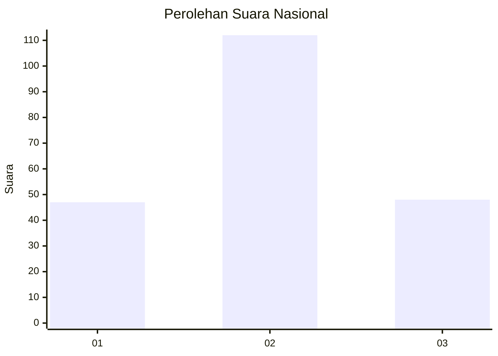
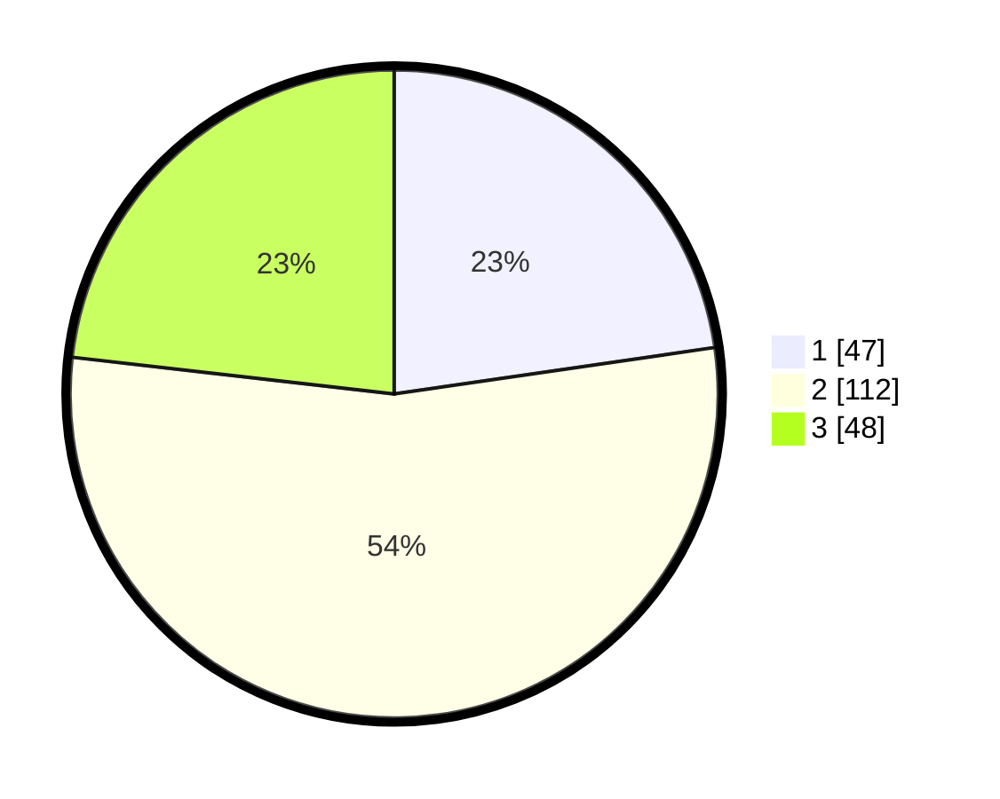

# Hasil

## Grafik

## Tabel

| No. | Nama Paslon    | Suara | Suara (raw) | Persentase |
|:--- |:-------------- | -----:| -----------:| ----------:|
| 1   | ANIES MUHAIMIN | 47    | [47][p-1]   | 22,71      |
| 2   | PRABOWO GIBRAN | 112   | [112][p-2]  | 54,11      |
| 3   | GANJAR MAHFUD  | 48    | [48][p-3]   | 23,19      |

[p-1]: https://github.com/gigit-pemilu/pemilu-2024/blob/main/pilpres/hitung-suara/sub/34-di-yogyakarta/sub/02-bantul/sub/14-piyungan/sub/2003-srimartani/sub/051-tps/sub/paslon-1.txt
[p-2]: https://github.com/gigit-pemilu/pemilu-2024/blob/main/pilpres/hitung-suara/sub/34-di-yogyakarta/sub/02-bantul/sub/14-piyungan/sub/2003-srimartani/sub/051-tps/sub/paslon-2.txt
[p-3]: https://github.com/gigit-pemilu/pemilu-2024/blob/main/pilpres/hitung-suara/sub/34-di-yogyakarta/sub/02-bantul/sub/14-piyungan/sub/2003-srimartani/sub/051-tps/sub/paslon-3.txt

## Foto C Plano

https://sirekap-obj-formc.kpu.go.id/5b9e/pemilu/ppwp/34/02/14/20/03/3402142003051-20240214-230412--29cffdc2-4863-4441-940c-f981fc0b3c17.jpg

https://sirekap-obj-formc.kpu.go.id/5b9e/pemilu/ppwp/34/02/14/20/03/3402142003051-20240214-230432--917834a7-a74f-4cac-8f8b-76515aab5a4d.jpg

https://sirekap-obj-formc.kpu.go.id/5b9e/pemilu/ppwp/34/02/14/20/03/3402142003051-20240215-163933--2bfbe2af-09e9-48c0-885e-6ec75a6adab5.jpg

## Metadata

| Key        | Value               |
| ---------- | ------------------- |
| Time Stamp | 2024-02-15 18:30:25 |

