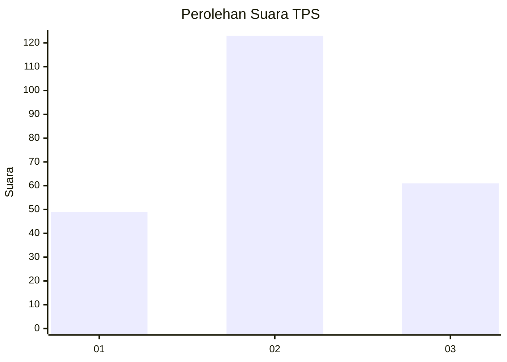
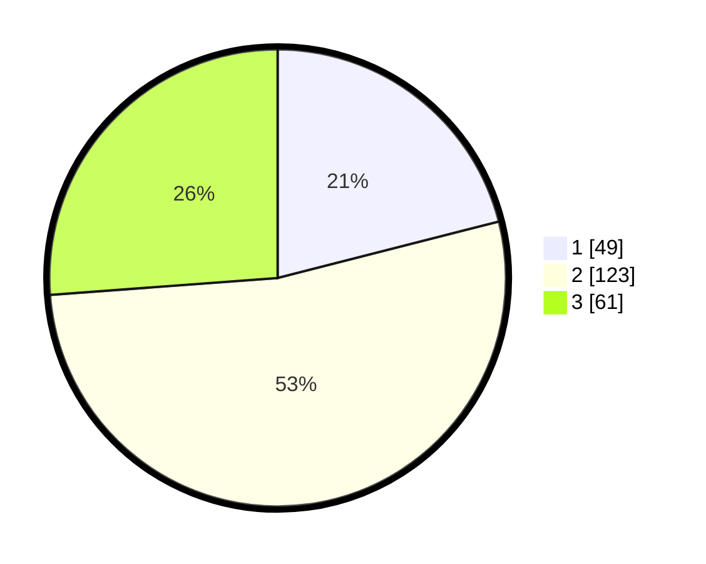

# Hasil

## Grafik

## Tabel

| No. | Nama Paslon    | Suara | Suara (raw) | Persentase |
|:--- |:-------------- | -----:| -----------:| ----------:|
| 1   | ANIES MUHAIMIN | 49    | [49][p-1]   | 21,03      |
| 2   | PRABOWO GIBRAN | 123   | [123][p-2]  | 52,79      |
| 3   | GANJAR MAHFUD  | 61    | [61][p-3]   | 26,18      |

[p-1]: https://github.com/gigit-pemilu/pemilu-2024-34-di-yogyakarta/blob/main/pilpres/hitung-suara/sub/34-di-yogyakarta/sub/02-bantul/sub/15-sewon/sub/2001-pendowoharjo/sub/002-tps/sub/paslon-1.txt
[p-2]: https://github.com/gigit-pemilu/pemilu-2024-34-di-yogyakarta/blob/main/pilpres/hitung-suara/sub/34-di-yogyakarta/sub/02-bantul/sub/15-sewon/sub/2001-pendowoharjo/sub/002-tps/sub/paslon-2.txt
[p-3]: https://github.com/gigit-pemilu/pemilu-2024-34-di-yogyakarta/blob/main/pilpres/hitung-suara/sub/34-di-yogyakarta/sub/02-bantul/sub/15-sewon/sub/2001-pendowoharjo/sub/002-tps/sub/paslon-3.txt

## Foto C Plano

https://sirekap-obj-formc.kpu.go.id/bb78/pemilu/ppwp/34/02/15/20/01/3402152001002-20240214-195622--95bdf41c-d0f5-4ea4-a1eb-6dc761e28c91.jpg

https://sirekap-obj-formc.kpu.go.id/bb78/pemilu/ppwp/34/02/15/20/01/3402152001002-20240214-195912--3323d4d9-063f-4198-8d5b-269d9c6fe1bf.jpg

https://sirekap-obj-formc.kpu.go.id/bb78/pemilu/ppwp/34/02/15/20/01/3402152001002-20240215-002348--ebcaf714-a3a7-4ca0-b68a-d878aae4f529.jpg

## Metadata

| Key        | Value               |
| ---------- | ------------------- |
| Time Stamp | 2024-02-24 22:31:28 |

