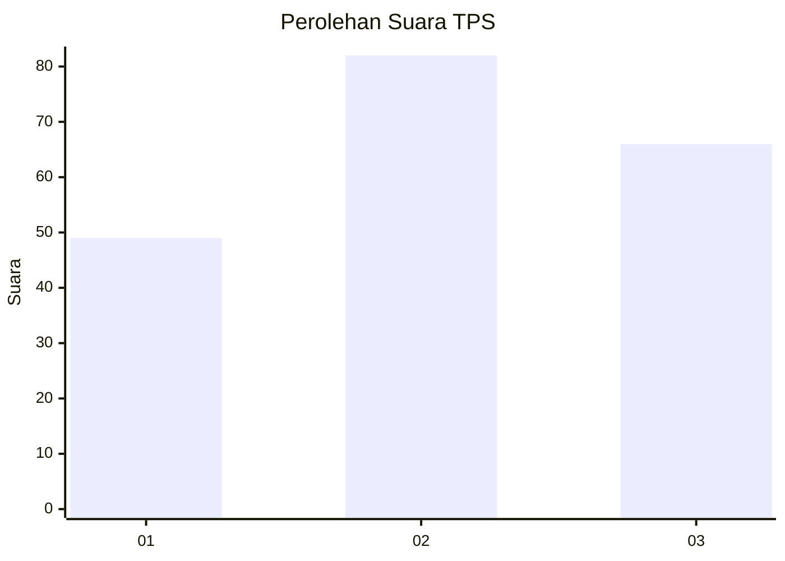
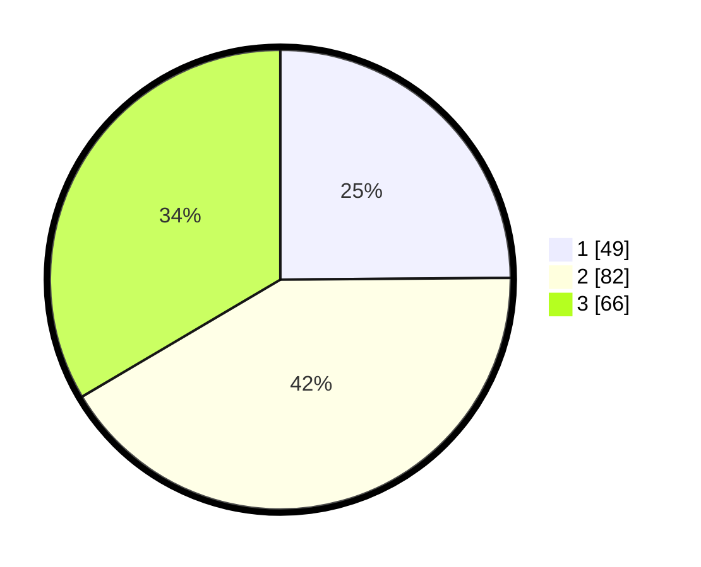

# Hasil

## Grafik

## Tabel

| No. | Nama Paslon    | Suara | Suara (raw) | Persentase |
|:--- |:-------------- | -----:| -----------:| ----------:|
| 1   | ANIES MUHAIMIN | 49    | [49][p-1]   | 24,87      |
| 2   | PRABOWO GIBRAN | 82    | [82][p-2]   | 41,62      |
| 3   | GANJAR MAHFUD  | 66    | [66][p-3]   | 33,50      |

[p-1]: https://github.com/gigit-pemilu/pemilu-2024-34-di-yogyakarta/blob/main/pilpres/hitung-suara/sub/34-di-yogyakarta/sub/02-bantul/sub/15-sewon/sub/2001-pendowoharjo/sub/003-tps/sub/paslon-1.txt
[p-2]: https://github.com/gigit-pemilu/pemilu-2024-34-di-yogyakarta/blob/main/pilpres/hitung-suara/sub/34-di-yogyakarta/sub/02-bantul/sub/15-sewon/sub/2001-pendowoharjo/sub/003-tps/sub/paslon-2.txt
[p-3]: https://github.com/gigit-pemilu/pemilu-2024-34-di-yogyakarta/blob/main/pilpres/hitung-suara/sub/34-di-yogyakarta/sub/02-bantul/sub/15-sewon/sub/2001-pendowoharjo/sub/003-tps/sub/paslon-3.txt

## Foto C Plano

https://sirekap-obj-formc.kpu.go.id/1510/pemilu/ppwp/34/02/15/20/01/3402152001003-20240215-102846--54fbe5d6-357e-454a-bd6b-b45880a1dbb1.jpg

https://sirekap-obj-formc.kpu.go.id/1510/pemilu/ppwp/34/02/15/20/01/3402152001003-20240214-141035--2250e4f1-ba76-4c86-b0d4-63f86cee8cdb.jpg

https://sirekap-obj-formc.kpu.go.id/1510/pemilu/ppwp/34/02/15/20/01/3402152001003-20240215-102857--31dc4392-ed0a-4e9a-8816-1f260775a772.jpg

## Metadata

| Key        | Value               |
| ---------- | ------------------- |
| Time Stamp | 2024-02-15 12:00:28 |

## DATA PEMILIH TETAP

Jumlah pemilih dalam DPT: **220**.
 * L: **103**.
 * P: **117**.

## DATA PENGGUNA HAK PILIH

Jumlah pengguna hak pilih dalam DPT: **194**.
 * L: **88**.
 * P: **106**.

Jumlah pengguna hak pilih dalam DPTb: **6**.
 * L: **0**.
 * P: **6**.

Jumlah pengguna hak pilih dalam DPK: **0**.
 * L: **0**.
 * P: **0**.

Jumlah pengguna hak pilih: **200**.
 * L: **88**.
 * P: **112**.

## JUMLAH SUARA SAH DAN TIDAK SAH

JUMLAH SELURUH SUARA SAH: **197**.

JUMLAH SUARA TIDAK SAH: **3**.

JUMLAH SELURUH SUARA SAH DAN SUARA TIDAK SAH: **200**.

