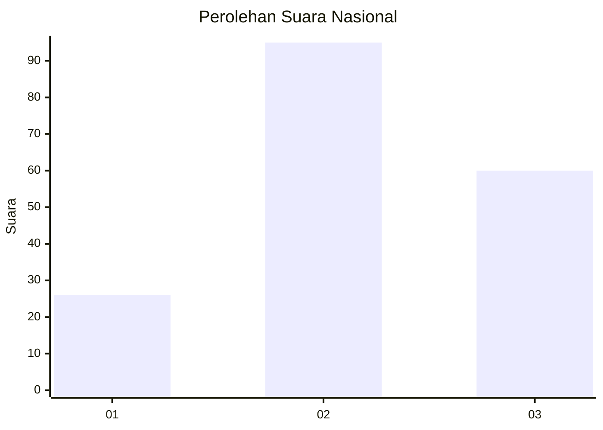
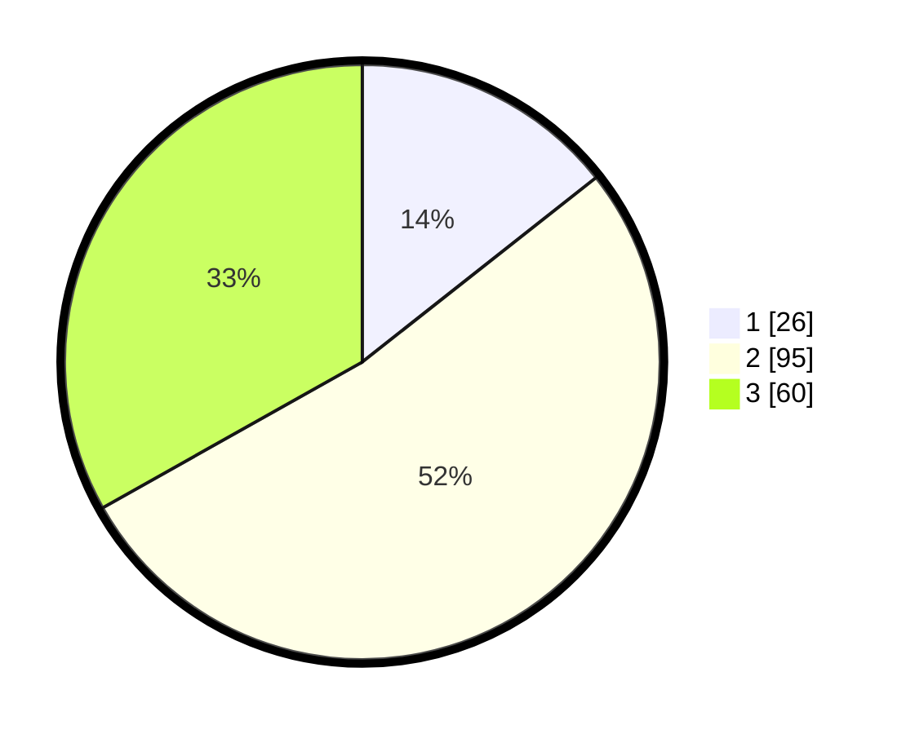

# Hasil

## Grafik

## Tabel

| No. | Nama Paslon    | Suara | Suara (raw) | Persentase |
|:--- |:-------------- | -----:| -----------:| ----------:|
| 1   | ANIES MUHAIMIN | 26    | [26][p-1]   | 14,36      |
| 2   | PRABOWO GIBRAN | 95    | [95][p-2]   | 52,49      |
| 3   | GANJAR MAHFUD  | 60    | [60][p-3]   | 33,15      |

[p-1]: https://github.com/gigit-pemilu/pemilu-2024/blob/main/pilpres/hitung-suara/sub/34-di-yogyakarta/sub/02-bantul/sub/15-sewon/sub/2001-pendowoharjo/sub/004-tps/sub/paslon-1.txt
[p-2]: https://github.com/gigit-pemilu/pemilu-2024/blob/main/pilpres/hitung-suara/sub/34-di-yogyakarta/sub/02-bantul/sub/15-sewon/sub/2001-pendowoharjo/sub/004-tps/sub/paslon-2.txt
[p-3]: https://github.com/gigit-pemilu/pemilu-2024/blob/main/pilpres/hitung-suara/sub/34-di-yogyakarta/sub/02-bantul/sub/15-sewon/sub/2001-pendowoharjo/sub/004-tps/sub/paslon-3.txt

## Foto C Plano

https://sirekap-obj-formc.kpu.go.id/0c92/pemilu/ppwp/34/02/15/20/01/3402152001004-20240215-233305--e104866f-13c8-4f8b-a0e4-42fe9c5ff408.jpg

https://sirekap-obj-formc.kpu.go.id/0c92/pemilu/ppwp/34/02/15/20/01/3402152001004-20240215-233308--d511bc31-66bc-4811-b5e2-b25920096688.jpg

https://sirekap-obj-formc.kpu.go.id/0c92/pemilu/ppwp/34/02/15/20/01/3402152001004-20240215-233307--7bbeced2-8f89-4de5-85ee-9142f0ad3f8e.jpg

## Metadata

| Key        | Value               |
| ---------- | ------------------- |
| Time Stamp | 2024-02-21 10:00:00 |

## DATA PEMILIH TETAP

Jumlah pemilih dalam DPT: **202**.
 * L: **100**.
 * P: **102**.

## DATA PENGGUNA HAK PILIH

Jumlah pengguna hak pilih dalam DPT: **181**.
 * L: **93**.
 * P: **88**.

Jumlah pengguna hak pilih dalam DPTb: **5**.
 * L: **0**.
 * P: **5**.

Jumlah pengguna hak pilih dalam DPK: **2**.
 * L: **0**.
 * P: **2**.

Jumlah pengguna hak pilih: **188**.
 * L: **93**.
 * P: **95**.

## JUMLAH SUARA SAH DAN TIDAK SAH

JUMLAH SELURUH SUARA SAH: **181**.

JUMLAH SUARA TIDAK SAH: **7**.

JUMLAH SELURUH SUARA SAH DAN SUARA TIDAK SAH: **188**.

