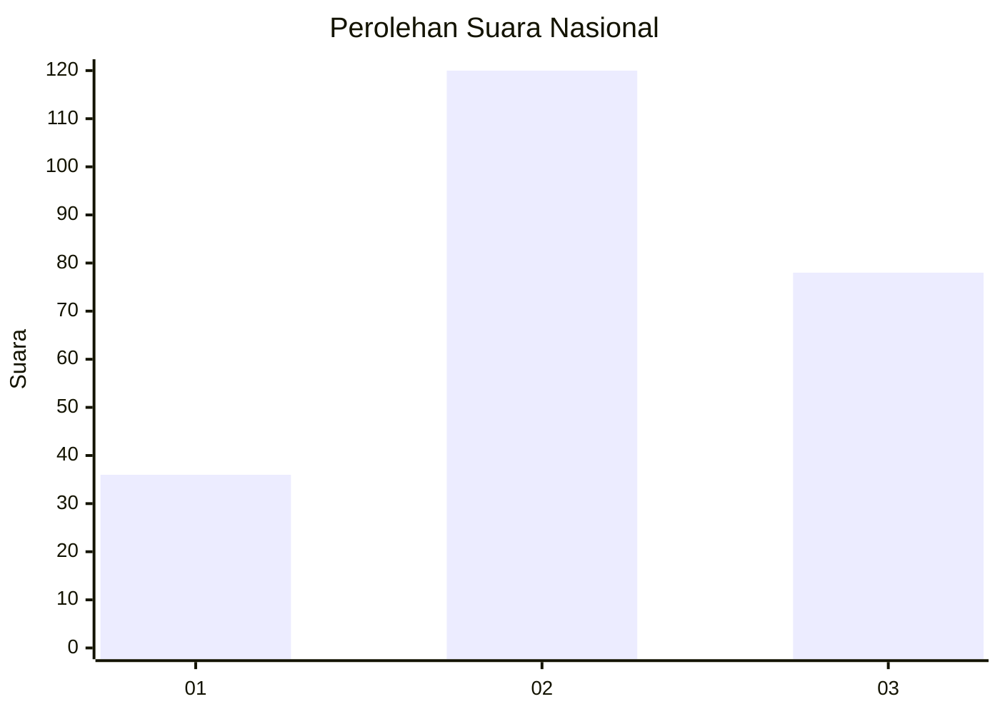
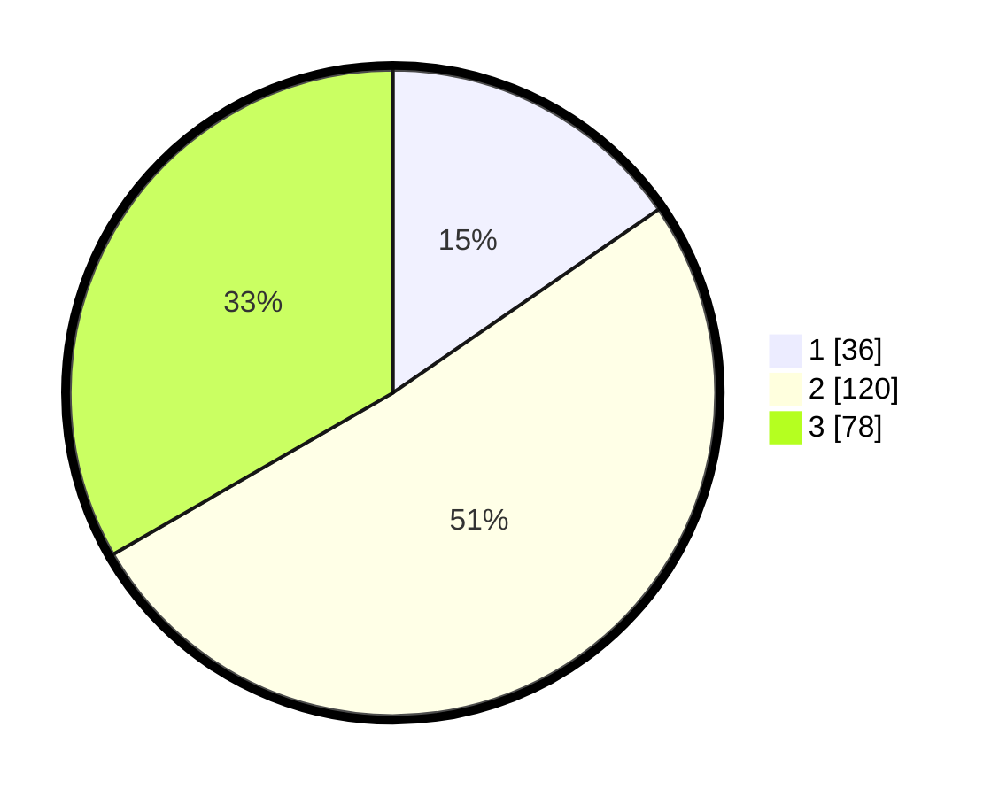

# Hasil

## Grafik

## Tabel

| No. | Nama Paslon    | Suara | Suara (raw) | Persentase |
|:--- |:-------------- | -----:| -----------:| ----------:|
| 1   | ANIES MUHAIMIN | 36    | [36][p-1]   | 15,38      |
| 2   | PRABOWO GIBRAN | 120   | [120][p-2]  | 51,28      |
| 3   | GANJAR MAHFUD  | 78    | [78][p-3]   | 33,33      |

[p-1]: https://github.com/gigit-pemilu/pemilu-2024/blob/main/pilpres/hitung-suara/sub/34-di-yogyakarta/sub/02-bantul/sub/15-sewon/sub/2001-pendowoharjo/sub/007-tps/sub/paslon-1.txt
[p-2]: https://github.com/gigit-pemilu/pemilu-2024/blob/main/pilpres/hitung-suara/sub/34-di-yogyakarta/sub/02-bantul/sub/15-sewon/sub/2001-pendowoharjo/sub/007-tps/sub/paslon-2.txt
[p-3]: https://github.com/gigit-pemilu/pemilu-2024/blob/main/pilpres/hitung-suara/sub/34-di-yogyakarta/sub/02-bantul/sub/15-sewon/sub/2001-pendowoharjo/sub/007-tps/sub/paslon-3.txt

## Foto C Plano

https://sirekap-obj-formc.kpu.go.id/79d1/pemilu/ppwp/34/02/15/20/01/3402152001007-20240215-212541--ba3f0935-8d41-492e-a73a-1afa5cfb9bab.jpg

https://sirekap-obj-formc.kpu.go.id/79d1/pemilu/ppwp/34/02/15/20/01/3402152001007-20240215-212543--79fb29e8-612a-46eb-9bab-68fbe189941c.jpg

https://sirekap-obj-formc.kpu.go.id/79d1/pemilu/ppwp/34/02/15/20/01/3402152001007-20240215-212543--a176fe37-3f60-4af6-b4b9-f9ccb0a771eb.jpg

## Metadata

| Key        | Value               |
| ---------- | ------------------- |
| Time Stamp | 2024-02-15 21:30:27 |

## DATA PEMILIH TETAP

Jumlah pemilih dalam DPT: **267**.
 * L: **132**.
 * P: **135**.

## DATA PENGGUNA HAK PILIH

Jumlah pengguna hak pilih dalam DPT: **231**.
 * L: **109**.
 * P: **122**.

Jumlah pengguna hak pilih dalam DPTb: **6**.
 * L: **0**.
 * P: **6**.

Jumlah pengguna hak pilih dalam DPK: **2**.
 * L: **1**.
 * P: **1**.

Jumlah pengguna hak pilih: **239**.
 * L: **110**.
 * P: **129**.

## JUMLAH SUARA SAH DAN TIDAK SAH

JUMLAH SELURUH SUARA SAH: **234**.

JUMLAH SUARA TIDAK SAH: **5**.

JUMLAH SELURUH SUARA SAH DAN SUARA TIDAK SAH: **239**.

