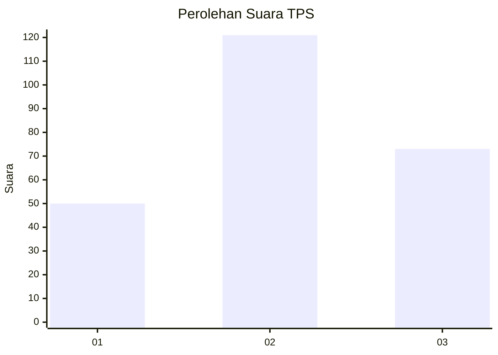
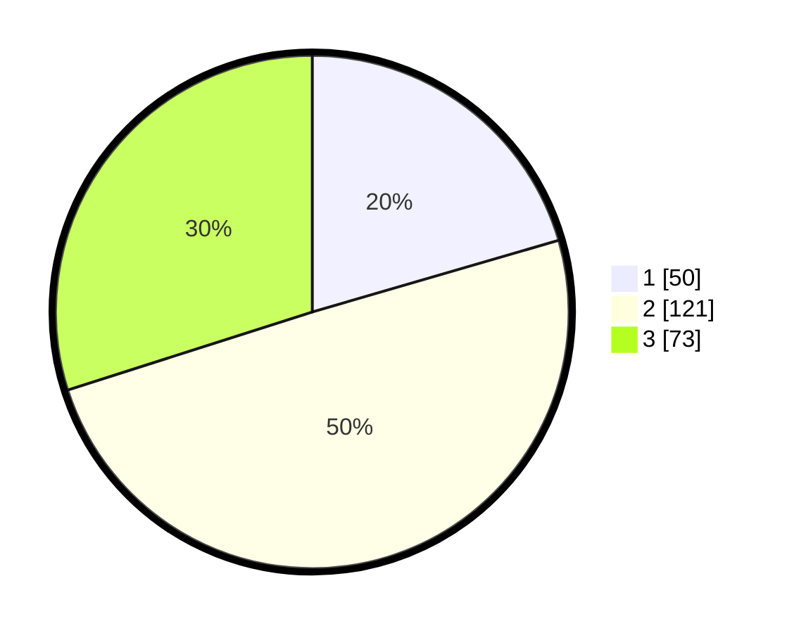

# Hasil

## Grafik

## Tabel

| No. | Nama Paslon    | Suara | Suara (raw) | Persentase |
|:--- |:-------------- | -----:| -----------:| ----------:|
| 1   | ANIES MUHAIMIN | 50    | [50][p-1]   | 20,49      |
| 2   | PRABOWO GIBRAN | 121   | [121][p-2]  | 49,59      |
| 3   | GANJAR MAHFUD  | 73    | [73][p-3]   | 29,92      |

[p-1]: https://github.com/gigit-pemilu/pemilu-2024-34-di-yogyakarta/blob/main/pilpres/hitung-suara/sub/34-di-yogyakarta/sub/02-bantul/sub/15-sewon/sub/2001-pendowoharjo/sub/008-tps/sub/paslon-1.txt
[p-2]: https://github.com/gigit-pemilu/pemilu-2024-34-di-yogyakarta/blob/main/pilpres/hitung-suara/sub/34-di-yogyakarta/sub/02-bantul/sub/15-sewon/sub/2001-pendowoharjo/sub/008-tps/sub/paslon-2.txt
[p-3]: https://github.com/gigit-pemilu/pemilu-2024-34-di-yogyakarta/blob/main/pilpres/hitung-suara/sub/34-di-yogyakarta/sub/02-bantul/sub/15-sewon/sub/2001-pendowoharjo/sub/008-tps/sub/paslon-3.txt

## Foto C Plano

https://sirekap-obj-formc.kpu.go.id/86f2/pemilu/ppwp/34/02/15/20/01/3402152001008-20240214-222458--4eb62134-efc6-497d-9fa9-1d7b3ef251b2.jpg

https://sirekap-obj-formc.kpu.go.id/86f2/pemilu/ppwp/34/02/15/20/01/3402152001008-20240214-222831--c5ca9082-469e-4e05-935e-eaf2477218ab.jpg

https://sirekap-obj-formc.kpu.go.id/86f2/pemilu/ppwp/34/02/15/20/01/3402152001008-20240214-222931--8f2bc87a-bdb8-408c-b214-f4e8cbd02109.jpg

## Metadata

| Key        | Value               |
| ---------- | ------------------- |
| Time Stamp | 2024-02-24 22:31:28 |

