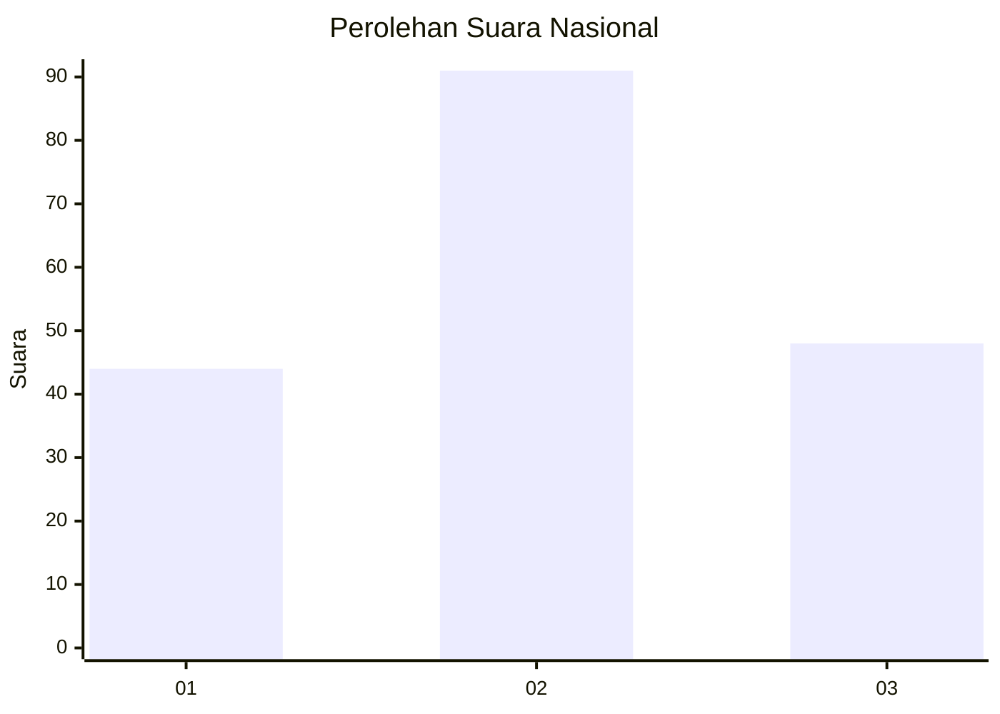
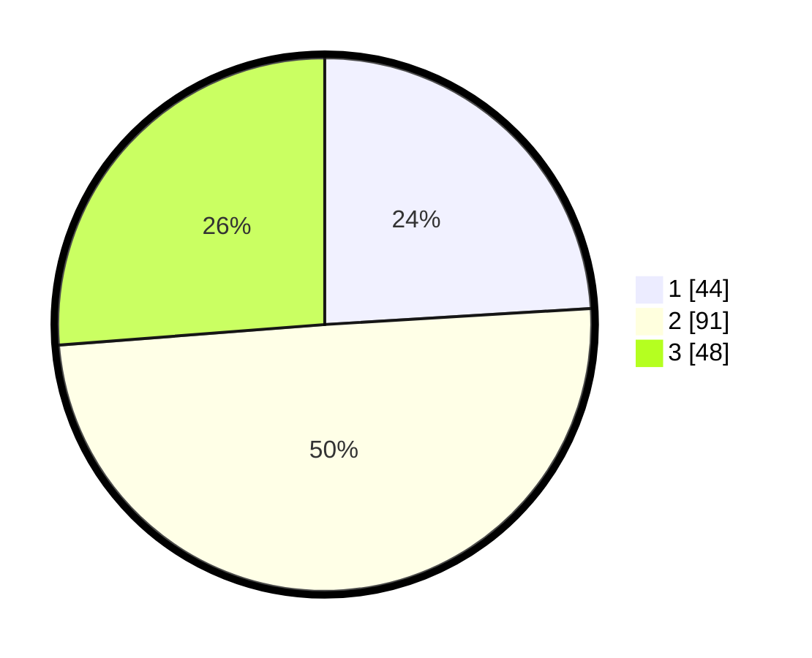

# Hasil

## Grafik

## Tabel

| No. | Nama Paslon    | Suara | Suara (raw) | Persentase |
|:--- |:-------------- | -----:| -----------:| ----------:|
| 1   | ANIES MUHAIMIN | 44    | [44][p-1]   | 24,04      |
| 2   | PRABOWO GIBRAN | 91    | [91][p-2]   | 49,73      |
| 3   | GANJAR MAHFUD  | 48    | [48][p-3]   | 26,23      |

[p-1]: https://github.com/gigit-pemilu/pemilu-2024/blob/main/pilpres/hitung-suara/sub/34-di-yogyakarta/sub/02-bantul/sub/15-sewon/sub/2001-pendowoharjo/sub/009-tps/sub/paslon-1.txt
[p-2]: https://github.com/gigit-pemilu/pemilu-2024/blob/main/pilpres/hitung-suara/sub/34-di-yogyakarta/sub/02-bantul/sub/15-sewon/sub/2001-pendowoharjo/sub/009-tps/sub/paslon-2.txt
[p-3]: https://github.com/gigit-pemilu/pemilu-2024/blob/main/pilpres/hitung-suara/sub/34-di-yogyakarta/sub/02-bantul/sub/15-sewon/sub/2001-pendowoharjo/sub/009-tps/sub/paslon-3.txt

## Foto C Plano

https://sirekap-obj-formc.kpu.go.id/d951/pemilu/ppwp/34/02/15/20/01/3402152001009-20240214-194056--061c9f01-36db-4042-91aa-98bc7518d7d7.jpg

https://sirekap-obj-formc.kpu.go.id/d951/pemilu/ppwp/34/02/15/20/01/3402152001009-20240214-194129--b2b278a5-e40e-496c-90f1-e5219a824336.jpg

https://sirekap-obj-formc.kpu.go.id/d951/pemilu/ppwp/34/02/15/20/01/3402152001009-20240214-194144--937c97fd-8699-4f66-873a-84715c03df3c.jpg

## Metadata

| Key        | Value               |
| ---------- | ------------------- |
| Time Stamp | 2024-02-24 22:31:28 |

