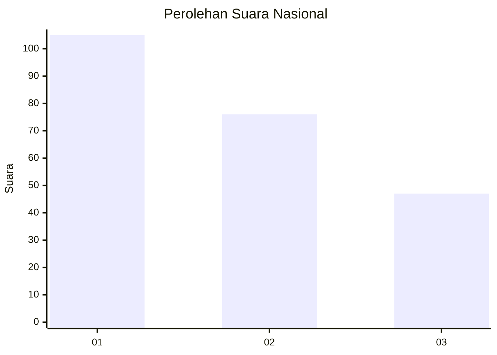
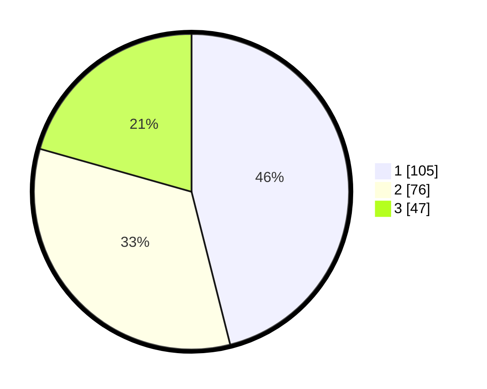

# Hasil

## Grafik

## Tabel

| No. | Nama Paslon    | Suara | Suara (raw) | Persentase |
|:--- |:-------------- | -----:| -----------:| ----------:|
| 1   | ANIES MUHAIMIN | 105   | [105][p-1]  | 46,05      |
| 2   | PRABOWO GIBRAN | 76    | [76][p-2]   | 33,33      |
| 3   | GANJAR MAHFUD  | 47    | [47][p-3]   | 20,61      |

[p-1]: https://github.com/gigit-pemilu/pemilu-2024/blob/main/pilpres/hitung-suara/sub/34-di-yogyakarta/sub/02-bantul/sub/15-sewon/sub/2001-pendowoharjo/sub/010-tps/sub/paslon-1.txt
[p-2]: https://github.com/gigit-pemilu/pemilu-2024/blob/main/pilpres/hitung-suara/sub/34-di-yogyakarta/sub/02-bantul/sub/15-sewon/sub/2001-pendowoharjo/sub/010-tps/sub/paslon-2.txt
[p-3]: https://github.com/gigit-pemilu/pemilu-2024/blob/main/pilpres/hitung-suara/sub/34-di-yogyakarta/sub/02-bantul/sub/15-sewon/sub/2001-pendowoharjo/sub/010-tps/sub/paslon-3.txt

## Foto C Plano

https://sirekap-obj-formc.kpu.go.id/596c/pemilu/ppwp/34/02/15/20/01/3402152001010-20240214-200519--e03d4175-79cc-4b86-b7de-4e62276eb7a3.jpg

https://sirekap-obj-formc.kpu.go.id/596c/pemilu/ppwp/34/02/15/20/01/3402152001010-20240214-194858--d4c82d54-3f21-4252-a25f-db0b541a3606.jpg

https://sirekap-obj-formc.kpu.go.id/596c/pemilu/ppwp/34/02/15/20/01/3402152001010-20240214-202000--9516cbc1-0179-493d-a7bd-8e49b82aa82e.jpg

## Metadata

| Key        | Value               |
| ---------- | ------------------- |
| Time Stamp | 2024-02-14 21:46:01 |

