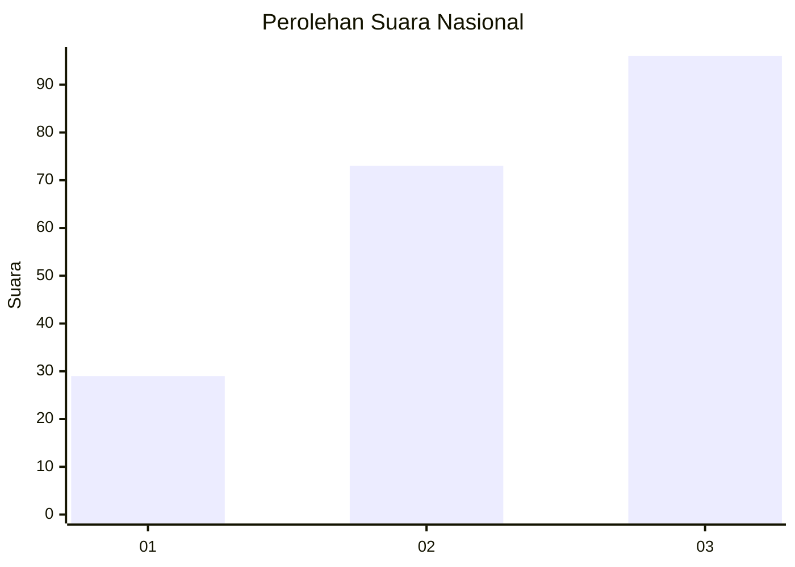
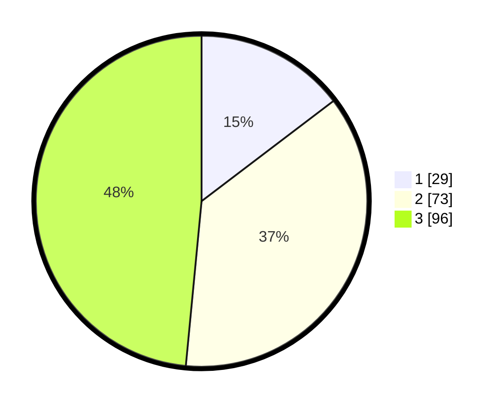

# Hasil

## Grafik

## Tabel

| No. | Nama Paslon    | Suara | Suara (raw) | Persentase |
|:--- |:-------------- | -----:| -----------:| ----------:|
| 1   | ANIES MUHAIMIN | 29    | [29][p-1]   | 14,65      |
| 2   | PRABOWO GIBRAN | 73    | [73][p-2]   | 36,87      |
| 3   | GANJAR MAHFUD  | 96    | [96][p-3]   | 48,48      |

[p-1]: https://github.com/gigit-pemilu/pemilu-2024/blob/main/pilpres/hitung-suara/sub/34-di-yogyakarta/sub/02-bantul/sub/15-sewon/sub/2001-pendowoharjo/sub/016-tps/sub/paslon-1.txt
[p-2]: https://github.com/gigit-pemilu/pemilu-2024/blob/main/pilpres/hitung-suara/sub/34-di-yogyakarta/sub/02-bantul/sub/15-sewon/sub/2001-pendowoharjo/sub/016-tps/sub/paslon-2.txt
[p-3]: https://github.com/gigit-pemilu/pemilu-2024/blob/main/pilpres/hitung-suara/sub/34-di-yogyakarta/sub/02-bantul/sub/15-sewon/sub/2001-pendowoharjo/sub/016-tps/sub/paslon-3.txt

## Foto C Plano

https://sirekap-obj-formc.kpu.go.id/ac01/pemilu/ppwp/34/02/15/20/01/3402152001016-20240214-230629--1b217737-c810-4836-8d56-934c5b09a456.jpg

https://sirekap-obj-formc.kpu.go.id/ac01/pemilu/ppwp/34/02/15/20/01/3402152001016-20240214-230807--2b17ed4a-e8a7-48e9-88fc-a85f494e181b.jpg

https://sirekap-obj-formc.kpu.go.id/ac01/pemilu/ppwp/34/02/15/20/01/3402152001016-20240214-231015--cfeefbe4-1e5b-4ceb-9a48-fee8750e92a0.jpg

## Metadata

| Key        | Value               |
| ---------- | ------------------- |
| Time Stamp | 2024-02-24 22:31:28 |

