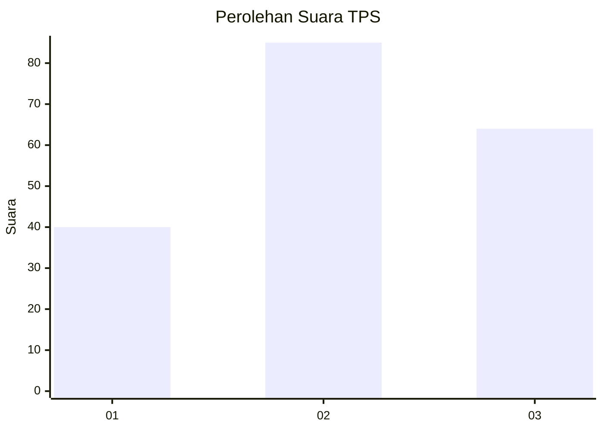
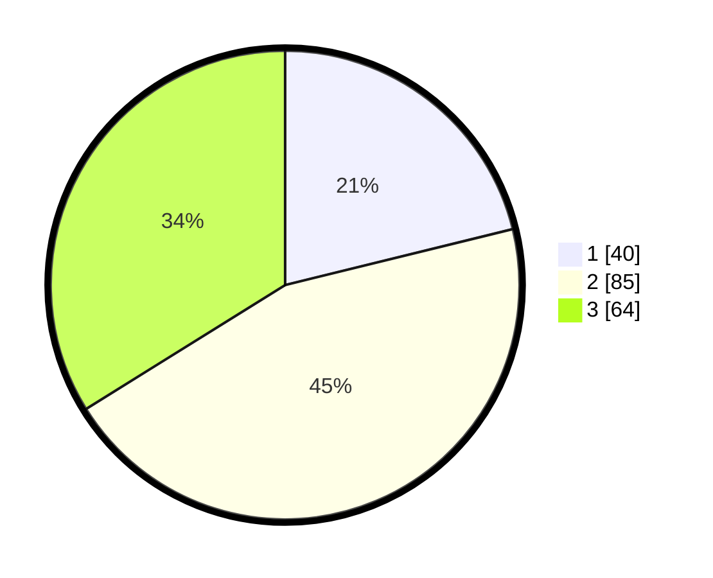

# Hasil

## Grafik

## Tabel

| No. | Nama Paslon    | Suara | Suara (raw) | Persentase |
|:--- |:-------------- | -----:| -----------:| ----------:|
| 1   | ANIES MUHAIMIN | 40    | [40][p-1]   | 21,16      |
| 2   | PRABOWO GIBRAN | 85    | [85][p-2]   | 44,97      |
| 3   | GANJAR MAHFUD  | 64    | [64][p-3]   | 33,86      |

[p-1]: https://github.com/gigit-pemilu/pemilu-2024-34-di-yogyakarta/blob/main/pilpres/hitung-suara/sub/34-di-yogyakarta/sub/02-bantul/sub/15-sewon/sub/2001-pendowoharjo/sub/017-tps/sub/paslon-1.txt
[p-2]: https://github.com/gigit-pemilu/pemilu-2024-34-di-yogyakarta/blob/main/pilpres/hitung-suara/sub/34-di-yogyakarta/sub/02-bantul/sub/15-sewon/sub/2001-pendowoharjo/sub/017-tps/sub/paslon-2.txt
[p-3]: https://github.com/gigit-pemilu/pemilu-2024-34-di-yogyakarta/blob/main/pilpres/hitung-suara/sub/34-di-yogyakarta/sub/02-bantul/sub/15-sewon/sub/2001-pendowoharjo/sub/017-tps/sub/paslon-3.txt

## Foto C Plano

https://sirekap-obj-formc.kpu.go.id/5383/pemilu/ppwp/34/02/15/20/01/3402152001017-20240215-032522--afdfe5ef-9b9b-4629-8b94-df83a438fdbd.jpg

https://sirekap-obj-formc.kpu.go.id/5383/pemilu/ppwp/34/02/15/20/01/3402152001017-20240215-010034--a330b987-3c4d-4728-b06c-b40426ae9450.jpg

https://sirekap-obj-formc.kpu.go.id/5383/pemilu/ppwp/34/02/15/20/01/3402152001017-20240214-234024--868ed326-45c3-4c89-9313-71f800ad55ce.jpg

## Metadata

| Key        | Value               |
| ---------- | ------------------- |
| Time Stamp | 2024-02-24 22:31:28 |

